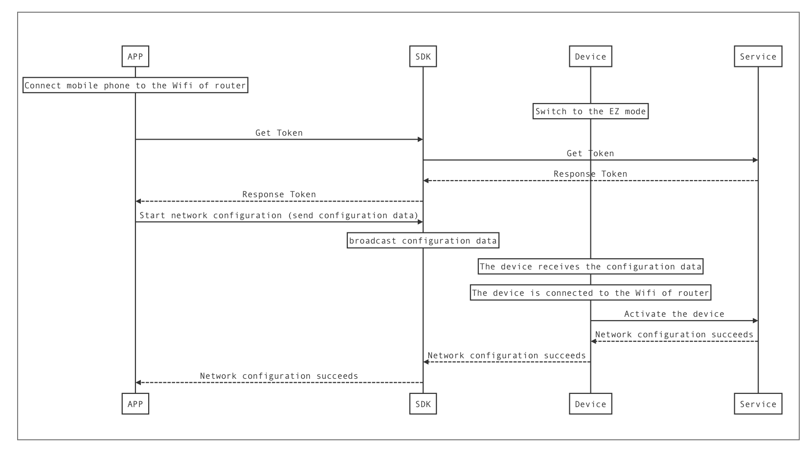

**Process of EZ mode network configuration:**




#### Get Token

Before the EZ/AP mode network configuration, the SDK needs to obtain the network configuration Token from the Tuya Cloud. The term of validity of Token is 5 minutes, and the Token become invalid once the network configuration succeeds. A new Token has to be obtained if you have to reconfigure network. 

```
- (void)getToken {
	[[TuyaSmartActivator sharedInstance] getTokenWithHomeId:homeId success:^(NSString *token) {
		NSLog(@"getToken success: %@", token);
		// TODO: startConfigWiFi
	} failure:^(NSError *error) {
		NSLog(@"getToken failure: %@", error.localizedDescription);
	}];
}
```

#### Start network configuration.


EZ mode network configuration:

```objc
- (void)startConfigWiFi:(NSString *)ssid password:(NSString *)password token:(NSString *)token {
	// 设置 TuyaSmartActivator 的 delegate，并实现 delegate 方法
	[TuyaSmartActivator sharedInstance].delegate = self;
	
	// 开始配网
	[[TuyaSmartActivator sharedInstance] startConfigWiFi:TYActivatorModeEZ ssid:ssid password:password token:token timeout:100];
}

#pragma mark - TuyaSmartActivatorDelegate
- (void)activator:(TuyaSmartActivator *)activator didReceiveDevice:(TuyaSmartDeviceModel *)deviceModel error:(NSError *)error {
	
	if (!error && deviceModel) {
		//配网成功
    }
    
    if (error) {
        //配网失败
    }	
}

```

The AP mode network configuration is the same to the EZ mode network configuration. You just need to change the first parameter of the `[TuyaSmartActivator startConfigWiFi:ssid:password:token:timeout:]` to TYActivatorModeAP. But the `ssid` and `password` needs to be the name and password of router hotspot instead of the device hotspot.


#### Stop network configuration.

The App will continuously broadcast the network configuration information until the network configuration succeeds or the timeout is reached once the network configuration starts. The `[TuyaSmartActivator stopConfigWiFi]` method has to be invoked if you need to cancel the network configuration or the network configuration is completed. 

```objc
- (void)stopConfigWifi {
	[TuyaSmartActivator sharedInstance].delegate = nil;
	[[TuyaSmartActivator sharedInstance] stopConfigWiFi];
}
```