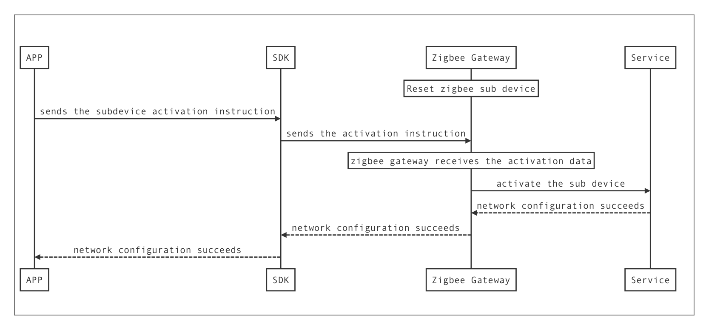

### Activate the ZigBee sub-device

#### 

The `stopActiveSubDeviceWithGwId` method has to be invoked if you need to cancel the network configuration or the network configuration is completed.

```objc
- (void)activeSubDevice {

	[[TuyaSmartActivator sharedInstance] activeSubDeviceWithGwId:@"your_device_id" timeout:100 success:^{
		NSLog(@"active sub device success");
	} failure:^(NSError *error) {
		NSLog(@"active sub device failure: %@", error);
	}];
}

#pragma mark - TuyaSmartActivatorDelegate
- (void)activator:(TuyaSmartActivator *)activator didReceiveDevice:(TuyaSmartDeviceModel *)deviceModel error:(NSError *)error {
    
    if (!error && deviceModel) {
		//配网成功
    }
    
    if (error) {
        //配网失败
    }  
}
```

#### Stop activating the ZigBee sub-device

```objc
- (void)stopActiveSubDevice {
	[[TuyaSmartActivator sharedInstance] stopActiveSubDeviceWithGwId:@"your_device_id"];
}
```

