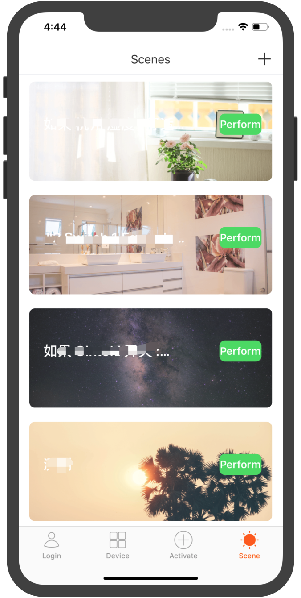

## Demo App

### Introduction:

Demo App introduces the SDK development process and some simple business logic. Before developing the App, it is recommended to complete the operation of demo App according to this document.

In the [preparation section](/resource/Preparation.html), get the `Appkey`, `Appsecret` and `Security pictures` of `iOS`. When integrating the SDK, please confirm whether the `BundleId`, `Appkey`, `Appsecret` and `Security pictures` are consistent with the information on the platform. Any mismatch will cause the SDK to be unavailable.


### Function Overview:

Demo App includes:

- User module: Account (mobile phone or email) registration and login
- Home management and device management module: including home creation and current home switching. Display of device list and control of device function point in home. Device rename and device removal.
- Device activator module: including smartConfig mode, AP mode, wired gateway distribution network and gateway sub device activator
- Smart scene module: smart scene creation and execution


<div align=left>
	
  
  


**[Demo link](https://github.com/TuyaInc/tuyasmart_home_ios_sdk)**


###QA：

**API interface request prompt signature error**

```objc
{
  "success" : false,
  "errorCode" : "SING_VALIDATE_FALED",
  "status" : "error",
  "errorMsg" : "Permission Verification Failed",
  "t" : 1583208740059
}
```

* Confirm whether the BundleId, Appkey, Appsecret and security picture are consistent with the information on the IOT platform. Any mismatch will fail the verification. Please check according to the section of [Preparation](/resource/Preparation.md).

