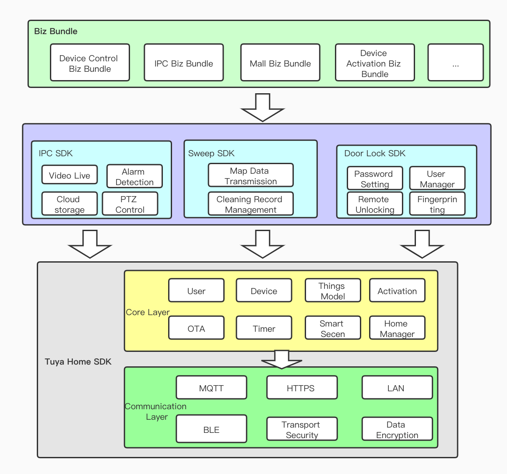

## Extension SDK

### Overview

The IPC SDK, smart door lock SDK and sweeper SDK belong to the vertical category of SDK, which rely on the Home SDK. They mainly encapsulate the unique functions of the vertical category to facilitate the rapid development of the functions of the vertical category products.

## Architecture

The architecture design is as follows:

