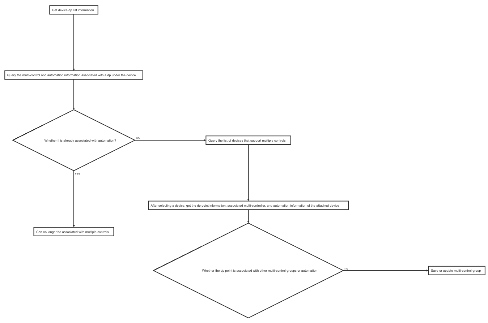

## Device Multi-Control

### Overview

Device multi-control association refers to the establishment of an association between a dp of a device and a dp of another device to generate a multi-control group. When controlling a device that establishes a dp association in the multi-control group, other devices in the group are associated The dp point status is synchronized.

For example: three two-way zigbee sub-device switches, the first dp point of each switch and the first dp point of the other two switches establish a multi-control group, when the first dp state of one of the switches is closed , The first dp of the other two switches are closed synchronously.

**Currently supports zigbee sub-device, mesh sub-device type switches**

**Support cross pid**

**Note:** At present, it is restricted that dpCode is `switch_number`, `sub_switch_number` type dp

| Class Name            | Description                                             |
| --------------------- | ------------------------------------------------------- |
| TuyaSmartMultiControl | Device multi-control associated interface encapsulation |

### Bussiness Flowchart




### Get Device Dp Information

**Declaration**

Obtain information such as multilingual names of all dp of the device from the cloud.

```objective-c
- (void)getDeviceDpInfoWithDevId:(NSString *)devId success:(void (^)(NSArray<TuyaSmartMultiControlDatapointModel *> *))success failure:(TYFailureError)failure;
```

**Parameters**

| Parameters | Description                                                  |
| ---------- | ------------------------------------------------------------ |
| devId      | device Id                                                    |
| success    | Success block, return ( `NSArray<TuyaSmartMultiControlDatapointModel *> *`) |
| failure    | Failure block                                                |

**`TuyaSmartMultiControlDatapointModel` Description**


| Property | Type     | Description              |
| -------- | -------- | ------------------------ |
| dpId     | NSString | device dp id             |
| name     | NSString | device dp name           |
| code     | NSString | device dp code（dpCode） |
| schemaId | NSString | device  dp schema Id     |

**Example**

**Objc:**

```objective-c
TuyaSmartMultiControl *multiControl = [[TuyaSmartMultiControl alloc] init];
[multiControl getDeviceDpInfoWithDevId:@"your_devId" success:^(NSArray<TuyaSmartMultiControlDatapointModel *> * list) {

} failure:^(NSError *error) {

}];
```

**Swift:**

```swift
let multiControl = TuyaSmartMultiControl.init()
multiControl.getDeviceDpInfo(withDevId: "your_devId", success: { (list) in

}) { (error) in

}
```


### Query Related Information of a Dp

**Declaration**

Query the multi-control and automation details associated with the current device dp, the current device is the main device, and the other related devices are auxiliary devices.

```objective-c
- (void)queryDeviceLinkInfoWithDevId:(NSString *)devId dpId:(NSString *)dpId success:(void (^)(TuyaSmartMultiControlLinkModel *))success failure:(TYFailureError)failure;
```

**Parameters**

| Parameters | Description                                                |
| ---------- | ---------------------------------------------------------- |
| devId      | Main Device Id                                             |
| dpId       | Main Device dp id                                          |
| success    | Success block, retun ( `TuyaSmartMultiControlLinkModel *`) |
| failure    | Failure block                                              |

**`TuyaSmartMultiControlLinkModel` Description**

| Property    | Type                                              | Description                                   |
| ----------- | ------------------------------------------------- | --------------------------------------------- |
| multiGroup  | TuyaSmartMultiControlGroupModel                   | Associated multi-control group data structure |
| parentRules | NSArray<`TuyaSmartMultiControlParentRuleModel *`> | Associated scene automation data structure    |

**`TuyaSmartMultiControlGroupModel` Description**

| Property       | Type                                               | Description                               |
| -------------- | -------------------------------------------------- | ----------------------------------------- |
| multiControlId | NSString                                           | Multi-control group Id                    |
| groupName      | NSString                                           | Multi-control group Name                  |
| groupType      | NSInteger                                          | Multi-control group Type                  |
| groupDetail    | NSArray<`TuyaSmartMultiControlGroupDetailModel *`> | Multi-control group Detail                |
| enabled        | BOOL                                               | Whether multi-control group are available |
| multiRuleId    | NSString                                           |                                           |
| ownerId        | NSString                                           | home Id                                   |
| uid            | NSString                                           | user Id                                   |

**`TuyaSmartMultiControlGroupDetailModel` Description**

| Property       | Type                                             | Description                                                  |
| -------------- | ------------------------------------------------ | ------------------------------------------------------------ |
| detailId       | NSString                                         |                                                              |
| multiControlId | NSString                                         | Multi-control group Id                                       |
| devId          | NSString                                         | Affiliate Device Id                                          |
| devName        | NSString                                         | Affiliate Device Name                                        |
| dpId           | NSString                                         | Affiliate Device's dp id                                     |
| dpName         | NSString                                         | Affiliate Device's dp name                                   |
| enabled        | BOOL                                             | Whether accessory device can be controlled by multi-control function |
| datapoints     | NSArray<`TuyaSmartMultiControlDatapointModel *`> | Accessory Device's Dps Infomation                            |

**`TuyaSmartMultiControlParentRuleModel` Description**

| Property | Type     | Description     |
| -------- | -------- | --------------- |
| ruleId   | NSString | Automation id   |
| name     | NSString | Automation name |

**Example**

**Objc:**

```objective-c
TuyaSmartMultiControl *multiControl = [[TuyaSmartMultiControl alloc] init];
[multiControl queryDeviceLinkInfoWithDevId:@"your_devId" dpId:@"your_dpId" success:^(TuyaSmartMultiControlLinkModel * model) {

} failure:^(NSError *error) {

}];
```

**Swift:**

```swift
let multiControl = TuyaSmartMultiControl.init()
multiControl.queryDeviceLinkInfo(withDevId: "your_devId", dpId: "your_dpId", success: { (linkModel) in

}) { (error) in

}
```


### Add Multi-control Group

**Declaration**

```objective-c
- (void)addMultiControlWithDevId:(NSString *)devId groupName:(NSString *)groupName groupDetail:(NSArray<TuyaSmartMultiControlDetailModel *> *)groupDetail success:(void (^)(TuyaSmartMultiControlModel *))success failure:(TYFailureError)failure;
```

**Parameters**

| Parameters  | Description                                                  |
| --- | --- |
| devId       | Main device id                                               |
| groupName   | Multi-control group name                                     |
| groupDetail | Multi-control group detail, return (NSArray<`TuyaSmartMultiControlDetailModel *`>) |
| success     | Success block                                                |
| failure     | Failure block                                                |

**`TuyaSmartMultiControlDetailModel` Description**

| Property | Type     | Description     |
| --- | --- | --- |
| detailId | NSString | |
| devId    | NSString | Affiliate Device Id |
| dpId     | NSString | Affiliate Device's dp id |
| enable   | BOOL     | Whether accessory device can be controlled by multi-control function |

**Example**

**Objc:**

```objective-c
TuyaSmartMultiControl *multiControl = [[TuyaSmartMultiControl alloc] init];
    
TuyaSmartMultiControlDetailModel *detailModel = [[TuyaSmartMultiControlDetailModel alloc] init];
detailModel.dpId = @"";
detailModel.devId = @"";
detailModel.enable = true;

[multiControl addMultiControlWithDevId:@"your_devId" groupName:@"groupName" groupDetail:@[detailModel] success:^(TuyaSmartMultiControlModel * model) {

} failure:^(NSError *error) {

}];
```

**Swift:**

```swift
let multiControl = TuyaSmartMultiControl.init()
        
let detail = TuyaSmartMultiControlDetailModel.init()
detail.devId = ""
detail.dpId = ""
detail.enable = true

multiControl.add(withDevId: "your_devId", groupName: "groupName", groupDetail: [detail], success: { (model) in

}) { (error) in

}
```


### Update Multi-control Group

**Declaration**

To add other devices to the main device to enter the multi-control group, you can update the name of the multi-control group and update the device list in the multi-control group.

**Note:** Update method is full update

```objective-c
- (void)updateMultiControlWithDevId:(NSString *)devId multiControlModel:(TuyaSmartMultiControlModel *)model success:(void (^)(TuyaSmartMultiControlModel *))success failure:(TYFailureError)failure;
```

**Parameters**

| Parameters | Description               |
| ---------- | ------------------------- |
| devId      | Main device id            |
| model      | Multi-control Group Model |
| success    | Success block             |
| failure    | Failure block             |

**`TuyaSmartMultiControlModel` Description**

| Property       | Type                                          | Description                            |
| -------------- | --------------------------------------------- | -------------------------------------- |
| multiControlId | NSString                                      | Multi-control group id                 |
| groupName      | NSString                                      | Multi-control group name               |
| groupType      | NSInteger                                     | Multi-control group type. Default `1`. |
| groupDetail    | NSArray<`TuyaSmartMultiControlDetailModel *`> | Multi-control group detail             |

**Example**

**Objc:**

```objective-c
TuyaSmartMultiControl *multiControl = [[TuyaSmartMultiControl alloc] init];

TuyaSmartMultiControlDetailModel *detailModel = [[TuyaSmartMultiControlDetailModel alloc] init];
detailModel.detailId = @"";
detailModel.dpId = @"";
detailModel.devId = @"";
detailModel.enable = true;

TuyaSmartMultiControlModel *model = [[TuyaSmartMultiControlModel alloc] init];
model.multiControlId = @"";
model.groupName = @"";
model.groupType = 1;

model.groupDetail = @[detailModel];

[multiControl updateMultiControlWithDevId:@"your_devId" multiControlModel:model success:^(TuyaSmartMultiControlModel * model) {

} failure:^(NSError *error) {

}];
```

**Swift:**

```swift
let multiControl = TuyaSmartMultiControl.init()

let detailModel = TuyaSmartMultiControlDetailModel.init()
detailModel.detailId = ""
detailModel.dpId = ""
detailModel.devId = ""
detailModel.enable = true

let model = TuyaSmartMultiControlModel.init()
model.multiControlId = ""
model.groupName = ""
model.groupDetail = [detailModel]
multiControl.update(withDevId: "your_devId", multiControlModel: model, success: { (model) in

}) { (error) in

}
```


### Enable or Disable Multi-control Group

**Declaration**

```objective-c
- (void)enableMultiControlWithMultiControlId:(NSString *)multiControlId enable:(BOOL)enable success:(TYSuccessBOOL)success failure:(TYFailureError)failure;
```

**Parameters**

| Parameters     | Description            |
| -------------- | ---------------------- |
| multiControlId | Multi-control group id |
| enable         | Enable or Disable      |
| success        | Success block          |
| failure        | Failure block          |

**Example**

**Objc:**

```objective-c
TuyaSmartMultiControl *multiControl = [[TuyaSmartMultiControl alloc] init];
[multiControl enableMultiControlWithMultiControlId:@"multiControlId" enable:true/false success:^(BOOL result) {

} failure:^(NSError *error) {

}];
```

**Swift:**

```swift
let multiControl = TuyaSmartMultiControl.init()
multiControl.enableMultiControl(withMultiControlId: "multiControlId", enable: true, success: { (result) in

}) { (error) in

}
```


### Query Devices that Support Multi-control

**Declaration**

Query the list of devices that support multiple controls (including user's and family's)

```objective-c
- (void)getMultiControlDeviceListWithHomeId:(long long)homeId success:(void (^)(NSArray<TuyaSmartMultiControlDeviceModel *> *))success failure:(TYFailureError)failure;
```

**Parameters**

| Parameters | Description                                                  |
| ---------- | ------------------------------------------------------------ |
| homeId     | home id                                                      |
| success    | Success block, return ( `NSArray<TuyaSmartMultiControlDeviceModel *> *`) |
| failure    | Failure block                                                |

**`TuyaSmartMultiControlDeviceModel` Description**

| Property        | Type                                             | Description                                                  |
| --------------- | ------------------------------------------------ | ------------------------------------------------------------ |
| devId           | NSString                                         | Device id                                                    |
| productId       | NSString                                         | Product id                                                   |
| name            | NSString                                         | Device name                                                  |
| iconUrl         | NSString                                         | Device icon url                                              |
| roomName        | NSString                                         | Name of the room where the device is located                 |
| inRule          | BOOL                                             | Is the device in an automated condition                      |
| datapoints      | NSArray<`TuyaSmartMultiControlDatapointModel *`> | Dps information                                              |
| multiControlIds | NSArray<`NSString *`>                            | The multi-control group id array of the device has been associated |

**Example**

**Objc:**

```objective-c
TuyaSmartMultiControl *multiControl = [[TuyaSmartMultiControl alloc] init];
[multiControl getMultiControlDeviceListWithHomeId:123 success:^(NSArray<TuyaSmartMultiControlDeviceModel *> * list) {

} failure:^(NSError *error) {

}];
```

**Swift:**

```swift
let multiControl = TuyaSmartMultiControl.init()
multiControl.getDeviceList(withHomeId: 123, success: { (list) in

}) { (error) in

}
```


### Get Affiliate Device Details

**Declaration**

Obtain the dp point information of the attached device, the associated multi-controller and automation information

```objective-c
- (void)queryDeviceDpRelationWithDevId:(NSString *)devId success:(void (^)(TuyaSmartMultiControlDpRelationModel *))success failure:(TYFailureError)failure;
```

**Parameters**

| Parameters | Description                                                  |
| ---------- | ------------------------------------------------------------ |
| devId      | device id                                                    |
| success    | Success block, return ( `TuyaSmartMultiControlDpRelationModel *`) |
| failure    | Failure block                                                |

**`TuyaSmartMultiControlDpRelationModel` Description**

| Property    | Type                                              | Description                             |
| ----------- | ------------------------------------------------- | --------------------------------------- |
| datapoints  | NSArray<`TuyaSmartMultiControlDatapointModel *`>  | dp infomation                           |
| mcGroups    | NSArray<`TuyaSmartMcGroupModel *`>                | Related multi-control group information |
| parentRules | NSArray<`TuyaSmartMultiControlParentRuleModel *`> | Related automation information          |

**`TuyaSmartMcGroupModel` Description**

| Property       | Type                                     | Description                               |
| -------------- | ---------------------------------------- | ----------------------------------------- |
| multiControlId | NSString                                 | Multi-control group id                    |
| groupName      | NSString                                 | Multi-control group name                  |
| groupDetail    | NSArray<`TuyaSmartMcGroupDetailModel *`> | Multi-control group detail                |
| enabled        | BOOL                                     | Whether multi-control group are available |
| groupType      | NSInteger                                | Multi-control group type                  |
| multiRuleId    | NSString                                 |                                           |
| ownerId        | NSString                                 | home id                                   |
| uid            | NSString                                 | user id                                   |

**`TuyaSmartMcGroupDetailModel` Description**

| Property       | Type     | Description            |
| -------------- | -------- | ---------------------- |
| detailId       | NSString |                        |
| dpId           | NSString | dp id                  |
| dpName         | NSString | dp name                |
| devId          | NSString | device id              |
| devName        | NSString | device name            |
| enabled        | BOOL     | isEnabled              |
| multiControlId | NSString | Multi-control group id |

**Example**

**Objc:**

```objective-c
TuyaSmartMultiControl *multiControl = [[TuyaSmartMultiControl alloc] init];
[multiControl queryDeviceDpRelationWithDevId:@"your_devId" success:^(TuyaSmartMultiControlDpRelationModel * model) {

} failure:^(NSError *error) {

}];
```

**Swift:**

```swift
let multiControl = TuyaSmartMultiControl.init()
multiControl.queryDeviceDpRelation(withDevId: "your_devId", success: { (model) in

}) { (error) in

}
```