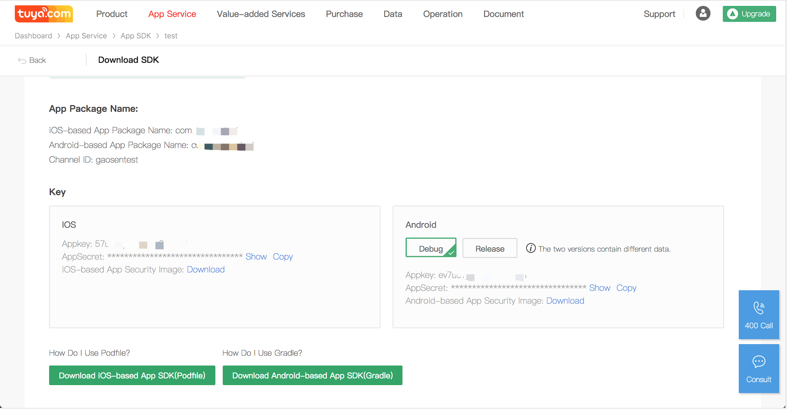

## Preparation Work

### Register Tuya Developer Account

Go to the [Tuya Smart Development Platform](https://iot.tuya.com) to register a developer account, create products and create function points, etc. Please refer to the [Contact workflow](https://docs.tuya.com/cn/overview/dev-process.html) for details. 

### Obtain the iOS App Key, App Secret and Security Image.
Go to the development platform -> App Service -> App SDK get iOS `App Key`,  `App Secret` and Security image.

 

Download the security image, rename as `t_s.bmp`, import it into the project as a resource file. Confirm that `Project Setting => Target => Build Phases => Copy Bundle Resources` contains `t_s.bmp` file.

Please confirm the `bundleId`、`appKey`、`appSceret`、security image in your project is the same as the tuya develop center, any mismatch will cause the SDK unusable.

### Joint Debugging Mode

- Use the hardware control panel to perform debugging on real devices.
- Use the development platform to simulate device debugging. 
