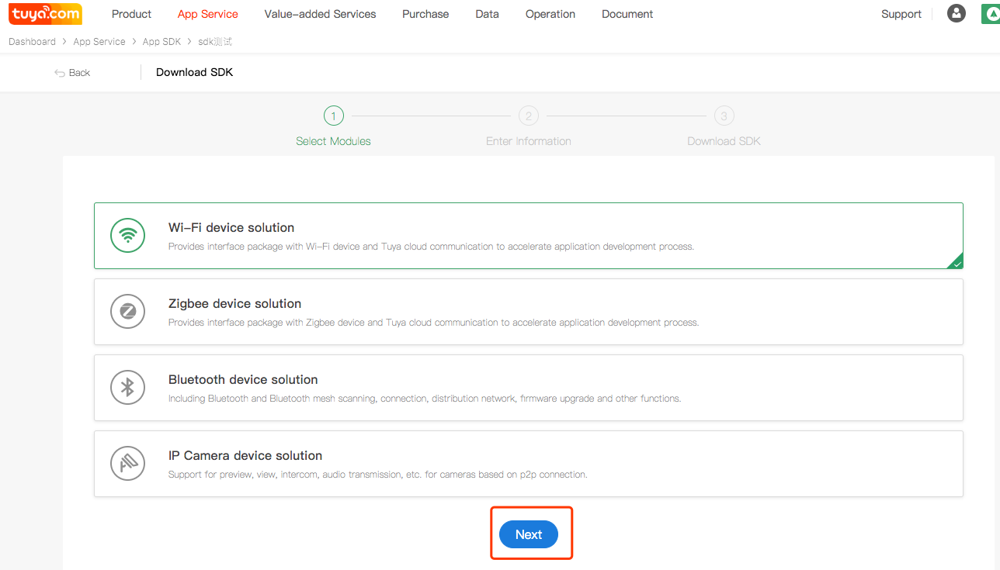
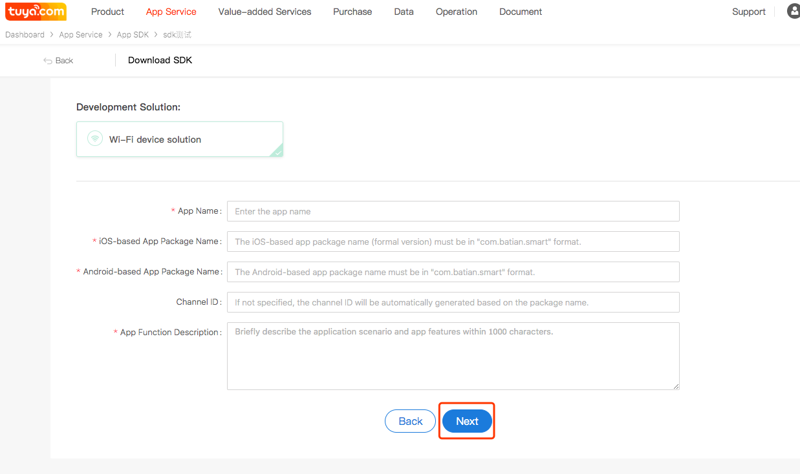
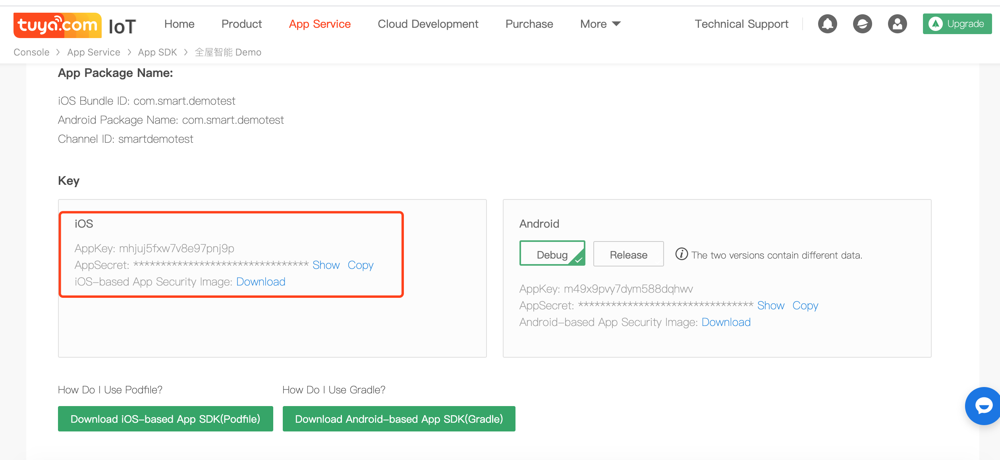

## Preparation Work

### Register Tuya Developer Account

Go to the [Tuya Smart Development Platform](https://iot.tuya.com) to register a developer account, create products and create function points, etc. Please refer to the [Contact workflow](https://docs.tuya.com/cn/overview/dev-process.html) for details. 

###  Create an SDK APP

1. Got to [Tuya IoT platform](https://iot.tuya.com/)
2. Click "App Service" - "App SDK" - "Obtain SDK" in order on the iot platform.
3. Select the feature according to your needs and click "Next".

 

Enter the created app information as prompted and click "Next".

`AppKey`, `AppSecret` can be obtained in the iOS section. Click "Download" and rename security images to `t_s.bmp`.

