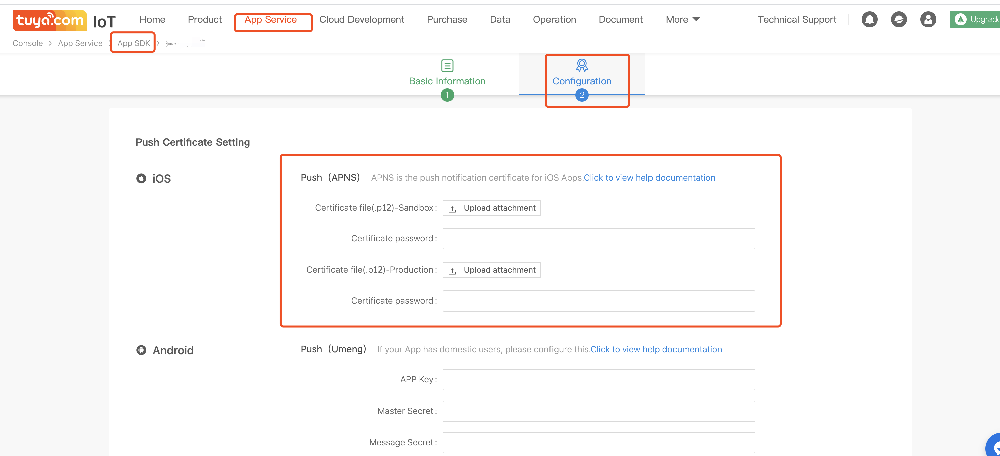
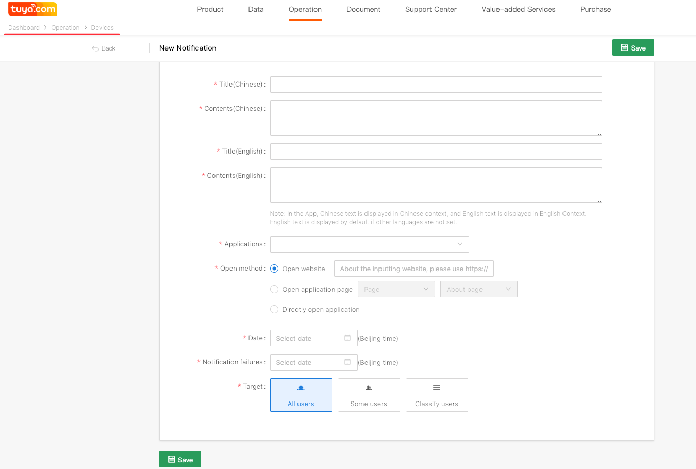
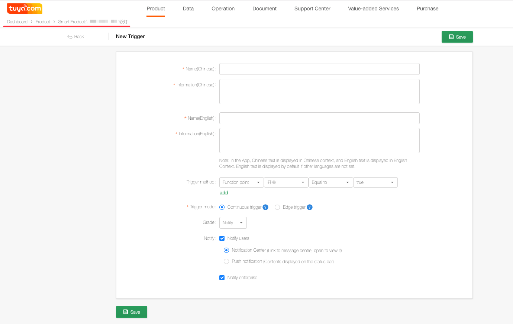

## Integrate push

For Apps developed by using the Tuya SDK, the Tuya platform supports push function, sending operation push to users and alarm push of products. 

### Configure Xcode

Clock project -> `TARGETS` -> `Capabilities`, and switch on the `Push Notification` switch. The effect is as follows.


### Configure the Tuya Developer Platform

Log in to the Tuya Developer Platform -> enter relevant App ->Configure the Push function->Upload the push certificate.




### Initialization

Initiate push in the `didFinishLaunchingWithOptions` method. 

```objc
    
- (BOOL)application:(UIApplication *)application didFinishLaunchingWithOptions:(NSDictionary *)launchOptions {
    
    
    [application registerForRemoteNotifications];
    [application registerUserNotificationSettings:[UIUserNotificationSettings settingsForTypes:UIUserNotificationTypeAlert|UIUserNotificationTypeBadge|UIUserNotificationTypeSound categories:nil]];
    
    
    if ([[[UIDevice currentDevice] systemVersion] floatValue] >= 10.0) {
        //iOS10 need the following code
        UNUserNotificationCenter *center = [UNUserNotificationCenter currentNotificationCenter];
        center.delegate = self;
        UNAuthorizationOptions types10 = UNAuthorizationOptionBadge|UNAuthorizationOptionAlert|UNAuthorizationOptionSound;
        [center requestAuthorizationWithOptions:types10 completionHandler:^(BOOL granted, NSError * _Nullable error) {
            if (granted) {
                
            } else {
                
            }
        }];
    }
    
}

```

### Register pushId

Register pushId in Tuya SDK in the `didRegisterForRemoteNotificationsWithDeviceToken`. 

```objc

- (void)application:(UIApplication *)application didRegisterForRemoteNotificationsWithDeviceToken:(NSData *)deviceToken {
    [TuyaSmartSDK sharedInstance].deviceToken = deviceToken;
}

```


### Receive notification

Execute in the delegate method `didReceiveRemoteNotification` when the remote notification is received. 


```objc
- (void)application:(UIApplication *)application didReceiveRemoteNotification:(NSDictionary *)userInfo fetchCompletionHandler:(void(^)(UIBackgroundFetchResult))completionHandler {


}
```

### Send push

#### Add operation push

Tuya Developer Platform -> User operation -> Message center ->Add message


#### Add alarm push

Tuya Developer Platform -> Product -> Extended function ->Set alarm -> Add rules for alarms (apply the push mode)
