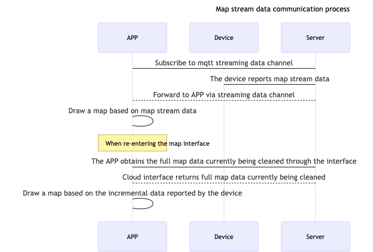

# Gyroscope and Visual Sweeper

## HTTPS Interface

### Get Latest Record

**API：** tuya.m.device.media.latest

**Version：** 2.0

**Request Parameters**

| Parameter | Type    | Description                                                  |
| --------- | ------- | ------------------------------------------------------------ |
| devId     | String  | Device Id                                                    |
| start     | String  | Start position (the first pass is empty, then fill the startRow value in the return value of the previous page when taking the next page) |
| size      | Integer | Query data size (fixed parameter is 500)                     |

**Response parameters**

| Parameter   | Type   | Description                    |
| ----------- | ------ | ------------------------------ |
| devId       | String | Device Id                      |
| startRow    | String | Paging query index             |
| dataList    | Array  | Streaming data                 |
| subRecordId | String | Record Id                      |
| hasNext     | BOOL   | Is there data on the next page |

**Response Example**

```json
{
    "devId":"6ccdd506b7186ee85avntm",
    "startRow":"mtnva58ee6817b605ddcc6_35_1535629239586",
    "dataList":[
        "373702373700",
        "383702383802373901383901383800",
        "373802373901373800",
        "373802363901363801373800",
        "373702373602373600",
        "373502373500",
        "373502373402373301363301373400",
        "363502363500",
        "363502363500"
    ],
    "subRecordId":35,
    "hasNext":true,
    "startTime":1535629049,
    "endTime":1535629244,
    "status":2
}
```


### Get Record List

**API：** m.smart.scale.history.get.list

**Version：** 1.0

**Request Parameters**

| Parameter | Type    | Description                                                |
| --------- | ------- | ---------------------------------------------------------- |
| devId     | String  | Device Id                                                  |
| offset    | Integer | Paging offset                                              |
| limit     | Integer | Paging Size                                                |
| dpIds     | String  | The dpId of the cleaning record configured on the Tuya Iot |

**Response parameters**

| Parameter          | Type   | Description                                                  |
| ------------------ | ------ | ------------------------------------------------------------ |
| uuid               | String | Input parameters when deleting records                       |
| dps                | Array  | The list of dpIds                                            |
| 15                 | String | The dpId of the cleaning record configured on the Tuya Iot   |
| 201906171721009007 | String | The value reported by the device at the corresponding dpId is parsed as "June 17, 2019, 17:21, cleaning time 009, cleaning area 007", the specific data is aligned with the device end |
| totalCount         | int    | Total Count                                                  |
| hasNext            | BOOL   | Is there data on the next page                               |

**Response Example**

```json
{
    "datas":[
        {
            "devId":"xxxx",
            "dps":[
                {
                    "15":"201906171721009007"
                }
            ],
            "avatar":"https://airtake-public-data.oss-cn-hangzhou.aliyuncs.com/smart/user_res/avatar/scale/no_body_icon.png",
            "userName":"xx",
            "gmtCreate":1560763848501,
            "uuid":"15607600058B81A6C4A0273FDD61091D0B02403848501",
            "userId":"0",
            "tags":0,
            "status":1
        }
    ],
    "hasNext":false,
    "totalCount":2
}
```


### Get Record Detail

**API：** tuya.m.device.media.detail

**Version：** 2.0

**Request parameters**

| Parameter   | Type    | Description                                                  |
| ----------- | ------- | ------------------------------------------------------------ |
| devId       | String  | Device Id                                                    |
| subRecordId | String  | Record Id                                                    |
| start       | String  | Start position (the first pass is empty, then fill the startRow value in the return value of the previous page when taking the next page) |
| size        | Integer | Query data size (fixed parameter is 500)                     |

**Response parameters**

| Parameter   | Type   | Description                    |
| ----------- | ------ | ------------------------------ |
| devId       | String | Device Id                      |
| startRow    | String | Paging query index             |
| dataList    | Array  | Streaming data                 |
| subRecordId | String | Record Id                      |
| hasNext     | BOOL   | Is there data on the next page |

**Response Example**

```json
{
    "devId":"6ccdd506b7186ee85avntm",
    "startRow":"mtnva58ee6817b605ddcc6_31_1535622776561",
    "dataList":[
        "3e3f02403e013e3f00",
        "3f3f024040013f3f00",
        "3f3f02403f014040013f3f00",
        "3f40024140014040013f3f024041013f41013f3f00",
        "3f3f024040014041013f41013f3f00"
    ],
    "subRecordId":31,
    "hasNext":true,
    "startTime":1535621566,
    "endTime":1535623017,
    "status":2
}
```


### Delete Record

**API：** m.smart.scale.history.delete

**Version：** 1.0

**Request parameters**

| Parameter | Type    | Description                                                  |
| --------- | ------- | ------------------------------------------------------------ |
| devId     | String  | Device Id                                                    |
| uuid      | Integer | Clean the record uuid, pass uuid to clear the specific record |

**Response Example**

```json
{
    "result":true,
    "success":true,
    "status":"ok",
    "t":1557740732829
}
```

## Data Transfer Subscribe

### Data flow



### Function Introduction

The graffiti gyroscope or visual sweeper uses a stream channel to transmit map data and implements the `TuyaSmartSweeperDeviceDelegate` proxy protocol to receive callbacks for receiving map stream data.

| Class                | Description                          |
| -------------------- | ------------------------------------ |
| TuyaSmartSweepDevice | Tuya sweeper device management class |


### Subscribe Data Stream

**Declaration**

Subscribe to the device's map streaming data

```objective-c
- (void)subscribeDeviceDataTransfer;
```

**Example**

Objc:

```objective-c
- (void)subscribeDevice {
    
    [self.sweeperDevice subscribeDeviceDataTransfer];
}
```

Swift:

```swift
func subscribeDevice() {
    sweeperDevice?.subscribeDeviceDataTransfer()
}
```


### Unsubscribe Data Stream

**Declaration**

Unsubscribe map stream data from device

```objective-c
- (void)unsubscribeDeviceDataTransfer;
```

**Example**

Objc:

```objective-c
- (void)unsubscribeDevice {
    
    [self.sweeperDevice unsubscribeDeviceDataTransfer];
}
```

Swift:

```swift
func unsubscribeDevice() {
    sweeperDevice?.unsubscribeDeviceDataTransfer()
}
```


### Data Stream Callback

**Declaration**

Real-time callback of streaming data reported by the device

```objective-c
- (void)sweeperDevice:(TuyaSmartSweeperDevice *)sweeperDevice didReceiveStreamData:(NSData *)data;
```

**Parameters**

| Parameter     | Description                              |
| ------------- | ---------------------------------------- |
| sweeperDevice | `TuyaSmartSweeperDevice` Instance object |
| data          | Streaming data（ `NSData`）              |

**Example**

Objc:

```objective-c
self.sweeperDevice = [TuyaSmartSweeperDevice deviceWithDeviceId:<#devId#>];
self.sweeperDevice.delegate = self;

- (void)sweeperDevice:(TuyaSmartSweeperDevice *)sweeperDevice didReceiveStreamData:(NSData *)data {
  
}
```

Swift:

```swift
sweeperDevice = TuyaSmartSweeperDevice.init(deviceId: "your_devId")
sweeperDevice?.delegate = self

func sweeperDevice(_ sweeperDevice: TuyaSmartSweeperDevice, didReceiveStreamData data: Data) {
        
}
```
