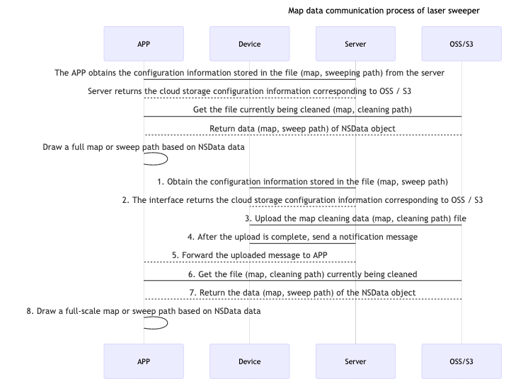

## Laser Sweeper

### Data flow



### Function Introduction

The laser sweeper uses mqtt and cloud storage to transfer data, save the map or sweeping path in the form of a file in the cloud, which involves obtaining cloud storage configuration information, receiving real-time messages and file download functions after file upload is completed. All functions correspond to the `TuyaSmartSweepDevice` class and need to be initialized using the device Id. The wrong device ID may cause initialization failure and return nil.

| Class                | Description                          |
| -------------------- | ------------------------------------ |
| TuyaSmartSweepDevice | Tuya sweeper device management class |


### Initialize Cloud Configuration

**Declaration**

Get cloud storage configuration information from the cloud

```objective-c
- (void)initCloudConfigWithSuccess:(void (^)(NSString *bucket))success
                           failure:(void (^)(NSError * _Nullable error))failure;
```

**Parameters**

| Parameter | Description                                    |
| --------- | ---------------------------------------------- |
| success   | success callback（bucket：File storage space） |
| failure   | failure callback                               |

**Example**

Objc:

```objective-c
[self.sweeperDevice initCloudConfigWithSuccess:^(NSString * _Nonnull bucket) {
        
} failure:^(NSError * _Nullable error) {
        
}];
```

Swift:

```swift
sweeperDevice?.initCloudConfig(success: { (bucket) in
            
}, failure: { (error) in
            
})
```


### Update Cloud Configuration

**Declaration**

Due to the timeliness of the obtained file address, when the file address becomes invalid, you need to call this interface to update the cloud configuration

```objective-c
- (void)updateCloudConfigWithSuccess:(void (^)(NSString *bucket))success
                             failure:(void (^)(NSError * _Nullable error))failure;
```

**Parameters**

| Parameter | Description                                    |
| --------- | ---------------------------------------------- |
| success   | success callback（bucket：File storage space） |
| failure   | failure callback                               |

**Example**

Objc:

```objective-c
[self.sweeperDevice updateCloudConfigWithSuccess:^(NSString * _Nonnull bucket) {
        
} failure:^(NSError * _Nullable error) {
        
}];
```

Swift:

```swift
sweeperDevice?.updateCloudConfig(success: { (bucket) in
            
}, failure: { (error) in
            
})
```


### Get Full File URL

**Declaration**

Download file data according to the relative path of the file (map, sweep path) stored in the cloud (OSS / S3)

```objective-c
- (nullable NSString *)getCloudFileDownloadURLWithBucket:(NSString *)bucket path:(NSString *)path;
```

**Parameters**

| Parameter | Description                                     |
| --------- | ----------------------------------------------- |
| bucket    | File storage space                              |
| path      | File (map, sweeping path) storage relative path |

**Example**

Objc:

```objective-c
NSString *url = [self.sweeperDevice getCloudFileDownloadURLWithBucket:<#bucket#> path:<#path#>];
```

Swift:

```swift
let url = sweeperDevice?.getCloudFileDownloadURL(withBucket: "", path: "")
```


### Get Data Content

**Declaration**

Download file data according to the relative path of the file (map, sweep path) stored in the cloud (OSS / S3)

```objective-c
- (void)getSweeperDataWithBucket:(NSString *)bucket
                            path:(NSString *)path
                         success:(void (^)(NSData *data))success
                         failure:(void (^)(NSError * _Nullable error))failure;
```

**Parameters**

| Parameter | Description                                     |
| --------- | ----------------------------------------------- |
| bucket    | File storage space                              |
| path      | File (map, sweeping path) storage relative path |
| success   | success callback                                |
| failure   | failure callback                                |

**Example**

Objc:

```objective-c
[self.sweeperDevice getSweeperDataWithBucket:<#bucket#> path:<#path#> success:^(NSData * _Nonnull data) {
        
} failure:^(NSError * _Nullable error) {
        
}];
```

Swift:

```swift
sweeperDevice?.getSweeperData(withBucket: "", path: "", success: { (data) in
            
}, failure: { (error) in
            
})
```


### Get the Data Content of Current Cleaning

**Declaration**

Get the relative path of the files (map, cleaning path) currently being cleaned in the cloud (OSS / S3)

```objective-c
- (void)getSweeperCurrentPathWithSuccess:(void (^)(NSString *bucket, NSDictionary<TuyaSmartSweeperCurrentPathKey, NSString *> *paths))success
                                 failure:(void (^)(NSError * _Nullable error))failure;
```

**Parameter**

| TuyaSmartSweeperCurrentPathKey    | Description                                                  |
| --------------------------------- | ------------------------------------------------------------ |
| TuyaSmartSweepCurrentMapPathKey   | The key corresponding to the relative path of the current map |
| TuyaSmartSweepCurrentRoutePathKey | The key corresponding to the relative path of the current cleaning path |

| Parameter | Description                                                  |
| --------- | ------------------------------------------------------------ |
| success   | success callback（bucket：File storage space，paths：Map and sweep path storage relative path） |
| failure   | failure callback                                             |

**Example**

Objc:

```objective-c
[self.sweeperDevice getSweeperCurrentPathWithSuccess:^(NSString * _Nonnull bucket, NSDictionary<TuyaSmartSweeperCurrentPathKey,NSString *> * _Nonnull paths) {
  
        NSString *mapPath = paths[TuyaSmartSweepCurrentMapPathKey];
        NSString *routePath = paths[TuyaSmartSweepCurrentRoutePathKey];
        
    } failure:^(NSError * _Nullable error) {
        
    }];
```

Swift:

```swift
sweeperDevice?.getSweeperCurrentPath(success: { (bucket, paths) in
            
            let mapPath = paths[TuyaSmartSweepCurrentMapPathKey]
            let routePath = paths[TuyaSmartSweepCurrentRoutePathKey]
            
        }, failure: { (error) in
            
        })
```


### Get History Sweep Records

**Declaration**

Get the historical cleaning records of the laser sweeper from the cloud

```objective-c
- (void)getSweeperHistoryDataWithLimit:(NSUInteger)limit
                                offset:(NSUInteger)offset
                             startTime:(long)startTime
                               endTime:(long)endTime
                               success:(void (^)(NSArray<TuyaSmartSweeperHistoryModel *> *datas, NSUInteger totalCount))success
                               failure:(void (^)(NSError * _Nullable error))failure;
```

**Parameters**

| Class                        | Description      |
| ---------------------------- | ---------------- |
| TuyaSmartSweeperHistoryModel | Historical sweep |

| Property | Type     | Description                                        |
| -------- | -------- | -------------------------------------------------- |
| fileId   | NSString | Cleaning record file id                            |
| time     | long     | Time stamp of cleaning record file                 |
| extend   | NSString | Cleaning record split reading rules                |
| bucket   | NSString | Sweep the storage space of log files               |
| file     | NSString | Relative path for storage of cleaning record files |

| Parameter | Description                                                  |
| --------- | ------------------------------------------------------------ |
| limit     | The number of data obtained at a time (it is recommended not to exceed 100) |
| offset    | Get data offset (for paging)                                 |
| startTime | Start time stamp (none by default)                           |
| endTime   | End timestamp (none by default)                              |
| success   | success callback（datas：Sweep record array，totalCount：Total number of historical sweep records） |
| failure   | failure callback                                             |

**Example**

Objc:

```objective-c
[self.sweeperDevice getSweeperHistoryDataWithLimit:50 offset:0 startTime:-1 endTime:-1 success:^(NSArray<TuyaSmartSweeperHistoryModel *> * _Nonnull datas, NSUInteger totalCount) {
        
    } failure:^(NSError * _Nullable error) {
        
    }];
```

Swift:

```swift
sweeperDevice?.getSweeperHistoryData(withLimit: 50, offset: 0, success: { (datas, count) in
            
        }, failure: { (error) in
            
        })
```


### Delete History Sweep Records

**Declaration**

Delete the historical cleaning records specified by the current laser sweeper equipment

```objective-c
- (void)removeSweeperHistoryDataWithFileIds:(NSArray<NSString *> *)fileIds
                                    success:(void (^)(void))success
                                    failure:(void (^)(NSError * _Nullable error))failure;
```

**Parameters**

| Parameter | Description                             |
| --------- | --------------------------------------- |
| fileIds   | String array of cleaning record file id |
| success   | success callback                        |
| failure   | failure callback                        |

**Example**

Objc:

```objective-c
[self.sweeperDevice removeSweeperHistoryDataWithFileIds:<#fileIds#> success:^{
        
    } failure:^(NSError * _Nullable error) {
        
    }];
```

Swift:

```swift
sweeperDevice?.removeSweeperHistoryData(withFileIds: [""], success: {
            
        }, failure: { (error) in
            
        })
```


### Clear History Sweep Rcords

**Declaration**

Clear all the historical cleaning records of the current laser sweeper equipment

```objective-c
- (void)removeAllHistoryDataWithSuccess:(void (^)(void))success
                                failure:(void (^)(NSError * _Nullable error))failure;
```

**Parameters**

| Parameter | Description      |
| --------- | ---------------- |
| success   | success callback |
| failure   | failure callback |

**Example**

Objc:

```objective-c
[self.sweeperDevice removeAllHistoryDataWithSuccess:^{
        
    } failure:^(NSError * _Nullable error) {
        
    }];
```

Swift:

```swift
sweeperDevice?.removeAllHistoryData(success: {
            
        }, failure: { (error) in
            
        })
```


### Get History Sweep Rcords (multi-map)

**Declaration**

For the case where the laser sweeper sweeps and records multiple maps at one time, it provides historical sweeping records that obtain multiple maps from the cloud.

```objective-c
- (void)getSweeperMultiHistoryDataWithLimit:(NSUInteger)limit
                                     offset:(NSUInteger)offset
                                  startTime:(long)startTime
                                    endTime:(long)endTime
                                    success:(void(^)(NSArray<TuyaSmartSweeperHistoryModel *> *datas, NSUInteger totalCount))success
                                    failure:(void(^)(NSError * _Nullable error))failure;
```

**Parameters**

| Parameter | Description                                                  |
| --------- | ------------------------------------------------------------ |
| limit     | The number of data obtained at a time (it is recommended not to exceed 100) |
| offset    | Get data offset (for paging)                                 |
| startTime | Start time stamp (none by default)                           |
| endTime   | End timestamp (none  by default)                             |
| success   | success callback（datas：Sweep record array，totalCount：Total count of historical sweep records） |
| failure   | failure callback                                             |

**Example**

Objc:

```objective-c
[self.sweeperDevice getSweeperMultiHistoryDataWithLimit:50 offset:0 startTime:-1 endTime:-1 success:^(NSArray<TuyaSmartSweeperHistoryModel *> * _Nonnull datas, NSUInteger totalCount) {
        
    } failure:^(NSError * _Nullable error) {
        
    }];
```

Swift:

```swift
sweeperDevice?.getSweeperMultiHistoryData(withLimit: 50, offset: 0, success: { (datas, count) in
            
        }, failure: { (error) in
            
        })
```


### Clear History Sweep Records (multiple maps)

**Declaration**

For the case where the laser sweeper sweeps multiple maps in one sweep, it provides the historical sweeping record of clearing all multiple maps

```objective-c
- (void)removeAllMultiHistoryDataWithSuccess:(void (^)(void))success
                                     failure:(void (^)(NSError * _Nullable error))failure;
```

**Parameters**

| Parameter | Description      |
| --------- | ---------------- |
| success   | success callback |
| failure   | failure callback |

**Example**

Objc:

```objective-c
[self.sweeperDevice removeAllMultiHistoryDataWithSuccess:^{
        
    } failure:^(NSError * _Nullable error) {
        
    }];
```

Swift:

```swift
sweeperDevice?.removeAllMultiHistoryData(success: {
            
        }, failure: { (error) in
            
        })
```


### Real-time callback of the message that the cleaning file upload is completed

When the laser sweeper is working, the real-time map or sweep path data is uploaded to OSS / S3 to complete the message callback. By setting the `TuyaSmartSweeperDeviceDelegate` proxy protocol, you can monitor real-time message callbacks.

**MQTT notification message data model**

| Class                       | Description                                                  |
| --------------------------- | ------------------------------------------------------------ |
| TuyaSmartSweeperMQTTMessage | Mqtt notification message sent after the device has uploaded the file |

| Property | Type                            | Description                                                |
| -------- | ------------------------------- | ---------------------------------------------------------- |
| mapId    | NSString                        | File (map, sweeping path) id                               |
| mapType  | TuyaSmartSweeperMQTTMessageType | File type. 0: map; 1: path                                 |
| mapPath  | NSString                        | The relative path of the file (map, cleaning path) storage |

**Declaration**

Message callback after the device uploads files

```objective-c
- (void)sweeperDevice:(TuyaSmartSweeperDevice *)sweeperDevice didReceiveMessage:(TuyaSmartSweeperMQTTMessage *)message;
```

**Parameters**

| Parameter     | Description                                                  |
| ------------- | ------------------------------------------------------------ |
| sweeperDevice | `TuyaSmartSweeperDevice` instance                            |
| message       | After the device upload is complete, the pushed mqtt message |

**Example**

Objc:

```objective-c
self.sweeperDevice = [TuyaSmartSweeperDevice deviceWithDeviceId:<#devId#>];
self.sweeperDevice.delegate = self;

- (void)sweeperDevice:(TuyaSmartSweeperDevice *)sweeperDevice didReceiveMessage:(TuyaSmartSweeperMQTTMessage *)message {
  
}
```

Swift:

```swift
sweeperDevice = TuyaSmartSweeperDevice.init(deviceId: "your_devId")
sweeperDevice?.delegate = self

func sweeperDevice(_ sweeperDevice: TuyaSmartSweeperDevice, didReceive message: TuyaSmartSweeperMQTTMessage) {
        
}
```


### Cleaning data real-time callback

**Declaration**

Message callback after the device uploads the file, set `shouldAutoDownloadData` to` YES`, trigger this callback to download the file content.

```objective-c
- (void)sweeperDevice:(TuyaSmartSweeperDevice *)sweeperDevice didReceiveMessage:(TuyaSmartSweeperMQTTMessage *)message downloadData:(nullable NSData *)data downloadError:(nullable NSError *)error;
```

**Parameters**

| Parameter     | Description                                                  |
| ------------- | ------------------------------------------------------------ |
| sweeperDevice | `TuyaSmartSweeperDevice` instance                            |
| message       | After the device upload is complete, the pushed mqtt message |
| data          | The specific content of the `NSData` type after the file is downloaded |
| error         | File download error message                                  |

**Example**

Objc:

```objective-c
self.sweeperDevice = [TuyaSmartSweeperDevice deviceWithDeviceId:<#devId#>];
self.sweeperDevice.delegate = self;

- (void)sweeperDevice:(TuyaSmartSweeperDevice *)sweeperDevice didReceiveMessage:(TuyaSmartSweeperMQTTMessage *)message downloadData:(nullable NSData *)data downloadError:(nullable NSError *)error {
  
}
```

Swift:

```swift
sweeperDevice = TuyaSmartSweeperDevice.init(deviceId: "your_devId")
sweeperDevice?.delegate = self

func sweeperDevice(_ sweeperDevice: TuyaSmartSweeperDevice, didReceive message: TuyaSmartSweeperMQTTMessage, downloadData data: Data?, downloadError error: Error?) {
        
    }
```