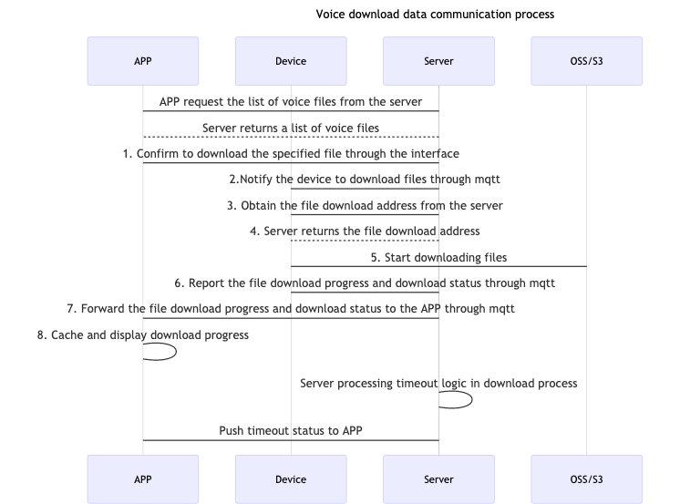

## Voice Package Download

### Data flow



### Function Introduction

The sweeper SDK provides a voice download function, which implements the `TuyaSmartSweeperDeviceDelegate` proxy protocol to receive the status change callback and download progress callback during the voice download process.

| Class                | Description                          |
| -------------------- | ------------------------------------ |
| TuyaSmartSweepDevice | Tuya sweeper device management class |


### Get Voice Package List

**Declaration**

Request the list of voice files available for the current sweeper device

```objective-c
- (void)getFileDownloadInfoWithSuccess:(void (^)(NSArray<TuyaSmartFileDownloadModel *> *upgradeFileList))success failure:(void (^)(NSError * _Nullable error))failure;
```

**Parameters**

| Class                      | Description                  |
| -------------------------- | ---------------------------- |
| TuyaSmartFileDownloadModel | The class of voice file data |

| Property    | Type                | Description                            |
| ----------- | ------------------- | -------------------------------------- |
| fileId      | NSString            | Voice file Id                          |
| productId   | NSString            | Product Id                             |
| name        | NSString            | Voice file name                        |
| desc        | NSString            | Voice file description                 |
| auditionUrl | NSString            | Download link for audio audition file  |
| officialUrl | NSString            | Download link for official voice files |
| imgUrl      | NSString            | Voice file icon download link          |
| region      | NSArray<NSString *> | Area code                              |

| Parameter | Description                                                  |
| --------- | ------------------------------------------------------------ |
| success   | success callback（upgradeFileList：List of available voice files） |
| failure   | failure callback                                             |

**Example**

Objc:

```objective-c
[self.sweeperDevice getFileDownloadInfoWithSuccess:^(NSArray<TuyaSmartFileDownloadModel *> * _Nonnull upgradeFileList) {
        
    } failure:^(NSError * _Nullable error) {
        
    }];
```

Swift:

```swift
sweeperDevice?.getFileDownloadInfo(success: { (upgradeFileList) in
            
        }, failure: { (error) in
            
        })
```


### Confirm Download Voice Package

**Declaration**

Confirm the download of the specified voice file

```objective-c
- (void)downloadFileWithFileId:(NSString *)fileId
                       success:(void (^)(id result))success
                       failure:(void (^)(NSError * _Nullable error))failure;
```

**Parameters**

| Parameter | Description                      |
| --------- | -------------------------------- |
| fileId    | Confirm downloaded voice file id |
| success   | success callback                 |
| failure   | failure callback                 |

**Example**

Objc:

```objective-c
[self.sweeperDevice downloadFileWithFileId:<#fileId#> success:^(id  _Nonnull result) {
        
    } failure:^(NSError * _Nullable error) {
        
    }];
```

Swift:

```swift
sweeperDevice?.downloadFile(withFileId: "", success: { (result) in
            
        }, failure: { (error) in
            
        })
```


### Get Voice Package Download Progress

**Declaration**

Voice file download progress data model

```objective-c
- (void)getFileDownloadRateWithSuccess:(void (^)(TuyaSmartFileDownloadRateModel *rateModel))success failure:(void (^)(NSError * _Nullable error))failure;
```

**Parameters**

| Class                          | Description                        |
| ------------------------------ | ---------------------------------- |
| TuyaSmartFileDownloadRateModel | File download progress information |

| Property | Type      | Description       |
| -------- | --------- | ----------------- |
| fileId   | NSString  | Voice file id     |
| deviceId | NSString  | Device id         |
| status   | NSInteger | Download status   |
| rate     | int       | Download progress |

| Parameter | Description                                                  |
| --------- | ------------------------------------------------------------ |
| success   | success callback（rateModel：Voice file download progress information） |
| failure   | failure callback                                             |

**Example**

Objc:

```objective-c
[self.sweeperDevice getFileDownloadRateWithSuccess:^(TuyaSmartFileDownloadRateModel * _Nonnull rateModel) {
        
    } failure:^(NSError * _Nullable error) {
        
    }];
```

Swift:

```swift
sweeperDevice?.getFileDownloadRate(success: { (rateModel) in
            
        }, failure: { (error) in
            
        })
```


### Voice Download Callback

#### Download status real-time callback

**Declaration**

Real-time callback of voice download status

```objective-c
- (void)sweeperDevice:(TuyaSmartSweeperDevice *)sweeperDevice type:(NSString *)type downloadStatus:(TuyaSmartSweeperFileDownloadStatus)status;
```

**Parameters**

| TuyaSmartSweeperFileDownloadStatus    | Description             |
| ------------------------------------- | ----------------------- |
| TuyaSmartSweeperFileDownloadUpgrading | File downloading        |
| TuyaSmartSweeperFileDownloadFinish    | File download completed |
| TuyaSmartSweeperFileDownloadFailure   | File download failed    |

| Parameter     | Description                                             |
| ------------- | ------------------------------------------------------- |
| sweeperDevice | `TuyaSmartSweeperDevice` instance                       |
| type          | File type                                               |
| status        | Downlaod status（`TuyaSmartSweeperFileDownloadStatus`） |

**Example**

Objc:

```objective-c
self.sweeperDevice = [TuyaSmartSweeperDevice deviceWithDeviceId:<#devId#>];
self.sweeperDevice.delegate = self;

- (void)sweeperDevice:(TuyaSmartSweeperDevice *)sweeperDevice type:(NSString *)type downloadStatus:(TuyaSmartSweeperFileDownloadStatus)status {
  
}
```

Swift:

```swift
sweeperDevice = TuyaSmartSweeperDevice.init(deviceId: "your_devId")
sweeperDevice?.delegate = self

func sweeperDevice(_ sweeperDevice: TuyaSmartSweeperDevice, type: String, downloadStatus status: TuyaSmartSweeperFileDownloadStatus) {
        
    }
```


#### Real-time callback of download progress

**Declaration**

Real-time callback of voice download progress

```objective-c
- (void)sweeperDevice:(TuyaSmartSweeperDevice *)sweeperDevice type:(NSString *)type downloadProgress:(int)progress;
```

**Parameters**

| Parameter     | Description                       |
| ------------- | --------------------------------- |
| sweeperDevice | `TuyaSmartSweeperDevice` instance |
| type          | File type                         |
| progress      | File download progress            |

**Example**

Objc:

```objective-c
self.sweeperDevice = [TuyaSmartSweeperDevice deviceWithDeviceId:<#devId#>];
self.sweeperDevice.delegate = self;

- (void)sweeperDevice:(TuyaSmartSweeperDevice *)sweeperDevice type:(NSString *)type downloadProgress:(int)progress {
  
}
```

Swift:

```swift
sweeperDevice = TuyaSmartSweeperDevice.init(deviceId: "your_devId")
sweeperDevice?.delegate = self

func sweeperDevice(_ sweeperDevice: TuyaSmartSweeperDevice, type: String, downloadProgress progress: Int32) {
        
    }
```