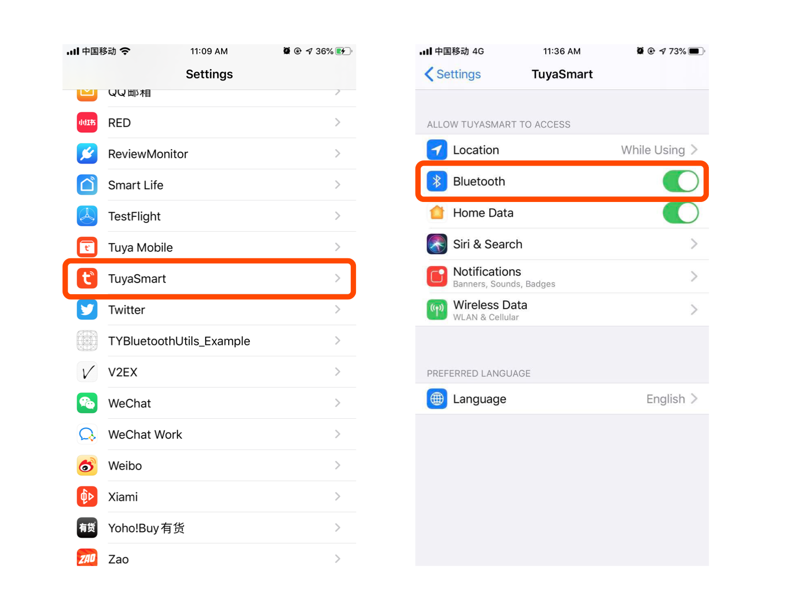

# iOS Version Adaptation

## iOS 14 Adaptation

Starting from iOS 14, the "local network" permission pop-up window will be triggered when the device is configured for network and local control of the local network. After the user clicks Allow, the app can send data to the local area network. If the user clicks to reject, the related functions will not be available. At present, Apple does not provide any API to get permission status. It is recommended that developers prompt and guide users to check "System Settings - App Settings" when related functions cannot be used normally to confirm whether the "Local Network" permission is turned on.

## iOS 13 Adaptation

### Wi-Fi Permission Changed

  Since iOS 13, if you disable the permission to access location, `[[TuyaSmartActivator sharedInstance] currentWifiSSID]` will return false SSID. Here's the Apple email:

  ```
  As we announced at WWDC19, we're making changes to further protect user privacy and prevent unauthorized location tracking. Starting with iOS 13, the CNCopyCurrentNetworkInfo API will no longer return valid Wi-Fi SSID and BSSID information. Instead, the information returned by default will be:

  SSID: "Wi-Fi" or "WLAN" (“WLAN" will be returned for the China SKU)
  BSSID: "00:00:00:00:00:00"
  ```

  1. Confirm the app has enabled the location permission.

2. When BSSID is "00:00:00:00:00:00", SSID is "Wi-Fi" or "WLAN" which is actually false and should be ignored. In this situation, let user input SSID manually is an option.

### Bluetooth Permission Changed

If you have integrated TuyaSmartHomeKit with Tuya bluetooth device, please pay attention on "Bluetooth" permission. In iOS 13, every application will have a "Bluetooth" permission independent. When application first launched, user will be asked to switch on/off this permission.

In iOS 13, Apple replaced the original `NSBluetoothPeripheralUsageDescription` fields used by Bluetooth to `NSBluetoothAlwaysUsageDescription` fields. At info.plist  Add new field to.


When user disable this permission, bluetooth center will get status of `CBCentralManagerStateUnauthorized`, please suggest user turn it on.




## iOS 12 Adaptation

In iOS 12, `[[TuyaSmartActivator sharedInstance] currentWifiSSID]` can't get ssid.

- Xcode 10 should open access wifi information capability to get ssid. This can be found at:
Xcode -> [Project Name] -> Targets -> [Target Name] -> Capabilities -> Access WiFi Information -> ON


