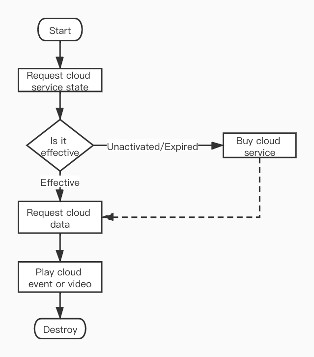

# Cloud Storage

Tuya IoT provides cloud storage service for smart camera, which can upload the video recorded by the device to Tuya cloud.

## Flow chart

Request the cloud storage service status first. If the cloud storage service is not activated or has expired and the cloud video has been completely deleted (after the cloud storage service expires, the uploaded cloud video will be retained for some days), you need to first purchase cloud storage services. If the cloud storage service is in the validity period, first request the dates of the cloud storage video, and then request the relevant data of the specified date, including cloud storage events, timeline data, authentication information, etc. After that, you can choose a cloud storage event or a point in time to start playing cloud video.



## Cloud service

### Import

Cloud storage purchase needs to introduce the SDK of cloud storage service purchase page, and add the following code in podfile:

```ruby
# specs source of Tuya
source 'https://github.com/TuyaInc/TYPublicSpecs.git'
source 'https://github.com/CocoaPods/Specs.git'

platform :ios, '9.0'
target 'Your_Target' do
  pod 'TYCameraCloudServicePanelSDK'
end
```

Then run the `pod update` command in the root directory of project.

### Use

Initializing the SDK of cloud storage purchase service requires passing in the channel identifier of the registered app on the Tuya development platform.

**Declaration**

To initialize the SDK, it needs to be called after `TuyaSmartSDK` is activated.

```objc
+ (void)setupWithAppScheme:(NSString *)scheme;
```

**Parameters**

| Parameter | Description               |
| --------- | ------------------------- |
| scheme    | Channel identifier of app |


**Example**

ObjC

```objc
- (BOOL)application:(UIApplication *)application didFinishLaunchingWithOptions:(NSDictionary *)launchOptions
{
    [[TuyaSmartSDK sharedInstance] startWithAppKey:@"your_appKey" secretKey:@"your_appSecret"];
    [TYCameraCloudServicePanelSDK setupWithAppScheme:@"your_scheme"];
}
```

Swift

``` swift
func application(_ application: UIApplication, didFinishLaunchingWithOptions launchOptions: [UIApplication.LaunchOptionsKey: Any]?) -> Bool {
    TuyaSmartSDK.sharedInstance().start(withAppKey: "your_appKey", secretKey: "your_appSecret")
    TYCameraCloudServicePanelSDK.setup(withAppScheme: "your_scheme")
    return true   
}
```

**Declaration**

Synchronize user login status.

```objc
+ (void)userStateChanged;
```

> When the user logs in/logs out, the login status of the user must to be synchronized.

**Example**

ObjC

```objc
- (void)login {
    [[TuyaSmartUser sharedInstance] loginByPhone:@"countryCode" phoneNumber:@"phoneNumber" password:@"password" success:^{
				[TYCameraCloudServicePanelSDK userStateChanged];
    } failure:^(NSError *error) {
				// failed
    }];
}
```

Swift

``` swift
func login() {
        TuyaSmartUser.sharedInstance().login("countryCode", phoneNumber: "phoneNumber", password: "password", success: {
            TYCameraCloudServicePanelSDK.userStateChanged()
        }) { (error) in
            //failed
        }
    }
```

###  Request cloud service purchase page

The cloud storage purchase page is an H5 page. Since the corresponding page address needs to be requested from the cloud, the interface to obtain the cloud storage page is asynchronous, and the `TuyaSmartDeviceMode` object of the corresponding device needs to be passed in.

**Declaration**

Gets the view controller that cloud storage purchased.

```objc
+ (void)cloudServicePanelWithDevice:(TuyaSmartDeviceModel *)deviceModel
                            success:(void(^)(UIViewController *vc))success
                            failure:(void(^)(NSError *error))failure;
```

**Parameters**

| Parameter   | Description                                                  |
| ----------- | ------------------------------------------------------------ |
| deviceModel | Device model                                                 |
| success     | Success callback, respond a view controller object of `UINavigationController` subclass |
| failure     | Failure callback, error indicates an error message           |

> The cloud storage purchase view controller returned by the interface is an object that is a subclass of `UINavigationController`, so it cannot be added to the navigation controller's view stack using `push`.

**Example**

ObjC

```objc
- (void)gotoCloudServicePanelWithDevice:(TuyaSmartDeviceModel *)deviceModel {
    [TYCameraCloudServicePanelSDK cloudServicePanelWithDevice:deviceModel success:^(UIViewController *vc) {
				[self presentViewController:vc animated:YES completion:nil];
	} failure:^(NSError *error) {
				//failed
	}];
}
```

Swift

``` swift
TYCameraCloudServicePanelSDK.cloudServicePanel(withDevice: deviceModel, success: { (vc) in
    self.presentViewController(vc, animated: true, completion:nil)
}) { (error) in
		//failed
}
```

## Cloud video

After purchasing the cloud storage service, the smart camera will upload the recorded video to the Tuya cloud. You can use the SDK to play videos that have been uploaded to the Tuya cloud.

**Class and Protocol**

| Class (Protocol)              | Description                                                  |
| ----------------------------- | ------------------------------------------------------------ |
| TuyaSmartCloudManager         | Cloud storage service status, video data management and cloud video playback |
| TuyaSmartCloudManagerDelegate | Cloud video playback delegate                                |

When `TuyaSmartCloudManager` initializes, the device id needs to be passed in. Cloud video starts playing silently by default. If the sound need turned on when playing, the mute state can be set to `NO` when initialization. When cloud video plays, both the video frame data and the frame information are called back using the delegate method.

**Declaration**

`TuyaSmartCloudManager` initialize.

```objc
- (instancetype)initWithDeviceId:(NSString *)devId;
```

**Parameters**

| Parameter | Description |
| --------- | ----------- |
| devId     | Deivice id  |


The `TuyaSmartCloudManagerDelegate `has only one method, will return each frame of video YUV data and frame information. If you want to render video frame by yourself, set `autoRender` of `TuyaSmartCloudManager` to `NO`( default is `YES`), and then render the video in delegate method.

**Declaration**

Respond video frame data and frame information.

```objc
- (void)cloudManager:(TuyaSmartCloudManager *)cloudManager didReceivedFrame:(CMSampleBufferRef)frameBuffer videoFrameInfo:(TuyaSmartVideoFrameInfo)frameInfo;
```

**Parameters**

| Parameter    | Description                    |
| ------------ | ------------------------------ |
| cloudManager | `TuyaSmartCloudManager` object |
| frameBuffer  | Video frame data               |
| frameInfo    | Video frame information        |

### Cloud storage data

Before playback the cloud video, the relevant data of cloud storage needs to be loaded first. This interface will return the current state of cloud storage service, as well as the corresponding encryption secret key and authentication information.

**Declaration**

Loading cloud storage data.

```objc
- (void)loadCloudData:(void(^)(TuyaSmartCloudState state))complete
```

**Parameters**

| Parameter | Description                                        |
| --------- | -------------------------------------------------- |
| complete  | Complete callback, return the cloud service status |

**enum TuyaSmartCloudState**

| Value                            | Description                                                  |
| -------------------------------- | ------------------------------------------------------------ |
| TuyaSmartCloudStateNoService     | The cloud storage service is not enabled                     |
| TuyaSmartCloudStateNoData        | Cloud storage is available, but there is no video            |
| TuyaSmartCloudStateValidData     | Cloud storage is available, and has the playback video       |
| TuyaSmartCloudStateExpiredNoData | The cloud storage service has expired and there is no video  |
| TuyaSmartCloudStateExpiredData   | The cloud storage service has expired, but there are still playback videos to view |
| TuyaSmartCloudStateLoadFailed    | Loading failed                                               |


After the cloud storage service expires, the uploaded cloud storage video is reserved for a period of time (usually 7 days, depending on the cloud storage service agreement). If there is no renewal during this period, the cloud storage video will be deleted after the expiration.

#### Cloud video date

After successfully returning the loaded cloud storage data, if there is video playback data in the cloud, the date of video playback data can be obtained by `cloudDays`property.

```objc
@property (nonatomic, strong, readonly) NSArray<TuyaSmartCloudDayModel *> *cloudDays;
```

**TuyaSmartCloudDayModel**

| Field       | Type      | Description                            |
| ----------- | --------- | -------------------------------------- |
| sumDuration | NSInteger | Video total sesonds of the day         |
| uploadDay   | NSString  | Date format string, format: yyyy-MM-dd |
| startTime   | NSInteger | Unix timestamp of  00:00:00            |
| endTime     | NSInteger | Unix timestamp of  23:59:59            |

#### Video time slice

Before playing the cloud video, you need to get the time slices of the video clips of that day.

**Declaration**

Get the time slices of the video clips of some day.

```objc
- (void)timeLineWithCloudDay:(TuyaSmartCloudDayModel *)cloudDay
                     success:(void(^)(NSArray<TuyaSmartCloudTimePieceModel *> * timePieces))success
                     failure:(void(^)(NSError * error))failure;
```

**Parameters**

| Parameter | Description                                        |
| --------- | -------------------------------------------------- |
| cloudDay  | `TuyaSmartCloudDayModel` object                    |
| success   | Success callback, return the time slices of videos |
| failure   | Failure callback, error indicates an error message |


**TuyaSmartCloudTimePieceModel**

| Field     | Type      | Description                      |
| --------- | --------- | -------------------------------- |
| startTime | NSInteger | Video start time, Unix timestamp |
| startDate | NSDate    | Video start date                 |
| endTime   | NSInteger | Video end time, Unix timestamp   |
| endDate   | NSDate    | Video end date                   |

#### Cloud event

After the cloud storage service is started, the device will be associated with the cloud video by detecting the events reported by the alarm. Cloud storage alarm events and detection alarm messages are slightly different. Their trigger reasons may be the same, but the deletion of detection alarm message will not affect the cloud storage event, and not all detection alarm messages will trigger the cloud video recording, such as lowpower warning. Moreover, cloud storage events are associated with cloud videos. Under normal circumstances, each cloud storage event will have a corresponding cloud video.

**Declaration**

Get cloud alarm events of some day.

```objc
- (void)timeEventsWithCloudDay:(TuyaSmartCloudDayModel *)cloudDay
                        offset:(int)offset
                         limit:(int)limit
                       success:(void(^)(NSArray<TuyaSmartCloudTimeEventModel *> * timeEvents))success
                       failure:(void(^)(NSError * error))failure;
```

**Parameters**

| Parameter | Description                                        |
| --------- | -------------------------------------------------- |
| cloudDay  | `TuyaSmartCloudDayModel` object                    |
| offset    | Offset, 0 marks the beginning of the first event   |
| limit     | Count limit, -1 indicates access to all events     |
| success   | Success callback, return the event mode list       |
| failure   | Failure callback, error indicates an error message |


**TuyaSmartCloudTimeEventModel**

| Field       | Type      | Description                                            |
| ----------- | --------- | ------------------------------------------------------ |
| describe    | NSString  | Description of event                                   |
| startTime   | NSInteger | Start time of event, Unix timestamp                    |
| endTime     | NSInteger | End time of event, Unix timestamp                      |
| snapshotUrl | NSString  | Camera captures a picture of the event when it happens |


### Cloud video playback

When playing a cloud video, you need to specify the start time, end time, and whether it is a event.

**Declaration**

Play cloud video.

```objc
- (void)playCloudVideoWithStartTime:(long)startTime
                            endTime:(long)endTime
                            isEvent:(BOOL)isEvent
                         onResponse:(void(^)(int errCode))responseCallback
                         onFinished:(void(^)(int errCode))finishedCallback;
```

**Parameters**

| Parameter        | Description                                                  |
| ---------------- | ------------------------------------------------------------ |
| startTime        | The start time to playback                                   |
| endTime          | The end time, cloud video playback will automatically continue to play until the end of all videos of the day |
| isEvent          | Is playback event                                            |
| responseCallback | Result callback, errCode is 0 indicates playback succeed     |
| finishedCallback | Video playback finished callback                             |

**Declaration**

Pause playabck.

```objc
- (int)pausePlayCloudVideo;
```

**Return**

| Type | Description                                                  |
| ---- | ------------------------------------------------------------ |
| int  | Error code, indicating the reason for the failure, 0 indicates succeed |

**Declaration**

Resume playback.

```objc
- (int)resumePlayCloudVideo;
```

**Return**

| Type | Description                                                  |
| ---- | ------------------------------------------------------------ |
| int  | Error code, indicating the reason for the failure, 0 indicates succeed |

**Declaration**

Stop playback.

```objc
- (int)stopPlayCloudVideo;
```

**Return**

| Type | Description                                                  |
| ---- | ------------------------------------------------------------ |
| int  | Error code, indicating the reason for the failure, 0 indicates succeed |

**Declaration**

Get the video rendering view.

```objc
- (UIView<TuyaSmartVideoViewType> *)videoView;
```

**Return**

| Type                           | Description                  |
| ------------------------------ | ---------------------------- |
| UIView<TuyaSmartVideoViewType> | Default video rendering view |


If play a video clip (`TuyaSmartCloudTimePieceModel`), `startTime` pass in a timestamp between `TuyaSmartCloudTimePieceModel.startTime` and `TuyaSmartCloudTimePieceModel.endTime`, `isEvent` pass in `NO`.

If play a event (`TuyaSmartCloudTimeEventModel`), `startTime` pass in `TuyaSmartCloudTimeEventModel.stsrtTime`, `isEvent` pass in `YES`.

The `endTime` could pass in 'TuyaSmartCloudDayModel.entTime'.

#### Other functions

**Declaration**

Enable mute of video.

```objc
- (void)enableMute:(BOOL)mute success:(void(^)(void))success failure:(void (^)(NSError * error))failure;
```

**Parameters**

| Parameter | Description                                        |
| --------- | -------------------------------------------------- |
| mute      | Is muted                                           |
| success   | Success callback                                   |
| failure   | Failure callback, error indicates an error message |

**Declaration**

Get mute state of video.

```objc
- (BOOL)isMuted;
```

**Return**

| Type | Description |
| ---- | ----------- |
| BOOL | Is muted    |

**Declaration**

Record the video and save it to the phone system album.

```objc
- (void)startRecord;
```

**Declaration**

Save the recorded video to the specified path.

```objc
- (void)startRecordAtPath:(NSString *)filePath;
```

**Parameters**

| Parameter | Description              |
| --------- | ------------------------ |
| filePath  | Save the video file path |

**Declaration**

Stop record and save the video.

```objc
- (int)stopRecord;
```

**Return**

| Type | Description                                                  |
| ---- | ------------------------------------------------------------ |
| int  | Error code, indicating the reason for the failure, 0 indicates succeed |

**Declaration**

Video screenshot, picture saved in the phone system album.

```objc
- (UIImage *)snapShoot;
```

**Return**

| Type    | Description                                                  |
| ------- | ------------------------------------------------------------ |
| UIImage | `UIImage` object of the video screenshot, returns nil to indicate that the image saved failed |

**Declaration**

Video screenshot, image saved in the specified file path.

```objc
- (UIImage *)snapShootAtPath:(NSString *)filePath thumbnilPath:(NSString *)thumbnilPath;
```

**Parameters**

| Parameter    | Description                                                  |
| ------------ | ------------------------------------------------------------ |
| filePath     | The file path to save the picture                            |
| thumbnilPath | Save the file path of the thumbnail and pass nil if you don't need it |

**Example**

ObjC

```objc
// self.devId = @"xxxxx";
- (void)viewDidLoad {
	_cloudManager = [[TuyaSmartCloudManager alloc] initWithDeviceId:self.devId];
    [_cloudManager enableMute:NO success:nil failure:nil];
	_cloudManager.delegate = self;
}

- (void)loadData {
	__weak typeof(self) weakSelf = self;
	[self.cloudManager loadCloudData:^(TuyaSmartCloudState state) {
      weak_self.cloudStorageDays = weak_self.cloudManager.cloudDays;
      weak_self.selectedDay = weak_self.cloudManager.cloudDays.lastObject;
      [weakSelf checkCloudState:state];
  }];
}

- (void)requestTimelineData {
    [self.cloudManager timeLineWithCloudDay:self.selectedDay success:^(NSArray<TuyaSmartCloudTimePieceModel *> *timePieces) {
		// success
    } failure:^(NSError *error) {
		// failed
    }];
}

-(void)playVideo:(TuyaSmartCloudTimePieceModel *)timePiece {
    [self.cloudManager playCloudVideoWithStartTime:timePiece.startTime endTime:self.selectedDay.endTime isEvent:NO onResponse:^(int errCode) {
        if (errCode == 0) {
            // success
        }else {
				    // failed
        }
    } onFinished:^(int errCode) {
	  		// finished
        if (errCode != 0) {
				    // Some error
        }
    }];
}

- (void)playEvent:(TuyaSmartCloudTimeEventModel *)event {
    [self.cloudManager playCloudVideoWithStartTime:event.startTime endTime:self.selectedDay.endTime isEvent:YES onResponse:^(int errCode) {
        if (errCode == 0) {
            // success
        }else {
    // failed
        }
    } onFinished:^(int errCode) {
  // finished
        if (errCode != 0) {
    // Some error
        }
    }];
}

- (void)pause {
    if ([self.cloudManager pausePlayCloudVideo] != 0) {
        // Pause playabck failed
    }
}

- (void)resume {
    if ([self.cloudManager resumePlayCloudVideo] != 0) {
        // Resume playback failed
    }
}

- (void)stop {
		[self.cloudManager stopPlayCloudVideo];
}

- (void)muteAction {
    BOOL isMuted = [self.cloudManger isMuted];
    [self.cloudManager enableMute:!isMuted success:^{
		// success
    } failure:^(NSError *error) {
		// failed
    }];
}

- (void)recordAction {
    if (self.isRecording) {
        if ([self.cloudManager stopRecord] != 0) {
            // Record video failed
        }else {
            // Record video success, the video has been saved to the system album
        }
      	self.isRecording = NO;
    }else {
        [self.cloudManager startRecord];
    		self.isRecording = YES;
    }
}

- (void)snapShoot {
    if ([self.cloudManager snapShoot]) {
        // The picture has been saved to the system album
    }else {
        // failed
    }
}

```

Swift

```swift
func viewDidLoad() {
    let cloudManager = TuyaSmartCloudManager(deviceId: devId)
    cloudManager?.enableMute(false, success: nil, failure: nil)
    cloudManager?.delegate = self
}

func loadData() {
    self.cloudManager.loadCloudData { [weak self] (state) in
    		self.cloudStorageDays = self.cloudManager.cloudDays
		    self.selectedDay =  self.cloudManager.cloudDays.last
    		self.checkCloudState(state)            
    }
}

func requestTimelineData() {
		self.cloudManager.timeLine(withCloudDay: self.selectedDay, success: { (timePieces) in
        //success
    }) { (error) in
        //failed
    }
}

func playVideo(_ timePiece: TuyaSmartCloudTimePieceModel) {
    self.cloudManager.playCloudVideo(withStartTime: timePiece.startTime, endTime:self.selectedDay.endTime , isEvent: false, onResponse: { (code) in
        if code == 0 {
            //success
        } else {
            //failed
        }
    }) { (errCode) in
        //finished
        if codeCode != 0 {
            //Some error
        }
    }
}
    
func playEvent(_ event: TuyaSmartCloudTimeEventModel) {
    cloudManager.playCloudVideo(withStartTime: event.startTime, endTime: self.selectedDay.endTime, isEvent: true, onResponse: { (errCode) in
        if code == 0 {
            //success
        } else {
            //failed
        }
    }) { (errCode) in
        //finished
        if errCode != 0 {
            // Some error
        }
    }
}

func pause() {
    if self.cloudManager.pausePlayCloudVideo() != 0 {
        // Pause playabck failed
    }
}

func resume() {
    if self.cloudManager.resumePlayCloudVideo() != 0 {
        // Resume playback failed
    }
}

func stop() {
		self.cloudManager.stopPlayCloudVideo()
}

func muteAction() {
    let isMuted = self.cloudManager.isMuted()
    self.cloudManager.enableMute(!isMuted, success: {
				// success
    }) { (error) in
        // failed
    }
}

func recordAction() {
    if self.isRecording {
        if self.cloudManager.stopRecord() != 0 {
            // Record video failed
        } else {
            // Record video success, the video has been saved to the system album
        }
        self.isRecording = false
    } else {
        self.cloudManager.startRecord()
        self.isRecording = true
    }
}

func snapShoot() {
    if self.cloudManager.snapShoot() {
        // The picture has been saved to the system album
    } else {
        // failed
    }
}
```


