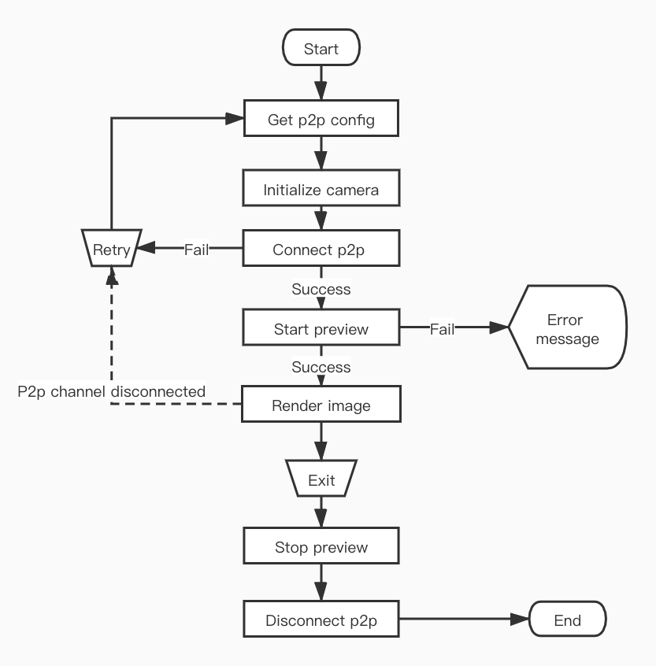

# Camera Features

Camera SDK provides live video of smart cameras, device memory card video playback, screenshots, recorded videos, and real-time calls with cameras. It also provides YUV data after video frame decoding. Developers can Perform secondary processing on the video data.

## Live video

After creating the `TuyaSmartCameraType` instance object, you can start playing live video. Video data transmission and command interaction are based on p2p channels.

### P2P connection

Before start playing the video, you need to connect the p2p channel. The connection status of p2p needs to be maintained by the developer. The SDK is only responsible for publish commands and receiving camera response results.

**Declaration**

Start connecting p2p channels.

``` objc
- (void)connect;
```

**Declaration**

Disconnect p2p channel.

```objc
- (void)disConnect;
```


**Delegate Declaration**

p2p channel successfully connected.

```objc
- (void)cameraDidConnected: (id <TuyaSmartCameraType>) camera;
```

**Delegate Declaration**

The p2p channel is disconnected and will only be called when it is passively disconnected, such as a poor network environment or the device actively disconnects.

```objc
- (void)cameraDisconnected: (id <TuyaSmartCameraType>) camera;
```

> The connect method may block the thread. It is recommended to call it from a child thread.

### Live video

After the p2p channel is successfully connected, you can start playing live video.

**Declaration**

Start playing live video.

```objc
- (void)startPreview;
```

**Declaration**

Stop playing live video.
```objc
- (void)stopPreview;
```

**Declaration**

Get video render view.

```objc
- (UIView<TuyaSmartVideoViewType> *)videoView;
```

**Delegate Declaration**

The live video has started successfully.

```objc
- (void)cameraDidBeginPreview: (id <TuyaSmartCameraType>) camera;
```

**Delegate Declaration**

The live video has successfully stopped playing.

```objc
- (void)cameraDidStopPreview: (id <TuyaSmartCameraType>) camera;
```

### Video rendering
After the video is successfully played, the SDK receives the video stream and it will be automatically rendered. Developers can use the camera object's `- (UIView<TuyaSmartVideoViewType> *)videoView` method to get the rendered view, add it to the screen, and set the layout properties.

**Protocol**

| Protocol               | Description                                                  |
| ---------------------- | ------------------------------------------------------------ |
| TuyaSmartVideoViewType | Video renderer protocol, depending on the camera implementation, the specific implementation of video rendering is also different |

**Declaration**

Image scaling properties. The default is `NO` . If the aspect ratio of the view is different from the aspect ratio of the video image, there will be black borders on the top, bottom, or left and right sides of the image. Set to `YES`, the image will stretch to cover the entire view, which may cause image distortion.

```objc
@property (nonatomic, assign) BOOL scaleToFill;
```

**Declaration**

Set image scaling.

```objc
- (void)tuya_setScaled:(float)scaled;
```

**Declaration**

Set image offset.

```objc
- (void)tuya_setOffset:(CGPoint)offset;
```

**Declaration**

Clear current image and cached video frames.

```objc
- (void)tuya_clear;
```

**Declaration**

Screenshot of the currently rendered image.

```objc
- (UIImage *)screenshot;
```

> The `TuyaSmartCameraType` object also provides an `autoRender` property, which defaults to `YES`, and the SDK will automatically render the video image. If the developer does not want the SDK to automatically render the video, this property can be set to `NO`, and then the YUV data of each frame of video can be obtained from the delegate method, and the video rendering is developed independently. Refer to [Original video data]( https://tuyainc.github.io/tuyasmart_camera_ios_sdk_doc/en/resource/av_function.html#original-video-data) .


#### Full screen

The SDK does not provide full-screen playback capabilities. Full-screen playback only needs to modify the layout of the video rendering view. If you need the video image to fill the view, you can set the `scaleToFill` property to YES, but the image may be stretched and deformed . In full-screen mode, the rotation of the horizontal and vertical screens and the layout changes need to be maintained by the developer.

### Flow chart



### Error callback

All error feedback of camera operation will be called back by delegate method.

**Declaration**

Camera operation failed callback.

```objc
- (void)camera:(id<TuyaSmartCameraType>)camera didOccurredErrorAtStep:(TYCameraErrorCode)errStepCode specificErrorCode:(NSInteger)errorCode;
```
**Parameters**

| Parameter   | Description                                       |
| ----------- | ------------------------------------------------- |
| camera      | The camera object where the error occurred        |
| errStepCode | Error operation                                   |
| errorCode   | Error code, indicating the reason for the failure |

**enum TYCameraErrorCode**

| Value | Description |
| -------------------------------- | --------------------------------- |
| TY_ERROR_NONE | None |
| TY_ERROR_CONNECT_FAILED | P2p connection failed |
| TY_ERROR_START_PREVIEW_FAILED | Live video play failed |
| TY_ERROR_START_PLAYBACK_FAILED | Memory card video playback failed |
| TY_ERROR_PAUSE_PLAYBACK_FAILED | Failed to pause video playback |
| TY_ERROR_RESUME_PLAYBACK_FAILED | Failed to resume video playback |
| TY_ERROR_ENABLE_MUTE_FAILED | Video sound switch failed |
| TY_ERROR_START_TALK_FAILED | Talk failed |
| TY_ERROR_RECORD_FAILED | Video recording failed |
| TY_ERROR_ENABLE_HD_FAILED | Failed to set video definition |
| TY_ERROR_GET_HD_FAILED | Failed to get video definition |
| TY_ERROR_QUERY_RECORD_DAY_FAILED | Memory card video playback date query failed |
| TY_ERROR_QUERY_TIMESLICE_FAILED | Memory card video clip query failed |


The meaning of `errorCode` can refer to the [Error Code](./resource/errors.html).

**Example**

ObjC

``` objc
#define kTuyaSmartIPCConfigAPI @"tuya.m.ipc.config.get"
#define kTuyaSmartIPCConfigAPIVersion @"2.0"

- (void)startStream {
    if (self.connected) {
        [self.camera startPreview];
        return;
    }
    id p2pType = [self.deviceModel.skills objectForKey:@"p2pType"];
    [[TuyaSmartRequest new] requestWithApiName:kTuyaSmartIPCConfigAPI postData:@{@"devId": self.devId} version:kTuyaSmartIPCConfigAPIVersion success:^(id result) {
        dispatch_async(dispatch_get_global_queue(DISPATCH_QUEUE_PRIORITY_DEFAULT, 0), ^{
            TuyaSmartCameraConfig *config = [TuyaSmartCameraFactory ipcConfigWithUid:[TuyaSmartUser sharedInstance].uid localKey:self.deviceModel.localKey configData:result];
            self.camera = [TuyaSmartCameraFactory cameraWithP2PType:p2pType config:config delegate:self];
            [self.camera connect];
        });
    } failure:^(NSError *error) {
				// Failed to get configuration information
    }];
}

#pragma mark - TuyaSmartCameraDelegate

- (void)cameraDidConnected:(id<TuyaSmartCameraType>)camera {
    self.connected = YES;
		[camera startPreview];
}

- (void)cameraDisconnected:(id<TuyaSmartCameraType>)camera {
    self.connected = NO;
    self.previewing = NO;
}

- (void)cameraDidBeginPreview:(id<TuyaSmartCameraType>)camera {
    self.previewing = YES;
		[self.view addSubview:camera.videoView];
}

- (void)cameraDidStopPreview:(id<TuyaSmartCameraType>)camera {
    self.previewing = NO;
}

- (void)camera:(id<TuyaSmartCameraType>)camera didOccurredErrorAtStep:(TYCameraErrorCode)errStepCode specificErrorCode:(NSInteger)errorCode {
		if (errStepCode == TY_ERROR_CONNECT_FAILED) {
      	// p2p connect failed
        self.connected = NO;
    }
    else if (errStepCode == TY_ERROR_START_PREVIEW_FAILED) {
      	// live video play failed
        self.previewing = NO;
    }
}
```

Swift

```swift
func startStream() {
    if self.isConnected {
        self.camera.startPreview()
        return
    }
    let p2pType = self.deviceModel.skills["p2pType"]!
    TuyaSmartRequest().request(withApiName: kTuyaSmartIPCConfigAPI, postData: ["devId": self.devId], version: kTuyaSmartIPCConfigAPIVersion, success: { result in
        guard let responder = result as? [AnyHashable:Any] else {
            return;
        }
        DispatchQueue.global().async {
            let config = TuyaSmartCameraFactory.ipcConfig(withUid: TuyaSmartUser.sharedInstance().uid, localKey: self.deviceModel.localKey, configData: responder)
            self.camera = TuyaSmartCameraFactory.camera(withP2PType: p2pType, config: config, delegate: self)
            self.camera.connect()
        }
    }) { _ in
				// Failed to get configuration information
    }
}

func cameraDidConnected(_ camera: TuyaSmartCameraType!) {
    self.isConnected = true
    camera.startPreview()
}

func cameraDisconnected(_ camera: TuyaSmartCameraType!) {
    self.isConnected = false
    self.isPreviewing = false
}

func cameraDidBeginPreview(_ camera: TuyaSmartCameraType!) {
    self.isPreviewing = true;
    self.view.addSubview(camera.videoView())
}

func cameraDidStopPreview(_ camera: TuyaSmartCameraType!) {
    self.isPreviewing = false
}

func camera(_ camera: TuyaSmartCameraType!, didOccurredErrorAtStep errStepCode: TYCameraErrorCode, specificErrorCode errorCode: Int) {
    if errStepCode == TY_ERROR_CONNECT_FAILED  {
      	// p2p connect failed
        self.isConnected = false
    }else if errStepCode == TY_ERROR_START_PREVIEW_FAILED {
      	// live video play failed
        self.isPreviewing = false
    }
}
```

> When the app enters the background, it is necessary to stop the video playback. The video data uses hardware decoding and OpenGL rendering. When the app is in the background and continues to play, the app may crash. In addition, Tuya smart cameras generally support a maximum of 5 p2p channels (that is, 5 mobile phones can be connected at the same time). It is recommended that the app actively disconnect the p2p connection after a period of time in the background to release resources.