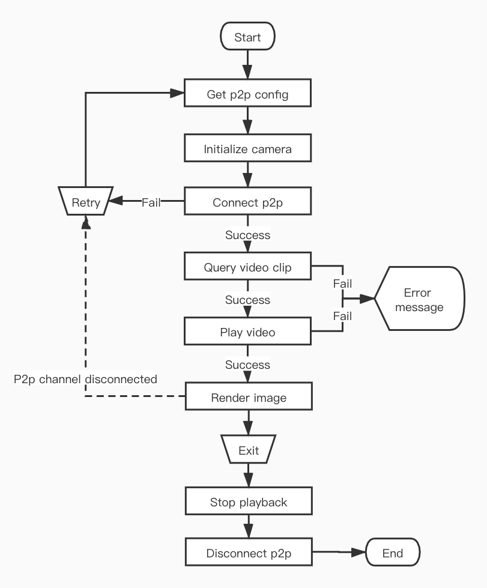

## Memory card video playback

Tuya smart camera support memory card recording. After the smart camera is inserted into the memory card, you can view the information and status of the memory card, and set the recording switch and mode. For details, please refer to [Memory card management](https://tuyainc.github.io/tuyasmart_camera_ios_sdk_doc/en/resource/sd_card.html).

After the device saves the video recording in the memory card, it can play the video recording on the App side through the Camera SDK. Like the live video, it needs to connect to the p2p channel before starting playback. After the p2p channel is successfully connected, you can obtain the time information of the video clip recorded in the memory card on the device, and then play the video clip.

### Video clip

The video clips saved in the memory card on the device can be as long as 10 minutes and as short as 10 seconds. The SDK supports viewing and playing video recordings on a day-by-day basis, and provides query on which days are saved with video recordings in a month, so that users can view them, and the query results are returned through the delegate method in `TuyaSmartCameraDelegate`.

**Description**

Query the days when video recordings are saved in a certain year and month.

```objc
- (void)queryRecordDaysWithYear:(NSUInteger)year month:(NSUInteger)month;
```

**Parameters**

| Parameter | Description         |
| --------- | ------------------- |
| year      | Year, such as: 2020 |
| month     | Month, such as: 2   |

**Description**

Query all video clips in a certain month and day.

```objc
- (void)queryRecordTimeSliceWithYear:(NSUInteger)year month:(NSUInteger)month day:(NSUInteger)day;
```

**Parameters**

| Parameter | Description         |
| --------- | ------------------- |
| year      | Year, such as: 2020 |
| month     | Month, such as: 2   |
| day       | Day, such as: 22    |


**Delegate Description**

Callback for querying the date of video recording.

```objc
- (void)camera:(id<TuyaSmartCameraType>)camera didReceiveRecordDayQueryData:(NSArray<NSNumber *> *)days;
```

**Parameters**

| Parameter | Description                                                  |
| --------- | ------------------------------------------------------------ |
| camera    | Camera object                                                |
| days      | An array of days with video recordings, such as `@[@(1), @(2)] ` indicates the current month of the query, there are video recordings on the 1st，2nd |

**Delegate Description**

Callback when querying all video clips in a day.

```objc
- (void)camera:(id<TuyaSmartCameraType>)camera didReceiveTimeSliceQueryData:(NSArray<NSDictionary *> *)timeSlices;
```

**Parameters**

| Parameter  | Description                                                  |
| ---------- | ------------------------------------------------------------ |
| camera     | Camera object                                                |
| timeSlices | Array of time information of video clips for the day, failure returns empty array |


**Video clip time data**

The element type in `timeSlices` is` NSDictionary`.

| Field (Constant defined in SDK)   | Type     | Description                             |
| --------------------------------- | -------- | --------------------------------------- |
| kTuyaSmartPlaybackPeriodStartDate | NSDate   | Video clip start date                   |
| kTuyaSmartPlaybackPeriodStopDate  | NSDate   | Video clip end date                     |
| kTuyaSmartPlaybackPeriodStartTime | NSNumber | Unix timestamp of video clip start time |
| kTuyaSmartPlaybackPeriodStopTime  | NSNumber | Unix timestamp of video clip end time   |


### Video playback

After successfully obtaining the video clips of a certain day, you can start playing the video. It is worth noting that if you stop playing the video recording and then play live video, or the p2p connection is disconnected, reconnect to the p2p channel, and then play the video recording again, you need to re-acquire the video clip of the day, otherwise it may appear exception.

**Description**

To start playing a certain video recording, the range of `playTime` is:` [startTime, stopTime) `.

```objc
- (void)startPlayback:(NSInteger)playTime startTime:(NSInteger)startTime stopTime:(NSInteger)stopTime;
```

**Parameters**

| Parameter | Description                                                  |
| --------- | ------------------------------------------------------------ |
| playTime  | In this video, the time point to start playing, using Unix timestamp |
| startTime | Start time of this video, using Unix timestamp               |
| stopTime  | End time of this video, using Unix timestamp                 |

**Description**

Pause playback.

```objc
- (void)pausePlayback;
```

**Description**

Resume playback.

```objc
- (void)resumePlayback;
```

**Description**

Stop play.

```objc
- (void)stopPlayback;
```


**Delegate Description**

Video playback started successfully.

```objc
- (void)cameraDidBeginPlayback:(id<TuyaSmartCameraType>)camera;
```

**Delegate Description**

Video playback paused.

```objc
- (void)cameraDidPausePlayback:(id<TuyaSmartCameraType>)camera;
```

**Delegate Description**

Video playback resumed.

```objc
- (void)cameraDidResumePlayback:(id<TuyaSmartCameraType>)camera;
```

**Delegate Description**

Video has stopped playing.

```objc
- (void)cameraDidStopPlayback:(id<TuyaSmartCameraType>)camera;
```

**Delegate Description**

Video playback finished,.

```objc
- (void)cameraPlaybackDidFinished:(id<TuyaSmartCameraType>)camera;
```


#### Continuous Play

Tuya smart camera has two recording modes, continuous recording and event recording. During continuous recording, the video recording will be a clip of 10 minutes, and all video clips are continuous, but if there is a video recording stop in the middle, there may be a gap between the video clips in the continuous recording mode. When recording events, the length of each video clip varies, and the interval between clips varies.

If the video recording segment of a certain day is continuous, then the next segment will be played automatically when the video is played. In other words, even if the start playback interface is called, the time of the first video clip of the day is passed in, and the video will be played until the last frame of the last video clip of the day, and the delegate method of the video playback finished will be called back.

If the video clip on a certain day is discontinuous (that is, there is a video clip B after a certain period of time after video clip A ends), the video is played to the disconnected position (that is, the last frame of video clip A is played), the video stream will automatically stop, and the SDK will not receive a callback when the video recording is over. In the latest Tuya smart camera firmware, when video clips are not continuous, each clip playback will call back the finished of video recording playback, so developers can play the next video after receiving the delegate method of the video playback finished. But if the device's firmware version is not the latest, the developer needs to use the time stamp in the frame information to determine whether the current frame is the last frame of the current video recording clip, determine whether the current video recording clip is playing finished, refer to [Original video data](https://tuyainc.github.io/tuyasmart_camera_ios_sdk_doc/en/resource/av_function.html#original-video-data).

#### Stop and Pause

Both `pausePlayback` and `stopPlayback` can achieve the purpose of stopping video playback. The difference between them is that after calling  `stopPlayback`, `resumePlayback` cannot be called to resume playback. After you stop playing, if you want to continue the previous progress and start playing, you must save the time stamp of the last frame of video when you stop playing, and the time segment of the video recorded to play, and call the `startPlayback` method to resume playback.

In addition, after successfully obtaining the time data of the video recording segment, whether it is playing the recording video or pausing playback, you can directly call  `startPlayback`  to replay another video recording segment without first calling `stopPlayback` to stop playback.

### Flow chart



**Example**

ObjC

```objc
#define kTuyaSmartIPCConfigAPI @"tuya.m.ipc.config.get"
#define kTuyaSmartIPCConfigAPIVersion @"2.0"

- (void)startPlayback {
    if (self.connected) {
        [self.camera queryRecordTimeSliceWithYear:2020 month:2 day:12];
        return;
    }
    id p2pType = [self.deviceModel.skills objectForKey:@"p2pType"];
    [[TuyaSmartRequest new] requestWithApiName:kTuyaSmartIPCConfigAPI postData:@{@"devId": self.devId} version:kTuyaSmartIPCConfigAPIVersion success:^(id result) {
        dispatch_async(dispatch_get_global_queue(DISPATCH_QUEUE_PRIORITY_DEFAULT, 0), ^{
            TuyaSmartCameraConfig *config = [TuyaSmartCameraFactory ipcConfigWithUid:[TuyaSmartUser sharedInstance].uid localKey:self.deviceModel.localKey configData:result];
            self.camera = [TuyaSmartCameraFactory cameraWithP2PType:p2pType config:config delegate:self];
            [self.camera connect];
        });
    } failure:^(NSError *error) {
				// Failed to get configuration information
    }];
}

- (void)pausePlayback {
    [self.camera pausePlayback];
}

- (void)resumePlayback {
    [self.camera resumePlayback];
}

- (void)stopPlayback {
    [self.camera stopPlayback];
}

#pragma mark - TuyaSmartCameraDelegate

- (void)cameraDidConnected:(id<TuyaSmartCameraType>)camera {
    self.connected = YES;
		[camera queryRecordTimeSliceWithYear:2020 month:2 day:12];
}

- (void)cameraDisconnected:(id<TuyaSmartCameraType>)camera {
    self.connected = NO;
    self.playbacking = NO;
}

- (void)camera:(id<TuyaSmartCameraType>)camera didReceiveTimeSliceQueryData:(NSArray<NSDictionary *> *)timeSlices {
		if (timeSlices.count == 0) {
        return;
    }
  	// start playback with first video clip
    self.timeSlicesInCurrentDay = [timeSlices copy];
  	self.timeSlicesIndex = 0;
    NSDictionary *timeSlice = timeSlices.firstObject;
    NSInteger startTime = [timeSlice[kTuyaSmartTimeSliceStartTime] integerValue];
    NSInteger stopTime = [timeSlice[kTuyaSmartTimeSliceStopTime] integerValue];

    NSInteger playTime = startTime;
    [camera startPlayback:playTime startTime:startTime stopTime:stopTime];
}

- (void)camera:(id<TuyaSmartCameraType>)camera ty_didReceiveVideoFrame:(CMSampleBufferRef)sampleBuffer frameInfo:(TuyaSmartVideoFrameInfo)frameInfo {
    NSInteger index = self.timeSlicesIndex + 1;
    if (index >= self.timeSlicesInCurrentDay.count) {
        return;
    }
    NSDictionary *currentTimeSlice = [self.timeSlicesInCurrentDay objectAtIndex:self.timeSlicesIndex];
    NSInteger stopTime = [currentTimeSlice[kTuyaSmartTimeSliceStopTime] integerValue];
  	// if timestamp of current frame is equal or greater than the end time of current video clip, play next video
    if (frameInfo.nTimeStamp >= stopTime) {
        NSDictionary *nextTimeSlice = [self.timeSlicesInCurrentDay objectAtIndex:index];
        NSInteger startTime = [nextTimeSlice[kTuyaSmartTimeSliceStartTime] integerValue];
	    	NSInteger stopTime = [nextTimeSlice[kTuyaSmartTimeSliceStopTime] integerValue];
    		NSInteger playTime = startTime;
    		[camera startPlayback:playTime startTime:startTime stopTime:stopTime];
    }
}

- (void)cameraDidBeginPlayback:(id<TuyaSmartCameraType>)camera {
  	self.playbacking = YES;
    self.playbackPaused = NO;
		[self.view addSubview:camera.videoView];
}

- (void)cameraDidPausePlayback:(id<TuyaSmartCameraType>)camera {
    self.playbackPaused = YES;
}

- (void)cameraDidResumePlayback:(id<TuyaSmartCameraType>)camera {
    self.playbackPaused = NO;
}

- (void)cameraDidStopPlayback:(id<TuyaSmartCameraType>)camera {
   	self.playbacking = NO;
    self.playbackPaused = NO;
}

- (void)cameraPlaybackDidFinished:(id<TuyaSmartCameraType>)camera {
    self.playbacking = NO;
    self.playbackPaused = NO;
}

- (void)camera:(id<TuyaSmartCameraType>)camera didOccurredErrorAtStep:(TYCameraErrorCode)errStepCode specificErrorCode:(NSInteger)errorCode {
		if (errStepCode == TY_ERROR_CONNECT_FAILED) {
      	// p2p connect failed
        self.connected = NO;
    }
    else if (errStepCode == TY_ERROR_START_PLAYBACK_FAILED) {
      	// start playback failed
        self.playbacking = NO;
		    self.playbackPaused = NO;
    }
  	else if (errStepCode == TY_ERROR_PAUSE_PLAYBACK_FAILED) {
				// pause playback failed
    }
    else if (errStepCode == TY_ERROR_RESUME_PLAYBACK_FAILED) {
				// resume playback failed
    }
}
```

Swift

```swift
func startPlayback() {
    if self.isConnected {
        self.camera.queryRecordTimeSlice(withYear: 2020, month: 2, day: 12)
        return
    }
    let p2pType = self.deviceModel.skills["p2pType"]!
    TuyaSmartRequest().request(withApiName: kTuyaSmartIPCConfigAPI, postData: ["devId": self.devId], version: kTuyaSmartIPCConfigAPIVersion, success: { result in
        guard let responder = result as? [AnyHashable:Any] else {
            return;
        }
        DispatchQueue.global().async {
            let config = TuyaSmartCameraFactory.ipcConfig(withUid: TuyaSmartUser.sharedInstance().uid, localKey: self.deviceModel.localKey, configData: responder)
            self.camera = TuyaSmartCameraFactory.camera(withP2PType: p2pType, config: config, delegate: self)
            self.camera.connect()
        }
    }) { _ in
				// Failed to get configuration information
    }
}

func pausePlayback() {
    self.camera.pausePlayback()
}

func resumePlayback() {
    self.camera.resumePlayback()
}

func stopPlayback() {
    self.camera.stopPlayback()
}

func cameraDidConnected(_ camera: TuyaSmartCameraType!) {
    self.isConnected = true
  	// start playback with first video clip
    camera.queryRecordTimeSlice(withYear: 2020, month: 2, day: 12)
}

func cameraDisconnected(_ camera: TuyaSmartCameraType!) {
    self.isConnected = false
    self.isPlaybacking = false
}

func camera(_ camera: TuyaSmartCameraType!, didReceiveTimeSliceQueryData timeSlices: [[AnyHashable : Any]]!) {
    guard timeSlices.count > 0 else {
        return;
    }
  	// start playback with first video clip
    self.timeSlices = timeSlices
    self.timesliceIndex = 0
    let video = timeSlices.first!
    let startTime = video[kTuyaSmartTimeSliceStartTime] as! Int
    let stopTime = video[kTuyaSmartTimeSliceStopTime] as! Int
  
    let playTime = startTime
    camera.startPlayback(playTime, startTime: startTime, stopTime: stopTime)
}

func camera(_ camera: TuyaSmartCameraType!, ty_didReceiveVideoFrame sampleBuffer: CMSampleBuffer!, frameInfo: TuyaSmartVideoFrameInfo) {
    let index = self.timesliceIndex + 1
    guard index < self.timeSlices.count else {
        return
    }
    let currentTimeSlice = timeSlices[self.timesliceIndex]
    let endTime = currentTimeSlice[kTuyaSmartTimeSliceStopTime] as! Int
    guard frameInfo.nTimeStamp >= endTime else {
        return
    }
  	// if timestamp of current frame is equal or greater than the end time of current video clip, play next video
    let nextTimeSlice = timeSlices.first!
    let startTime = nextTimeSlice[kTuyaSmartTimeSliceStartTime] as! Int
    let stopTime = nextTimeSlice[kTuyaSmartTimeSliceStopTime] as! Int
    let playTime = startTime
    camera.startPlayback(playTime, startTime: startTime, stopTime: stopTime)
}

func cameraDidBeginPlayback(_ camera: TuyaSmartCameraType!) {
    self.isPlaybacking = true
    self.isPlaybackPaused = false
    self.view.addSubview(camera.videoView())
}

func cameraDidPausePlayback(_ camera: TuyaSmartCameraType!) {
    self.isPlaybackPaused = true
}

func cameraDidResumePlayback(_ camera: TuyaSmartCameraType!) {
    self.isPlaybackPaused = false
}

func cameraDidStopPlayback(_ camera: TuyaSmartCameraType!) {
    self.isPlaybacking = false
    self.isPlaybackPaused = false
}

func cameraPlaybackDidFinished(_ camera: TuyaSmartCameraType!) {
    self.isPlaybacking = false
    self.isPlaybackPaused = false
}

func camera(_ camera: TuyaSmartCameraType!, didOccurredErrorAtStep errStepCode: TYCameraErrorCode, specificErrorCode errorCode: Int) {
    if errStepCode == TY_ERROR_CONNECT_FAILED  {
      	// p2p connect failed
        self.isConnected = false
    }else if errStepCode == TY_ERROR_START_PLAYBACK_FAILED {
      	// start playback failed
        self.isPlaybacking = false
        self.isPlaybackPaused = false
    }else if errStepCode == TY_ERROR_PAUSE_PLAYBACK_FAILED {
				// pause playback failed
    }else if errStepCode == TY_ERROR_RESUME_PLAYBACK_FAILED {
				// resume playback failed
    }
}
```

> During live video, if you want to switch to video playback mode, you do not need to disconnect the p2p connection and then reconnect to the p2p channel, but you need to stop the live video playback before you get the video recording of the day to start playing.

