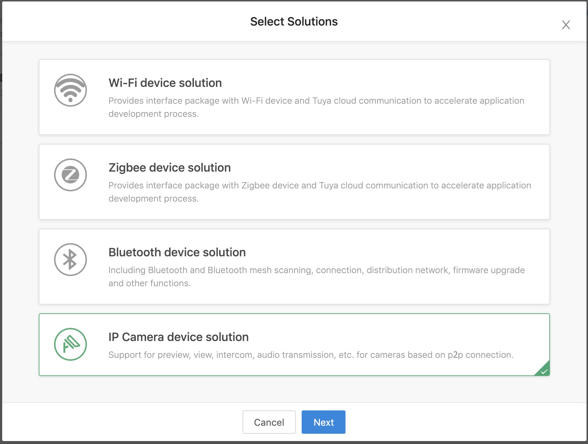

# Integrated SDK

## Solutions introduction

Before integrate Tuya smart camera SDK, please learn about [Home SDK](https://tuyainc.github.io/tuyasmart_home_ios_sdk_doc/en/).

The Camera SDK depends on the user management, device configuration, home management, device management parts of the Home SDK, and on this basis, the functions of the smart camera device are realized.

The Tuya Open Platform provides various integrate modes based on Tuya's mature IoT services, refer to [Solutions Introduction](https://docs.tuya.com/en/iot/open-api/quick-start/solution-overview).

### Mini SDK

Based on the partner own App, embed in Tuya's mini sdk (only includes the distribution network package: ssid, password and user token obtained from the cloud). Device status changes can't be pushed to the App directly, the pushing ability to rely on the partner's own cloud.

However, since the camera cannot be controlled using open api, the Mini SDK solution still needs to integrate the Camera SDK.

You can use the open api provided by Tuya Cloud to develop user management, cloud storage, alarm detection, and functions based on data points. Use Tuya smart Camera SDK to develop the basic functions of camera like live video.

**Modules**

| Module             | Description                                        |
| ------------------ | -------------------------------------------------- |
| TuyaSmartActivator | Device network configuration for Mini SDK solution |
| TuyaSmartCameraKit | Tuya smart camera business core kit                |

Add the following content in the `Podfile` file.

```ruby
platform :ios, '9.0'

target 'your_target_name' do

  pod "TuyaSmartActivator"
	pod "TuyaSmartCameraKit"
	# pod "TuyaSmartCameraT"

end
```

### Full SDK

The App is based entirely on the full version of the Home SDK, which can take full advantage of the various capabilities provided by the Home SDK, such as: distribution network, device control, home management, scene management, upgrade management, etc. and reduce the difficulty of App development.

**Modules**

| Module                | Description                                        |
| --------------------- | -------------------------------------------------- |
| TuyaSmartActivatorKit | Device network configuration for Full SDK solution |
| TuyaSmartCameraKit    | Tuya smart camera business core kit                |

> Mini SDK is use `TuyaSmartActivator` to configure network for device, but Full SDK is `TuyaSmartActivatorKit`. These two modules cannot be dependent at the same time, which will cause compilation conflicts.
>
> `TuyaSmartCameraKit `is not a separate library, refer to [SDK Architecture](https://tuyainc.github.io/tuyasmart_camera_ios_sdk_doc/en/resource/architecture.html).

Add the following content in the `Podfile` file.

```ruby
platform :ios, '9.0'

target 'your_target_name' do

  pod "TuyaSmartActivatorKit"
	pod "TuyaSmartCameraKit"
	# pod "TuyaSmartCameraT"

end
```

If your App need to support p2p 1.0, need to add  `pod "TuyaSmartCameraT"`.

Then run the `pod update` command in the root directory of project. For use of CocoaPods, please refer to the [CocoaPods Guides](https://guides.cocoapods.org/). It is recommended to update the CocoaPods to the latest version.

## Preparation work

Before starting to develop with the SDK, you need to register a developer account, create a product, etc. on the Tuya Smart Development Platform, and obtain a key to activate the SDK. Refer to [Preparation work](https://tuyainc.github.io/tuyasmart_home_ios_sdk_doc/en/resource/Preparation.html).

Please select IP Camera device solution when obtain SDK.



## Initialize SDK

1. Open project setting, `Target => General`, edit `Bundle Identifier` to the value from Tuya develop center.

2. Import security image to the project and rename as `t_s.bmp`, then add it into `Project Setting => Target => Build Phases => Copy Bundle Resources`.

3. Add the following to the project file `PrefixHeader.pch`, Swift project add the following to the `xxx_Bridging-Header.h` file:

   ```objc
   #import <TuyaSmartBaseKit/TuyaSmartBaseKit.h>
   #import <TuyaSmartActivatorKit/TuyaSmartActivatorKit.h>
   #import <TuyaSmartCameraKit/TuyaSmartCameraKit.h>
   ```

4. Open file `AppDelegate.m`，and use the `App Key` and `App Secret` obtained from the development platform in the `[AppDelegate application:didFinishLaunchingWithOptions:]`method to initialize SDK:

   ObjC

   ```objc
   [[TuyaSmartSDK sharedInstance] startWithAppKey:<#your_app_key#> secretKey:<#your_secret_key#>];
   ```

   Swift

   ```swift
   TuyaSmartSDK.sharedInstance()?.start(withAppKey: <#your_app_key#>, secretKey: <#your_secret_key#>)
   ```

Now all the prepare work has been completed. You can use the sdk to develop your application now.

## Debug Mode

During the development we can open debug mode, print the log to analyze some problem.

ObjC

```objc
#ifdef DEBUG
    [[TuyaSmartSDK sharedInstance] setDebugMode:YES];
#else
#endif
```

Swift

```swift
#if DEBUG
   TuyaSmartSDK.sharedInstance()?.debugMode = true
#else
#endif

```

