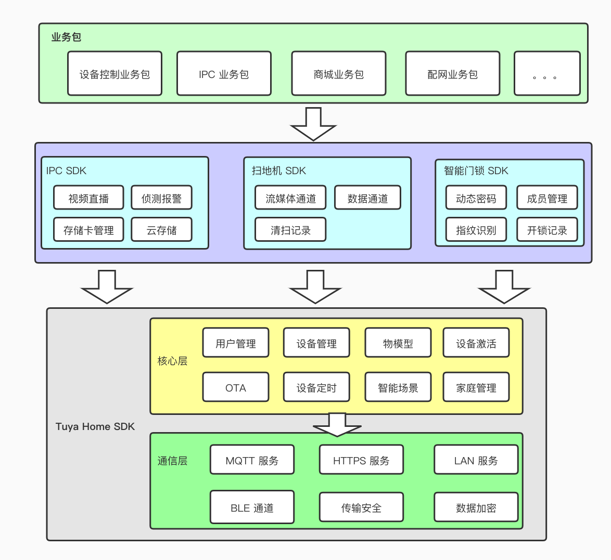

# 功能概述

## Home SDK

iOS Home SDK 是一套涂鸦智能针对全屋智能领域提供的 iOS 9.0 及以上版本的 SDK。iOS 开发者可以基于 SDK 快速的实现 APP 功能开发，实现对智能设备的配网，控制，固件升级，定时任务，智能场景等操作。

SDK 主要包括以下功能：

- 账户体系（手机号、邮箱的注册和登录、重置密码，session 失效处理等用户体系相关的功能）
- 家庭体系 （家庭管理、房间管理、家庭共享等功能）
- 设备相关（设备配网、设备控制、设备的状态上报、群组、定时任务、固件升级）

## 垂直品类 SDK

涂鸦还提供了一些垂直品类的 SDK，包括 IPC SDK，智能门锁 SDK，扫地机 SDK 等。主要针对垂直品类特有的功能进行了封装，方便垂直品类产品功能的快速开发。

垂直品类 SDK 是基于 Home SDK，架构设计如下图所示：

