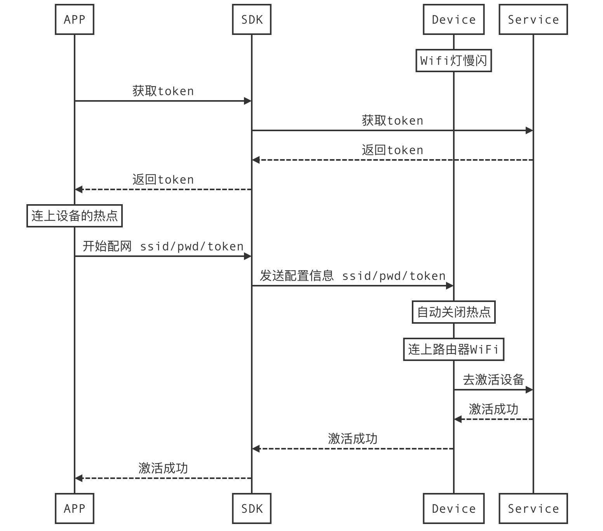

## 设备配网

涂鸦硬件Wifi模块支持两种配网模式：

- 快连模式（TLink，简称EZ模式）、热点模式（AP模式）。
- 快连模式操作较为简便，建议在配网失败后，再使用热点模式作为备选方案。

配网相关的所有功能对应`TuyaSmartActivator`类（单例）。


### 快连模式（EZ配网）

**EZ模式配网流程：**


#### 获取token

开始配网之前，SDK需要在联网状态下从涂鸦云获取配网Token，然后才可以开始EZ/AP模式配网。Token的有效期为5分钟，且配置成功后就会失效（再次配网需要重新获取）。

```
- (void)getToken {
	[[TuyaSmartActivator sharedInstance] getTokenWithHomeId:homeId success:^(NSString *token) {
		NSLog(@"getToken success: %@", token);
		// TODO: startConfigWiFi
	} failure:^(NSError *error) {
		NSLog(@"getToken failure: %@", error.localizedDescription);
	}];
}
```

#### 开始配网

EZ模式配网：

```objc
- (void)startConfigWiFi:(NSString *)ssid password:(NSString *)password token:(NSString *)token {
	// 设置 TuyaSmartActivator 的 delegate，并实现 delegate 方法
	[TuyaSmartActivator sharedInstance].delegate = self;

	// 开始配网
	[[TuyaSmartActivator sharedInstance] startConfigWiFi:TYActivatorModeEZ ssid:ssid password:password token:token timeout:100];
}

#pragma mark - TuyaSmartActivatorDelegate
- (void)activator:(TuyaSmartActivator *)activator didReceiveDevice:(TuyaSmartDeviceModel *)deviceModel error:(NSError *)error {

	if (!error && deviceModel) {
		//配网成功
    }

    if (error) {
        //配网失败
    }
}

```

注意`ssid`和`password`需要填写的是路由器的热点名称和密码，并不是设备的热点名称和密码。

#### 停止配网

开始配网操作后，APP会持续广播配网信息（直到配网成功，或是超时）。如果需要中途取消操作或配网完成，需要调用`[TuyaSmartActivator stopConfigWiFi]`方法。

```objc
- (void)stopConfigWifi {
	[TuyaSmartActivator sharedInstance].delegate = nil;
	[[TuyaSmartActivator sharedInstance] stopConfigWiFi];
}
```

### 热点模式（AP配网）

**AP模式配网流程：**



#### 获取token

开始配网之前，SDK需要在联网状态下从涂鸦云获取配网Token，然后才可以开始EZ/AP模式配网。Token的有效期为5分钟，且配置成功后就会失效（再次配网需要重新获取）。

```
- (void)getToken {
	[[TuyaSmartActivator sharedInstance] getTokenWithHomeId:homeId success:^(NSString *token) {
		NSLog(@"getToken success: %@", token);
		// TODO: startConfigWiFi
	} failure:^(NSError *error) {
		NSLog(@"getToken failure: %@", error.localizedDescription);
	}];
}
```

#### 开始配网

AP模式配网：

```objc
- (void)startConfigWiFi:(NSString *)ssid password:(NSString *)password token:(NSString *)token {
	// 设置 TuyaSmartActivator 的 delegate，并实现 delegate 方法
	[TuyaSmartActivator sharedInstance].delegate = self;

	// 开始配网
	[[TuyaSmartActivator sharedInstance] startConfigWiFi:TYActivatorModeAP ssid:ssid password:password token:token timeout:100];
}

#pragma mark - TuyaSmartActivatorDelegate
- (void)activator:(TuyaSmartActivator *)activator didReceiveDevice:(TuyaSmartDeviceModel *)deviceModel error:(NSError *)error {

	if (!error && deviceModel) {
		//配网成功
    }

    if (error) {
        //配网失败
    }
}

```

AP模式配网与EZ模式类似，把`[TuyaSmartActivator startConfigWiFi:ssid:password:token:timeout:]`的第一个参数改为`TYActivatorModeAP`即可。注意`ssid`和`password`需要填写的是路由器的热点名称和密码，并不是设备的热点名称和密码。

注意`ssid`和`password`需要填写的是路由器的热点名称和密码，并不是设备的热点名称和密码。

#### 停止配网

开始配网操作后，APP会持续广播配网信息（直到配网成功，或是超时）。如果需要中途取消操作或配网完成，需要调用`[TuyaSmartActivator stopConfigWiFi]`方法。

```objc
- (void)stopConfigWifi {
	[TuyaSmartActivator sharedInstance].delegate = nil;
	[[TuyaSmartActivator sharedInstance] stopConfigWiFi];
}
```


### Zigbee 网关配网

Zigbee 网关配网采用有线配网，不用输入路由器的热点名称和密码。


#### 获取token

开始配网之前，SDK需要在联网状态下从涂鸦云获取配网Token，然后才可以开始EZ/AP模式配网。Token的有效期为5分钟，且配置成功后就会失效（再次配网需要重新获取）。

```
- (void)getToken {
	[[TuyaSmartActivator sharedInstance] getTokenWithHomeId:homeId success:^(NSString *token) {
		NSLog(@"getToken success: %@", token);
		// TODO: startConfigWiFi
	} failure:^(NSError *error) {
		NSLog(@"getToken failure: %@", error.localizedDescription);
	}];
}
```

#### Zigbee 网关激活

```objc
- (void)startConfigWiFiToken:(NSString *)token {
	// 设置 TuyaSmartActivator 的 delegate，并实现 delegate 方法
	[TuyaSmartActivator sharedInstance].delegate = self;

	// 开始配网
	[[TuyaSmartActivator sharedInstance] startConfigWiFiWithToken:token timeout:100];
}

#pragma mark - TuyaSmartActivatorDelegate
- (void)activator:(TuyaSmartActivator *)activator didReceiveDevice:(TuyaSmartDeviceModel *)deviceModel error:(NSError *)error {

	if (!error && deviceModel) {
		//配网成功
    }

    if (error) {
        //配网失败
    }

}

```

#### 停止配网

开始配网操作后，APP会持续广播配网信息（直到配网成功，或是超时）。如果需要中途取消操作或配网完成，需要调用`[TuyaSmartActivator stopConfigWiFi]`方法。

```objc
- (void)stopConfigWifi {
	[TuyaSmartActivator sharedInstance].delegate = nil;
	[[TuyaSmartActivator sharedInstance] stopConfigWiFi];
}
```


### Zigbee 子设备激活

#### 

如果需要中途取消操作或配网完成，需要调用`stopActiveSubDeviceWithGwId`方法

```objc
- (void)activeSubDevice {

	[[TuyaSmartActivator sharedInstance] activeSubDeviceWithGwId:@"your_device_id" timeout:100 success:^{
		NSLog(@"active sub device success");
	} failure:^(NSError *error) {
		NSLog(@"active sub device failure: %@", error);
	}];
}

#pragma mark - TuyaSmartActivatorDelegate
- (void)activator:(TuyaSmartActivator *)activator didReceiveDevice:(TuyaSmartDeviceModel *)deviceModel error:(NSError *)error {

    if (!error && deviceModel) {
		//配网成功
    }

    if (error) {
        //配网失败
    }
}
```

#### 停止激活zigbee子设备

```objc
- (void)stopActiveSubDevice {
	[[TuyaSmartActivator sharedInstance] stopActiveSubDeviceWithGwId:@"your_device_id"];
}
```
