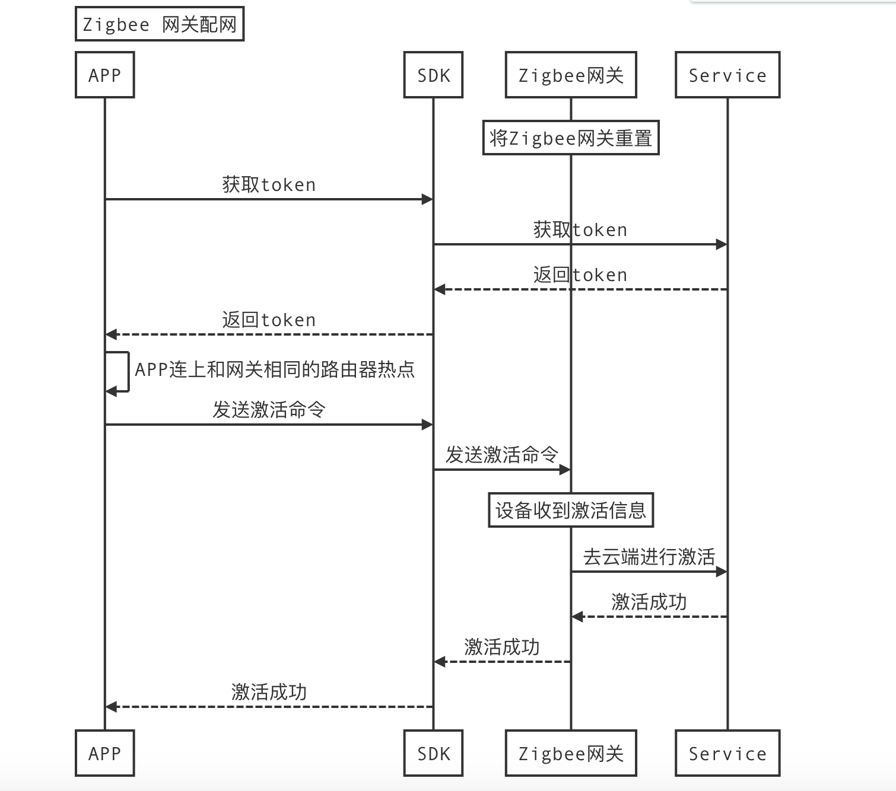

##### Zigbee 网关配网


Zigbee 网关配网采用有线配网，不用输入路由器的热点名称和密码。




##### 获取token

开始配网之前，SDK需要在联网状态下从涂鸦云获取配网Token，然后才可以开始EZ/AP模式配网。Token的有效期为5分钟，且配置成功后就会失效（再次配网需要重新获取）。

```
- (void)getToken {
	[[TuyaSmartActivator sharedInstance] getTokenWithHomeId:homeId success:^(NSString *token) {
		NSLog(@"getToken success: %@", token);
		// TODO: startConfigWiFi
	} failure:^(NSError *error) {
		NSLog(@"getToken failure: %@", error.localizedDescription);
	}];
}
```

##### zigbee 网关激活

```objc
- (void)startConfigWiFiToken:(NSString *)token {
	// 设置 TuyaSmartActivator 的 delegate，并实现 delegate 方法
	[TuyaSmartActivator sharedInstance].delegate = self;
	
	// 开始配网
	[[TuyaSmartActivator sharedInstance] startConfigWiFiWithToken:token timeout:100];
}

#pragma mark - TuyaSmartActivatorDelegate
- (void)activator:(TuyaSmartActivator *)activator didReceiveDevice:(TuyaSmartDeviceModel *)deviceModel error:(NSError *)error {
	
	if (!error && deviceModel) {
		//配网成功
    }
    
    if (error) {
        //配网失败
    }	

}

```

##### 停止配网

开始配网操作后，APP会持续广播配网信息（直到配网成功，或是超时）。如果需要中途取消操作或配网完成，需要调用`[TuyaSmartActivator stopConfigWiFi]`方法。

```objc
- (void)stopConfigWifi {
	[TuyaSmartActivator sharedInstance].delegate = nil;
	[[TuyaSmartActivator sharedInstance] stopConfigWiFi];
}
```

#### 