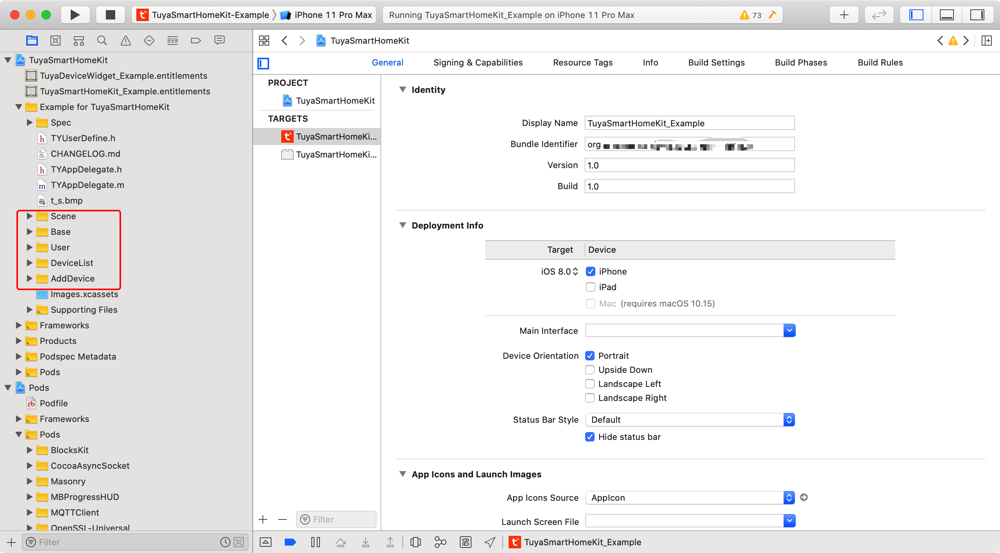
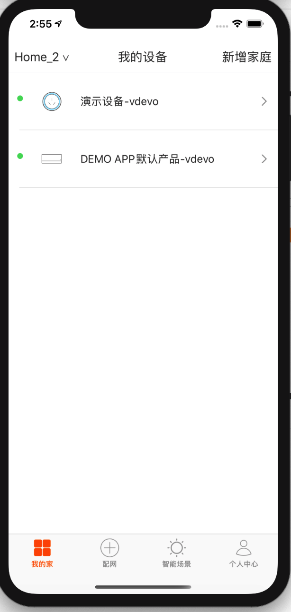
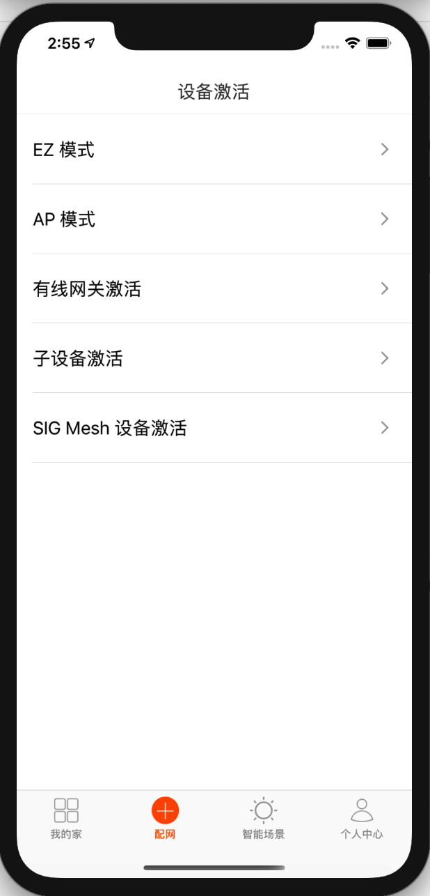
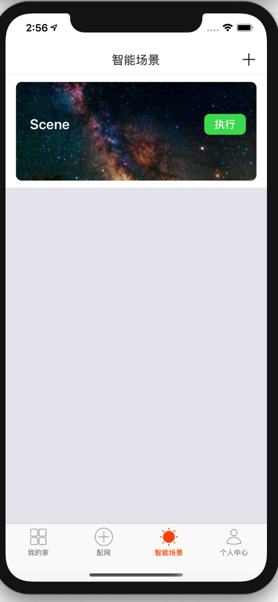
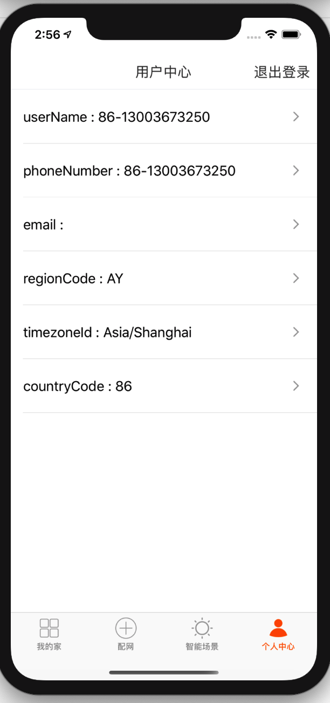

## Demo App

### 简介：

Demo App 主要介绍了 SDK 开发流程，以及一些简单的业务逻辑。在开发 App 之前，建议先按照本文档完成 Demo App 的操作。

在[准备工作](/resource/Preparation.html)章节里面获取 `iOS` 的 `AppKey`、 `AppSecret`、安全图片。集成 SDK 时请确认 `BundleId`、`AppKey`、`AppSecret`、安全图片是否与平台上的信息一致，任意一个不匹配会导致 SDK 无法使用。




### 功能概述：

Demo App 主要包括了

- 登录模块：账号（手机或者邮箱）的注册和登录
- 家庭管理和设备管理模块：包括家庭的创建和当前家庭的切换。家庭中设备列表的展现，设备功能点的控制。设备重命名和设备移除。
- 设备配网模块：包括 EZ 模式，AP 模式，有线网关配网，网关子设备配网
- 智能场景模块：场景的创建和场景的执行
- 用户信息模块：用户的信息

<div align=left>

  
  
  


**[Demo 链接](https://github.com/TuyaInc/tuyasmart_home_ios_sdk)**


###常见问题：

**API 接口请求提示签名错误**

```objc
{
  "success" : false,
  "errorCode" : "SING_VALIDATE_FALED",
  "status" : "error",
  "errorMsg" : "Permission Verification Failed",
  "t" : 1583208740059
}
```


* 确认 BundleId、AppKey、AppSecret、安全图片是否与 IoT 平台上的信息一致，任意一个不匹配都将校验失败。具体请按照[准备工作](./Preparation.md)章节来进行检查。