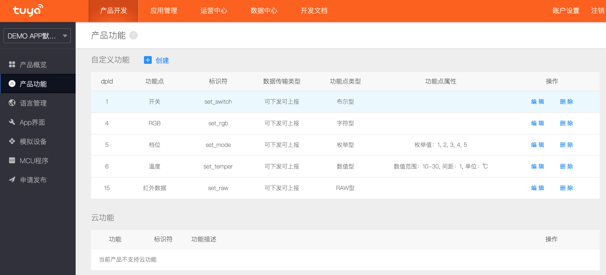

## 设备控制

设备控制相关的所有功能对应`TuyaSmartDevice`类，需要使用设备Id进行初始化。错误的设备Id可能会导致初始化失败，返回`nil`。


### 更新设备信息

#### 更新单个设备信息

```objc
- (void)updateDeviceInfo {
	// self.device = [TuyaSmartDevice deviceWithDeviceId:@"your_device_id"];

	__weak typeof(self) weakSelf = self;
	[self.device syncWithCloud:^{
		NSLog(@"syncWithCloud success");
		NSLog(@"deviceModel: %@", weakSelf.device.deviceModel);
	} failure:^{
		NSLog(@"syncWithCloud failure");
	}];
}
```


### 设备功能点

`TuyaSmartDeviceModel`类的`dps`属性（`NSDictionary`类型）定义了当前设备的状态，称作数据点（DP点）或功能点。

`dps`字典里的每个`key`对应一个功能点的`dpId`，`value`对应一个功能点的`dpValue `，`dpValue`为该功能点的值。<br />

产品功能点定义参见[涂鸦开发者平台](https://developer.tuya.com/)的产品功能，如下图所示：




发送控制指令按照以下格式：

`{"<dpId>":"<dpValue>"}`

根据后台该产品的功能点定义，示例代码如下:

```objc
- (void)publishDps {
    // self.device = [TuyaSmartDevice deviceWithDeviceId:@"your_device_id"];

    NSDictionary *dps;
	//设置dpId为1的布尔型功能点示例 作用:开关打开
	dps = @{@"1": @(YES)};

	//设置dpId为4的字符串型功能点示例 作用:设置RGB颜色为ff5500
	dps = @{@"4": @"ff5500"};

	//设置dpId为5的枚举型功能点示例 作用:设置档位为2档
	dps = @{@"5": @"2"};

	//设置dpId为6的数值型功能点示例 作用:设置温度为20°
	dps = @{@"6": @(20)};

	//设置dpId为15的透传型(byte数组)功能点示例 作用:透传红外数据为1122
	dps = @{@"15": @"1122"};

	//多个功能合并发送
	dps = @{@"1": @(YES), @"4": @(ff5500)};

	[self.device publishDps:dps success:^{
		NSLog(@"publishDps success");

		//下发成功，状态上报通过 deviceDpsUpdate方法 回调

	} failure:^(NSError *error) {
		NSLog(@"publishDps failure: %@", error);
	}];


}
```
##### 注意事项：
- 控制命令的发送需要特别注意数据类型。<br />
  比如功能点的数据类型是数值型（value），那控制命令发送的应该是 `@{@"2": @(25)}`  而不是  `@{@"2": @"25"}`<br />
- 透传类型传输的byte数组是字符串格式、字母需小写并且必须是偶数位。<br />
  比如正确的格式是: `@{@"1": @"011f"}` 而不是 `@{@"1": @"11f"}`

功能点更多概念参见[快速入门-功能点相关概念](https://docs.tuya.com/cn/creatproduct/#_7)

#### 设备状态更新

实现`TuyaSmartDeviceDelegate`代理协议后，可以在设备状态更变的回调中进行处理，刷新APP设备控制面板的UI。

```objc
- (void)initDevice {
	self.device = [TuyaSmartDevice deviceWithDeviceId:@"your_device_id"];
	self.device.delegate = self;
}

#pragma mark - TuyaSmartDeviceDelegate

- (void)device:(TuyaSmartDevice *)device dpsUpdate:(NSDictionary *)dps {
	NSLog(@"deviceDpsUpdate: %@", dps);
	// TODO: 刷新界面UI
}

- (void)deviceInfoUpdate:(TuyaSmartDevice *)device {
	//当前设备信息更新 比如 设备名、设备在线状态等
}

- (void)deviceRemoved:(TuyaSmartDevice *)device {
	//当前设备被移除
}

```

### 修改设备名称

```objc
- (void)modifyDeviceName:(NSString *)mame {
	// self.device = [TuyaSmartDevice deviceWithDeviceId:@"your_device_id"];

	[self.device updateName:name success:^{
		NSLog(@"updateName success");
	} failure:^(NSError *error) {
		NSLog(@"updateName failure: %@", error);
	}];
}
```

### 移除设备

设备被移除后，会重新进入待配网状态（快连模式）。

```objc
- (void)removeDevice {
	// self.device = [TuyaSmartDevice deviceWithDeviceId:@"your_device_id"];

	[self.device remove:^{
		NSLog(@"remove success");
	} failure:^(NSError *error) {
		NSLog(@"remove failure: %@", error);
	}];
}
```

### 获取设备的wifi信号强度

```objc
- (void)getWifiSignalStrength {
	// self.device = [TuyaSmartDevice deviceWithDeviceId:@"your_device_id"];
    // self.device.delegate = self;

	[self.device getWifiSignalStrengthWithSuccess:^{
		NSLog(@"get wifi signal strength success");
	} failure:^(NSError *error) {
		NSLog(@"get wifi signal strength failure: %@", error);
	}];
}

#pragma mark - TuyaSmartDeviceDelegate

- (void)device:(TuyaSmartDevice *)device signal:(NSString *)signal {
    NSLog(@" signal : %@", signal);
}
```

### 获取网关下的子设备列表

```objc
- (void)getSubDeviceList {
	// self.device = [TuyaSmartDevice deviceWithDeviceId:@"your_device_id"];

	[self.device getSubDeviceListFromCloudWithSuccess:^(NSArray<TuyaSmartDeviceModel *> *subDeviceList) {
        NSLog(@"get sub device list success");
    } failure:^(NSError *error) {
        NSLog(@"get sub device list failure: %@", error);
    }];
}
```

### 固件升级

**固件升级流程:**

获取设备升级信息 -> 下发联网模块升级指令 -> 联网模块升级成功 -> 下发设备控制模块升级指令 -> 设备控制模块升级成功

#### 获取设备升级信息：

```objc
- (void)getFirmwareUpgradeInfo {
	// self.device = [TuyaSmartDevice deviceWithDeviceId:@"your_device_id"];

	[self.device getFirmwareUpgradeInfo:^(NSArray<TuyaSmartFirmwareUpgradeModel *> *upgradeModelList) {
		NSLog(@"getFirmwareUpgradeInfo success");
	} failure:^(NSError *error) {
		NSLog(@"getFirmwareUpgradeInfo failure: %@", error);
	}];
}
```

#### 下发升级指令：

```objc
- (void)upgradeFirmware {
	// self.device = [TuyaSmartDevice deviceWithDeviceId:@"your_device_id"];
	// 设备类型type 从获取设备升级信息接口 getFirmwareUpgradeInfo 返回的类型
	// TuyaSmartFirmwareUpgradeModel - type

	[self.device upgradeFirmware:type success:^{
		NSLog(@"upgradeFirmware success");
	} failure:^(NSError *error) {
		NSLog(@"upgradeFirmware failure: %@", error);
	}];
}
```

#### 回调接口：
```objc
- (void)deviceFirmwareUpgradeSuccess:(TuyaSmartDevice *)device type:(NSInteger)type {
	//固件升级成功
}

- (void)deviceFirmwareUpgradeFailure:(TuyaSmartDevice *)device type:(NSInteger)type {
	//固件升级失败
}

- (void)device:(TuyaSmartDevice *)device firmwareUpgradeProgress:(NSInteger)type progress:(double)progress {
	//固件升级的进度
}

```


### 获取数据点的历史数据

#### 【描述】

获取dp点的历史状态数据，例如电量等信息。

1、获取dp点所有的历史数据

```objective-c
_request = [[TuyaSmartRequest alloc] init];

[_request requestWithApiName:@"m.smart.dp.his.stat.get.all" postData:@{@"devId":@"your_devId", @"dpId":@"device_dpId"} version:@"1.0" success:^(id result) {

} failure:^(NSError *error) {

}];

```

2、获取dp点一个月的历史数据

```objective-c
_request = [[TuyaSmartRequest alloc] init];

[_request requestWithApiName:@"m.smart.dp.his.stat.get.month" postData:@{@"devId":@"your_devId", @"month":@"201809", @"dpId":@"device_dpId"} version:@"1.0" success:^(id result) {

} failure:^(NSError *error) {

}];

```
