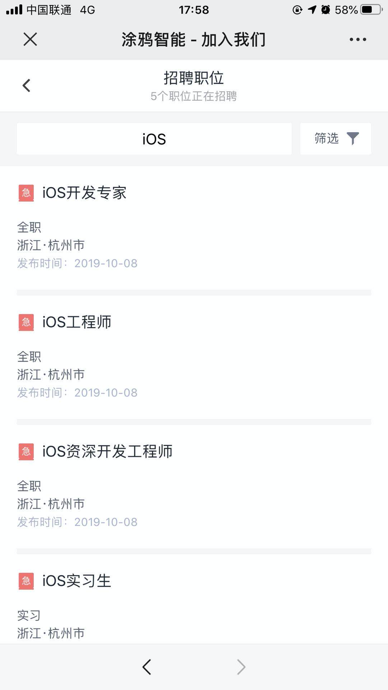

#  加入我们

🎉 🎉 涂鸦 iOS SDK 组招新了～ 🎉 🎉

## 职位介绍

### 资深 iOS 开发工程师

- 该职位请发送到： xucheng@tuya.com
- Title：[Github] 姓名-应聘职位名称
- PS：`技术类`岗位投递简历时建议附带作品介绍或技术文档链接

##### 职位描述

1.独立完成 iOS 客户端程序的开发，相关功能预研和研究；

2.负责 iOS 端的相关IoT SDK的开发、维护；

3.负责 iOS 端的架构设计，提升团队开发和协作效率；

##### 岗位要求：

1.本科及以上学历，3 年以上 iOS 开发经验，具有良好的英文阅读能力；

2.熟悉 Objective-C 语言，深入理解  OC 的运行时特性，有 IoT 方面开发经验的优先考虑；

3.熟悉算法、数据结构和常用的设计模式；

4.具有良好的技术钻研能力，能够深入底层解决技术难题；

5.有强烈的责任心和团队精神，善于沟通和合作；

## 关于我们

关于 [涂鸦智能](https://tuya.com/)，期待您的加入！

## 更多职位：

[招聘职位](https://app.mokahr.com/apply/tuya/3236#/?_k=hkx2cx)

## 其他招聘渠道

### 邮箱渠道：有 Github 标志，优先进入筛选列表哦 😄

- To： bole@tuya.com
- Title：[Github] 姓名-应聘职位名称
- PS：`技术类`岗位投递简历时建议附带作品介绍或链接

### 其他渠道招聘：可以直接搜索岗位并投递

- [其他渠道投简历](https://app.mokahr.com/apply/tuya/3236#/?anchorName=007&sourceToken=&_k=mvljbz)