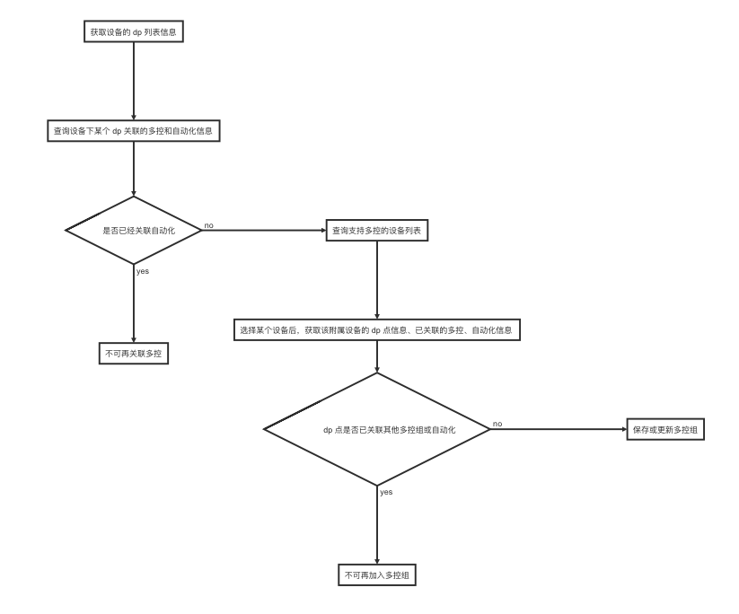

## 多控关联

### 概述

设备多控关联是指设备的某个 dp 与另一个设备的某个 dp 之间建立关联，生成一个多控组，当控制多控组内某个建立 dp 关联的设备，组内其他设备关联的 dp 点状态同步。

例如：三个二路 zigbee 子设备开关，每个开关的第一个 dp 点与另外两个开关的第一个 dp 点建立多控组，当控制其中一个开关的第一个 dp 状态为关闭状态，另外两个开关的第一个 dp 同步关闭。

**目前支持 zigbee 子设备、mesh 子设备类型的开关**

**支持跨 pid**

**注:** 目前限制 dpCode 是 `switch_数字` 、`sub_switch_数字`类型的 dp

| 类名                  | 说明                 |
| --------------------- | -------------------- |
| TuyaSmartMultiControl | 设备多控关联接口封装 |

### 业务流程图




### 获取设备的 dp 信息

**接口说明**

从云端获取设备所有dp的多语言名称等信息

```objective-c
- (void)getDeviceDpInfoWithDevId:(NSString *)devId success:(void (^)(NSArray<TuyaSmartMultiControlDatapointModel *> *))success failure:(TYFailureError)failure;
```

**参数说明**

| 参数    | 说明                                                         |
| ------- | ------------------------------------------------------------ |
| devId   | 设备 id                                                      |
| success | 成功回调 （参数 `NSArray<TuyaSmartMultiControlDatapointModel *> *）` |
| failure | 失败回调                                                     |

**`TuyaSmartMultiControlDatapointModel`字段信息**


| 字段     | 类型     | 说明                       |
| -------- | -------- | -------------------------- |
| dpId     | NSString | 设备 dp id                 |
| name     | NSString | 设备 dp 名称               |
| code     | NSString | 设备 dp 标准名称（dpCode） |
| schemaId | NSString | 按键  dp 所属的 schema Id  |

**示例代码**

**Objc:**

```objective-c
TuyaSmartMultiControl *multiControl = [[TuyaSmartMultiControl alloc] init];
[multiControl getDeviceDpInfoWithDevId:@"your_devId" success:^(NSArray<TuyaSmartMultiControlDatapointModel *> * list) {

} failure:^(NSError *error) {

}];
```

**Swift:**

```swift
let multiControl = TuyaSmartMultiControl.init()
multiControl.getDeviceDpInfo(withDevId: "your_devId", success: { (list) in

}) { (error) in

}
```


### 查询某个 dp 的关联信息

**接口说明**

查询当前的设备 dp 关联的多控和自动化详情，当前设备为主设备，关联的其他设备为附属设备

```objective-c
- (void)queryDeviceLinkInfoWithDevId:(NSString *)devId dpId:(NSString *)dpId success:(void (^)(TuyaSmartMultiControlLinkModel *))success failure:(TYFailureError)failure;
```

**参数说明**

| 参数    | 说明                                                |
| ------- | --------------------------------------------------- |
| devId   | 主设备 id                                           |
| dpId    | 主设备 dp id                                        |
| success | 成功回调（参数 `TuyaSmartMultiControlLinkModel *`） |
| failure | 失败回调                                            |

**`TuyaSmartMultiControlLinkModel` 字段信息**

| 字段        | 类型                                              | 说明                       |
| ----------- | ------------------------------------------------- | -------------------------- |
| multiGroup  | TuyaSmartMultiControlGroupModel                   | 已关联多控组数据结构       |
| parentRules | NSArray<`TuyaSmartMultiControlParentRuleModel *`> | 已关联的场景自动化数据结构 |

**`TuyaSmartMultiControlGroupModel`字段信息**

| 字段           | 类型                                               | 说明           |
| -------------- | -------------------------------------------------- | -------------- |
| multiControlId | NSString                                           | 多控组id       |
| groupName      | NSString                                           | 多控组名称     |
| groupType      | NSInteger                                          | 多控组类型     |
| groupDetail    | NSArray<`TuyaSmartMultiControlGroupDetailModel *`> | 多控组信息     |
| enabled        | BOOL                                               | 是否开启多控组 |
| multiRuleId    | NSString                                           |                |
| ownerId        | NSString                                           | 家庭 id        |
| uid            | NSString                                           | 用户 id        |

**`TuyaSmartMultiControlGroupDetailModel`字段信息**

| 字段           | 类型                                             | 说明                                     |
| -------------- | ------------------------------------------------ | ---------------------------------------- |
| detailId       | NSString                                         |                                          |
| multiControlId | NSString                                         | 多控组id                                 |
| devId          | NSString                                         | 附属设备 id                              |
| devName        | NSString                                         | 附属设备名称                             |
| dpId           | NSString                                         | 已关联的附属设备的 dp id                 |
| dpName         | NSString                                         | 已关联的附属设备的 dp 名称               |
| enabled        | BOOL                                             | 已关联的附属设备是否可以通过多控功能控制 |
| datapoints     | NSArray<`TuyaSmartMultiControlDatapointModel *`> | dp 点信息                                |

**`TuyaSmartMultiControlParentRuleModel`字段信息**

| 字段   | 类型     | 说明       |
| ------ | -------- | ---------- |
| ruleId | NSString | 自动化 id  |
| name   | NSString | 自动化名称 |

**示例代码**

**Objc:**

```objective-c
TuyaSmartMultiControl *multiControl = [[TuyaSmartMultiControl alloc] init];
[multiControl queryDeviceLinkInfoWithDevId:@"your_devId" dpId:@"your_dpId" success:^(TuyaSmartMultiControlLinkModel * model) {

} failure:^(NSError *error) {

}];
```

**Swift:**

```swift
let multiControl = TuyaSmartMultiControl.init()
multiControl.queryDeviceLinkInfo(withDevId: "your_devId", dpId: "your_dpId", success: { (linkModel) in

}) { (error) in

}
```


### 新增多控组

**接口说明**

```objective-c
- (void)addMultiControlWithDevId:(NSString *)devId groupName:(NSString *)groupName groupDetail:(NSArray<TuyaSmartMultiControlDetailModel *> *)groupDetail success:(void (^)(TuyaSmartMultiControlModel *))success failure:(TYFailureError)failure;
```

**参数说明**

| 参数        | 说明                                                         |
| ----------- | ------------------------------------------------------------ |
| devId       | 主设备 id                                                    |
| groupName   | 多控组名称                                                   |
| groupDetail | 多控组关联详情（参数 NSArray<`TuyaSmartMultiControlDetailModel *`>） |
| success     | 成功回调                                                     |
| failure     | 失败回调                                                     |

**`TuyaSmartMultiControlDetailModel`字段信息**

| 字段     | 类型     | 说明                                     |
| -------- | -------- | ---------------------------------------- |
| detailId | NSString |                                          |
| devId    | NSString | 附属设备 id                              |
| dpId     | NSString | 已关联的附属设备的 dp id                 |
| enable   | BOOL     | 已关联的附属设备是否可以通过多控功能控制 |

**示例代码**

**Objc:**

```objective-c
TuyaSmartMultiControl *multiControl = [[TuyaSmartMultiControl alloc] init];
    
TuyaSmartMultiControlDetailModel *detailModel = [[TuyaSmartMultiControlDetailModel alloc] init];
detailModel.dpId = @"";
detailModel.devId = @"";
detailModel.enable = true;

[multiControl addMultiControlWithDevId:@"your_devId" groupName:@"groupName" groupDetail:@[detailModel] success:^(TuyaSmartMultiControlModel * model) {

} failure:^(NSError *error) {

}];
```

**Swift:**

```swift
let multiControl = TuyaSmartMultiControl.init()
        
let detail = TuyaSmartMultiControlDetailModel.init()
detail.devId = ""
detail.dpId = ""
detail.enable = true

multiControl.add(withDevId: "your_devId", groupName: "groupName", groupDetail: [detail], success: { (model) in

}) { (error) in

}
```


### 更新多控组

**接口说明**

实现为主设备添加其他设备进入多控组，可以更新多控组名称，更新多控组内的设备列表。

**注：**更新方式为全量更新

```objective-c
- (void)updateMultiControlWithDevId:(NSString *)devId multiControlModel:(TuyaSmartMultiControlModel *)model success:(void (^)(TuyaSmartMultiControlModel *))success failure:(TYFailureError)failure;
```

**参数说明**

| 参数    | 说明             |
| ------- | ---------------- |
| devId   | 主设备 id        |
| model   | 多控组的数据结构 |
| success | 成功回调         |
| failure | 失败回调         |

**`TuyaSmartMultiControlModel`字段信息**

| 字段           | 类型                                          | 说明                 |
| -------------- | --------------------------------------------- | -------------------- |
| multiControlId | NSString                                      | 多控组 id            |
| groupName      | NSString                                      | 多控组名称           |
| groupType      | NSInteger                                     | 多控组类型。默认为 1 |
| groupDetail    | NSArray<`TuyaSmartMultiControlDetailModel *`> | 多控组信息           |


**示例代码**

**Objc:**

```objective-c
TuyaSmartMultiControl *multiControl = [[TuyaSmartMultiControl alloc] init];

TuyaSmartMultiControlDetailModel *detailModel = [[TuyaSmartMultiControlDetailModel alloc] init];
detailModel.detailId = @"";
detailModel.dpId = @"";
detailModel.devId = @"";
detailModel.enable = true;

TuyaSmartMultiControlModel *model = [[TuyaSmartMultiControlModel alloc] init];
model.multiControlId = @"";
model.groupName = @"";
model.groupType = 1;

model.groupDetail = @[detailModel];

[multiControl updateMultiControlWithDevId:@"your_devId" multiControlModel:model success:^(TuyaSmartMultiControlModel * model) {

} failure:^(NSError *error) {

}];
```

**Swift:**

```swift
let multiControl = TuyaSmartMultiControl.init()

let detailModel = TuyaSmartMultiControlDetailModel.init()
detailModel.detailId = ""
detailModel.dpId = ""
detailModel.devId = ""
detailModel.enable = true

let model = TuyaSmartMultiControlModel.init()
model.multiControlId = ""
model.groupName = ""
model.groupDetail = [detailModel]
multiControl.update(withDevId: "your_devId", multiControlModel: model, success: { (model) in

}) { (error) in

}
```


### 启用或禁用多控组

**接口说明**

```objective-c
- (void)enableMultiControlWithMultiControlId:(NSString *)multiControlId enable:(BOOL)enable success:(TYSuccessBOOL)success failure:(TYFailureError)failure;
```

**参数说明**

| 参数           | 说明       |
| -------------- | ---------- |
| multiControlId | 多控组 Id  |
| enable         | 启用或停用 |
| success        | 成功回调   |
| failure        | 失败回调   |

**示例代码**

**Objc:**

```objective-c
TuyaSmartMultiControl *multiControl = [[TuyaSmartMultiControl alloc] init];
[multiControl enableMultiControlWithMultiControlId:@"multiControlId" enable:true/false success:^(BOOL result) {

} failure:^(NSError *error) {

}];
```

**Swift:**

```swift
let multiControl = TuyaSmartMultiControl.init()
multiControl.enableMultiControl(withMultiControlId: "multiControlId", enable: true, success: { (result) in

}) { (error) in

}
```


### 查询支持多控的设备列表

**接口说明**

查询支持多控的设备列表（包括用户的和家庭的）

```objective-c
- (void)getMultiControlDeviceListWithHomeId:(long long)homeId success:(void (^)(NSArray<TuyaSmartMultiControlDeviceModel *> *))success failure:(TYFailureError)failure;
```

**参数说明**

| 参数    | 说明                                                         |
| ------- | ------------------------------------------------------------ |
| homeId  | 家庭 id                                                      |
| success | 成功回调（参数 `NSArray<TuyaSmartMultiControlDeviceModel *> *）` |
| failure | 失败回调                                                     |

**`TuyaSmartMultiControlDeviceModel`字段信息**

| 字段            | 类型                                             | 说明                         |
| --------------- | ------------------------------------------------ | ---------------------------- |
| devId           | NSString                                         | 设备 id                      |
| productId       | NSString                                         | 产品 id                      |
| name            | NSString                                         | 设备名称                     |
| iconUrl         | NSString                                         | 设备图标下载链接             |
| roomName        | NSString                                         | 所在房间名                   |
| inRule          | BOOL                                             | 该设备是否在自动化的条件中   |
| datapoints      | NSArray<`TuyaSmartMultiControlDatapointModel *`> | dp 点信息                    |
| multiControlIds | NSArray<`NSString *`>                            | 设备已被关联的多控组 id 数组 |

**示例代码**

**Objc:**

```objective-c
TuyaSmartMultiControl *multiControl = [[TuyaSmartMultiControl alloc] init];
[multiControl getMultiControlDeviceListWithHomeId:123 success:^(NSArray<TuyaSmartMultiControlDeviceModel *> * list) {

} failure:^(NSError *error) {

}];
```

**Swift:**

```swift
let multiControl = TuyaSmartMultiControl.init()
multiControl.getDeviceList(withHomeId: 123, success: { (list) in

}) { (error) in

}
```


### 获取附属设备的关联详情

**接口说明**

获取附属设备的 dp 点信息、已关联的多控、自动化信息

```objective-c
- (void)queryDeviceDpRelationWithDevId:(NSString *)devId success:(void (^)(TuyaSmartMultiControlDpRelationModel *))success failure:(TYFailureError)failure;
```

**参数说明**

| 参数    | 说明                                                      |
| ------- | --------------------------------------------------------- |
| devId   | 设备 id                                                   |
| success | 成功回调（参数 `TuyaSmartMultiControlDpRelationModel *`） |
| failure | 失败回调                                                  |

**`TuyaSmartMultiControlDpRelationModel`字段说明**

| 字段        | 类型                                              | 说明               |
| ----------- | ------------------------------------------------- | ------------------ |
| datapoints  | NSArray<`TuyaSmartMultiControlDatapointModel *`>  | dp 点信息          |
| mcGroups    | NSArray<`TuyaSmartMcGroupModel *`>                | 已关联的多控组信息 |
| parentRules | NSArray<`TuyaSmartMultiControlParentRuleModel *`> | 已关联的自动化信息 |

**`TuyaSmartMcGroupModel`字段信息**

| 字段           | 类型                                     | 说明           |
| -------------- | ---------------------------------------- | -------------- |
| multiControlId | NSString                                 | 多控组id       |
| groupName      | NSString                                 | 多控组名称     |
| groupDetail    | NSArray<`TuyaSmartMcGroupDetailModel *`> | 多控组关联详情 |
| enabled        | BOOL                                     | 多控组是否可用 |
| groupType      | NSInteger                                | 多控组类型     |
| multiRuleId    | NSString                                 |                |
| ownerId        | NSString                                 | 家庭 id        |
| uid            | NSString                                 | 用户 id        |

**`TuyaSmartMcGroupDetailModel`字段信息**

| 字段           | 类型     | 说明      |
| -------------- | -------- | --------- |
| detailId       | NSString |           |
| dpId           | NSString | dp id     |
| dpName         | NSString | dp 名称   |
| devId          | NSString | 设备 id   |
| devName        | NSString | 设备名称  |
| enabled        | BOOL     | 是否可用  |
| multiControlId | NSString | 多控组 id |

**示例代码**

**Objc:**

```objective-c
TuyaSmartMultiControl *multiControl = [[TuyaSmartMultiControl alloc] init];
[multiControl queryDeviceDpRelationWithDevId:@"your_devId" success:^(TuyaSmartMultiControlDpRelationModel * model) {

} failure:^(NSError *error) {

}];
```

**Swift:**

```swift
let multiControl = TuyaSmartMultiControl.init()
multiControl.queryDeviceDpRelation(withDevId: "your_devId", success: { (model) in

}) { (error) in

}
```