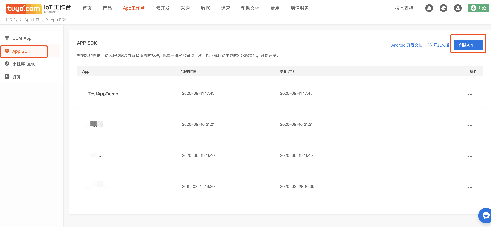
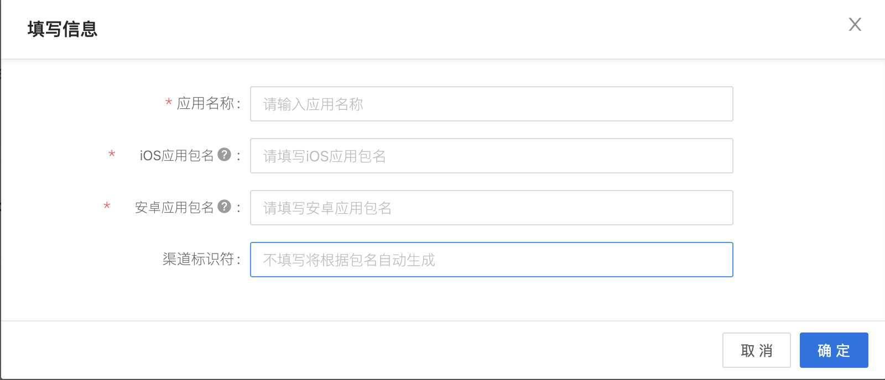
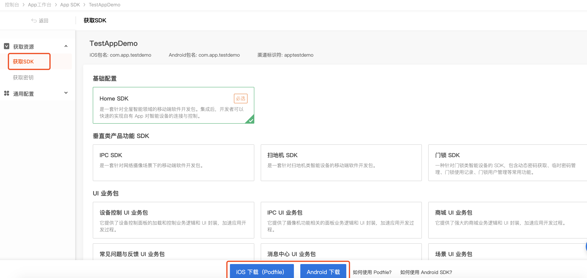
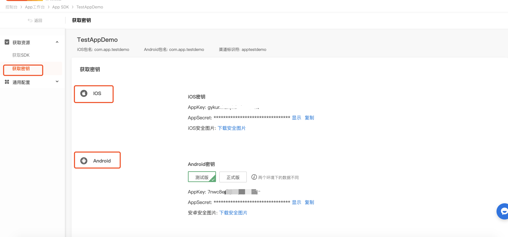

## 准备工作

### 注册开发者账号
前往 [涂鸦智能开发平台](https://iot.tuya.com) 注册开发者账号、创建产品、创建功能点等，具体流程请参考[接入流程](https://docs.tuya.com/zh/iot/device-intelligentize-in-5-minutes/device-intelligentize-in-5-minutes?id=K914joxbogkm6)

###  创建 SDK 应用

在[涂鸦 IoT 平台](https://iot.tuya.com/)中 “**App 工作台**” 中点击 “**App SDK**”，点击“**创建 App**”。

填写 App 相关信息，点击**确认**。

- **应用名称**：填写您的 App 名称。
- **iOS 应用包名**：填写您的 iOS App 包名（建议格式：com.xxxxx.xxxxx)。
- **安卓应用包名**：填写您的安卓 App 包名（两者可以保持一致，也可以不一致）。
- **渠道标识符**：不是必填项，如果不填写，系统会根据包名自动生成。

您可以根据实际需求选择需要的选择方案，支持多选，然后根据 Podfile 和 Gradle 进行 SDK 的集成。

点击**获取密码**，获取 SDK 的 AppKey，AppSecret，安全图片等信息。

