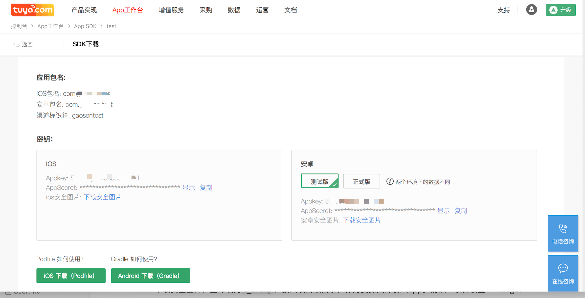

## 准备工作

### 注册开发者账号
前往 [涂鸦智能开发平台](https://iot.tuya.com) 注册开发者账号、创建产品、创建功能点等，具体流程请参考[接入流程](https://docs.tuya.com/cn/overview/dev-process.html)

### 获取 iOS 的 App Key、App Secret、安全图片

前往 开发平台 - App 工作台 - App SDK 获取 `iOS` 的 `AppKey`、 `AppSecret` 、安全图片。

下载安全图片，重命名为 `t_s.bmp`，放入项目根目录，作为资源文件引入 App。确认「项目设置 => Target => Build Phases => Copy Bundle Resources」包含 `t_s.bmp` 文件。

集成 SDK 时请确认 `BundleId`、`AppKey`、`AppSecret`、安全图片是否与平台上的信息一致，任意一个不匹配会导致 SDK 无法使用。

### 联调方式
- 通过硬件控制板 进行真机调试
- 通过开发平台 - 模拟设备 进行模拟调试
