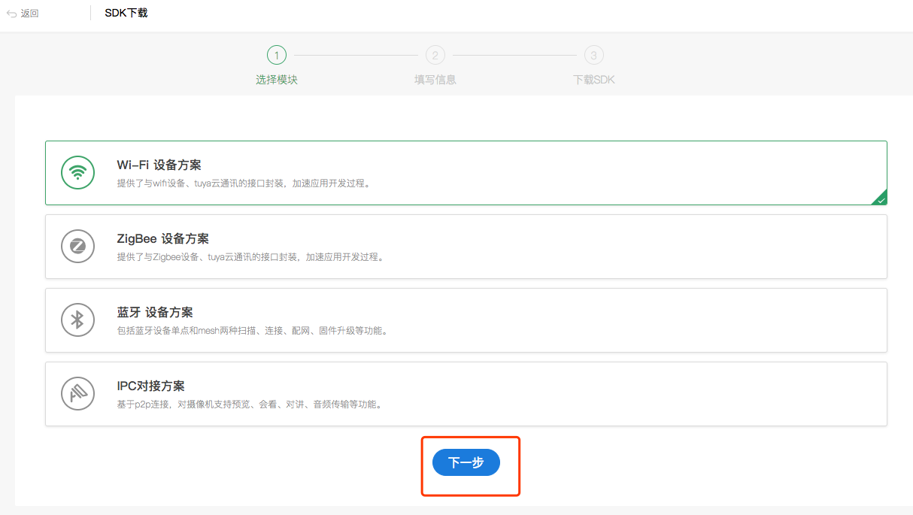

## 准备工作

### 注册开发者账号
前往 [涂鸦智能开发平台](https://iot.tuya.com) 注册开发者账号、创建产品、创建功能点等，具体流程请参考[接入流程](https://docs.tuya.com/zh/iot/device-intelligentize-in-5-minutes/device-intelligentize-in-5-minutes?id=K914joxbogkm6)

###  创建 SDK 应用

在[涂鸦 IoT 平台](https://iot.tuya.com/)中 “App 工作台” 中点击 “App SDK”，点击“获取 SDK”。

根据需求选择合适的开发方案，点击“下一步”。

在 iOS 部分可以获取 `AppKey`、`AppSecret`，点击"下载安全图片"，将安全图片重命名为 `t_s.bmp`

