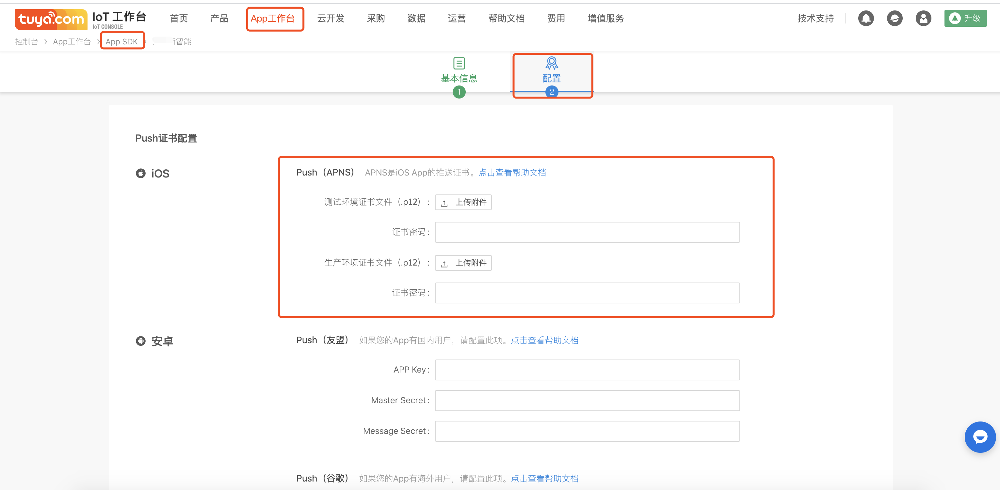

# 集成 Push

基于 Tuya SDK 开发的 App，Tuya 平台支持 Push 功能，支持给用户发送运营 Push 和产品的告警 Push

## Xcode 配置

点击 Xcode 项目 - `TARGETS` - `Capabilities`, 将 `Push Notification ` 的开关打开，效果如下图所示：


## 涂鸦开发者平台配置
登录涂鸦开发者平台 - 进入对应 APP - 推送配置 - 上传 push 证书




## 初始化
在 `didFinishLaunchingWithOptions` 方法中初始化 push

```objc
    
- (BOOL)application:(UIApplication *)application didFinishLaunchingWithOptions:(NSDictionary *)launchOptions {
	
	
    [application registerForRemoteNotifications];
    [application registerUserNotificationSettings:[UIUserNotificationSettings settingsForTypes:UIUserNotificationTypeAlert|UIUserNotificationTypeBadge|UIUserNotificationTypeSound categories:nil]];
   	
    
    if ([[[UIDevice currentDevice] systemVersion] floatValue] >= 10.0) {
        //iOS10需要加下面这段代码。
        UNUserNotificationCenter *center = [UNUserNotificationCenter currentNotificationCenter];
        center.delegate = self;
        UNAuthorizationOptions types10 = UNAuthorizationOptionBadge|UNAuthorizationOptionAlert|UNAuthorizationOptionSound;
        [center requestAuthorizationWithOptions:types10 completionHandler:^(BOOL granted, NSError * _Nullable error) {
            if (granted) {
                //点击允许
            } else {
                //点击不允许
            }
        }];
    }
    
}

```

## 注册 PushId
在 `didRegisterForRemoteNotificationsWithDeviceToken` 中注册 pushId 到 Tuya SDK

```objc

- (void)application:(UIApplication *)application didRegisterForRemoteNotificationsWithDeviceToken:(NSData *)deviceToken {
	[TuyaSmartSDK sharedInstance].deviceToken = deviceToken;
}

```


## 接收通知
接收到远程通知，在代理方法 `didReceiveRemoteNotification` 中执行

```objc
- (void)application:(UIApplication *)application didReceiveRemoteNotification:(NSDictionary *)userInfo fetchCompletionHandler:(void(^)(UIBackgroundFetchResult))completionHandler {


}
```

## 发送 Push

### 新增运营 Push
涂鸦开发者平台 - 用户运营 - 消息中心 - 新增消息


### 新增告警 Push
涂鸦开发者平台 - 对应产品 - 扩展功能 - 告警设置 - 新增告警规则(应用推送方式)


