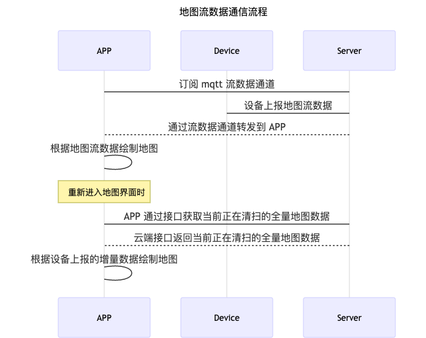

# 陀螺仪和视觉扫地机

## 通用接口

流数据相关的接口采用通用接口形式调用，接口调用文档：[通用接口](https://tuyainc.github.io/tuyasmart_home_ios_sdk_doc/zh-hans/resource/CommonInterface.html)

### 最新一次清扫记录

**接口：** tuya.m.device.media.latest

**版本：** 2.0

**入参说明**

| 字段名 | 类型    | 描述                                                         |
| ------ | ------- | ------------------------------------------------------------ |
| devId  | String  | 设备 Id                                                      |
| start  | String  | 开始位置 (第一次传空，之后取下一页时填上一页返回值里的startRow值) |
| size   | Integer | 查询数据的大小 (固定参数为 500)                              |

**响应参数**

| 字段名      | 类型   | 描述             |
| ----------- | ------ | ---------------- |
| devId       | String | 设备 Id          |
| startRow    | String | 分页查询索引     |
| dataList    | Array  | 流数据           |
| subRecordId | String | 清扫记录 Id      |
| hasNext     | BOOL   | 是否有下一页数据 |

**响应示例**

```json
{
    "devId":"6ccdd506b7186ee85avntm",
    "startRow":"mtnva58ee6817b605ddcc6_35_1535629239586",
    "dataList":[
        "373702373700",
        "383702383802373901383901383800",
        "373802373901373800",
        "373802363901363801373800",
        "373702373602373600",
        "373502373500",
        "373502373402373301363301373400",
        "363502363500",
        "363502363500"
    ],
    "subRecordId":35,
    "hasNext":true,
    "startTime":1535629049,
    "endTime":1535629244,
    "status":2
}
```


### 历史清扫记录列表

**接口：** m.smart.scale.history.get.list

**版本：** 1.0

**入参说明**

| 字段名 | 类型    | 描述                           |
| ------ | ------- | ------------------------------ |
| devId  | String  | 设备 Id                        |
| offset | Integer | 分页偏移量                     |
| limit  | Integer | 分页大小                       |
| dpIds  | String  | 在涂鸦平台配置的清扫记录的dpId |

**响应参数**

| 字段名             | 类型   | 描述                                                         |
| ------------------ | ------ | ------------------------------------------------------------ |
| uuid               | String | 删除记录时的入参                                             |
| dps                | Array  |                                                              |
| 15                 | String | 在涂鸦平台配置的清扫记录的dpId                               |
| 201906171721009007 | String | 设备在对应 dpId 上报的值，解析为“2019年06月17号，17点21分，清扫时间009，清扫面积007”，具体数据与设备端对齐 |
| totalCount         | int    | 总条数                                                       |
| hasNext            | BOOL   | 是否有下一页数据                                             |

**响应示例**

```json
{
    "datas":[
        {
            "devId":"xxxx",
            "dps":[
                {
                    "15":"201906171721009007"
                }
            ],
            "avatar":"https://airtake-public-data.oss-cn-hangzhou.aliyuncs.com/smart/user_res/avatar/scale/no_body_icon.png",
            "userName":"xx",
            "gmtCreate":1560763848501,
            "uuid":"15607600058B81A6C4A0273FDD61091D0B02403848501",
            "userId":"0",
            "tags":0,
            "status":1
        }
    ],
    "hasNext":false,
    "totalCount":2
}
```


### 清扫记录详情

**接口：** tuya.m.device.media.detail

**版本：** 2.0

**入参说明**

| 字段名      | 类型    | 描述                                                         |
| ----------- | ------- | ------------------------------------------------------------ |
| devId       | String  | 设备 Id                                                      |
| subRecordId | String  | 清扫记录 Id                                                  |
| start       | String  | 开始位置 (第一次传空，之后取下一页时填上一页返回值里的startRow值) |
| size        | Integer | 查询数据的大小 (固定参数为 500)                              |

**响应参数**

| 字段名      | 类型   | 描述             |
| ----------- | ------ | ---------------- |
| devId       | String | 设备 Id          |
| startRow    | String | 分页查询索引     |
| dataList    | Array  | 流数据           |
| subRecordId | String | 清扫记录 Id      |
| hasNext     | BOOL   | 是否有下一页数据 |

**响应示例**

```json
{
    "devId":"6ccdd506b7186ee85avntm",
    "startRow":"mtnva58ee6817b605ddcc6_31_1535622776561",
    "dataList":[
        "3e3f02403e013e3f00",
        "3f3f024040013f3f00",
        "3f3f02403f014040013f3f00",
        "3f40024140014040013f3f024041013f41013f3f00",
        "3f3f024040014041013f41013f3f00"
    ],
    "subRecordId":31,
    "hasNext":true,
    "startTime":1535621566,
    "endTime":1535623017,
    "status":2
}
```


### 删除历史清扫记录

**接口：** m.smart.scale.history.delete

**版本：** 1.0

**入参说明**

| 字段名 | 类型    | 描述        |
| ------ | ------- | ----------- |
| devId  | String  | 设备 Id     |
| uuid   | Integer | 清扫记录 Id |

**响应示例**

```json
{
    "result":true,
    "success":true,
    "status":"ok",
    "t":1557740732829
}
```

##  功能接口

### 数据流程



### 功能简介

涂鸦陀螺仪型或视觉型的扫地机是使用流通道来传输地图数据，实现 `TuyaSmartSweeperDeviceDelegate` 代理协议接收用来接收地图流数据回调。

| 类名                 | 说明                   |
| -------------------- | ---------------------- |
| TuyaSmartSweepDevice | 涂鸦扫地机设备相关的类 |

### 订阅地图流数据

**接口说明**

订阅设备的地图流数据

```objective-c
- (void)subscribeDeviceDataTransfer;
```

**示例代码**

Objc:

```objective-c
- (void)subscribeDevice {
    
    [self.sweeperDevice subscribeDeviceDataTransfer];
}
```

Swift:

```swift
func subscribeDevice() {
    sweeperDevice?.subscribeDeviceDataTransfer()
}
```


### 取消订阅地图流数据

**接口说明**

取消订阅设备的地图流数据

```objective-c
- (void)unsubscribeDeviceDataTransfer;
```

**示例代码**

Objc:

```objective-c
- (void)unsubscribeDevice {
    
    [self.sweeperDevice unsubscribeDeviceDataTransfer];
}
```

Swift:

```swift
func unsubscribeDevice() {
    sweeperDevice?.unsubscribeDeviceDataTransfer()
}
```


### 流数据回调

**接口说明**

设备上报的流数据实时回调

```objective-c
- (void)sweeperDevice:(TuyaSmartSweeperDevice *)sweeperDevice didReceiveStreamData:(NSData *)data;
```

**参数说明**

| 参数          | 说明                              |
| ------------- | --------------------------------- |
| sweeperDevice | `TuyaSmartSweeperDevice` 实例对象 |
| data          | 流数据（ `NSData` 类型）          |

**示例代码**

Objc:

```objective-c
self.sweeperDevice = [TuyaSmartSweeperDevice deviceWithDeviceId:<#devId#>];
self.sweeperDevice.delegate = self;

// 实现代理方法
- (void)sweeperDevice:(TuyaSmartSweeperDevice *)sweeperDevice didReceiveStreamData:(NSData *)data {
  
}
```

Swift:

```swift
sweeperDevice = TuyaSmartSweeperDevice.init(deviceId: "your_devId")
sweeperDevice?.delegate = self

func sweeperDevice(_ sweeperDevice: TuyaSmartSweeperDevice, didReceiveStreamData data: Data) {
        
}
```

