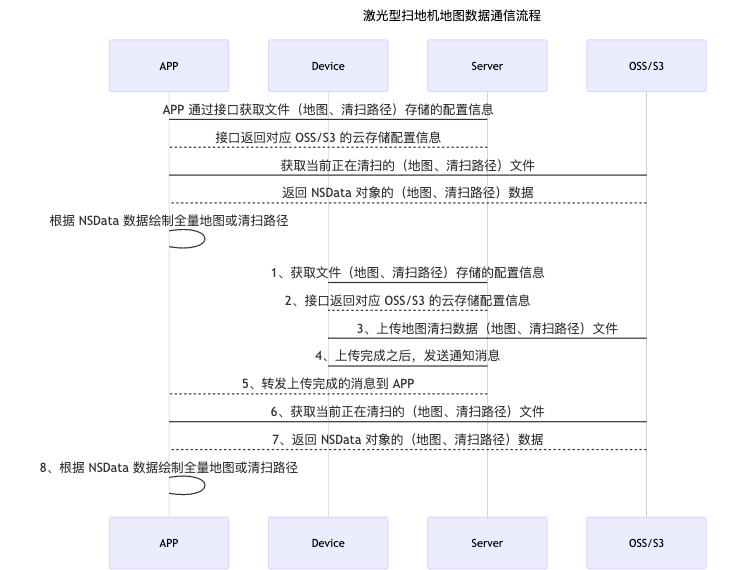

## 激光扫地机

### 数据流程



### 功能简介

激光型扫地机是借助 mqtt 和 云存储来进行数据的传输，将地图或清扫路径以文件的形式保存在云端，其中涉及到获取云存储配置信息，接收文件上传完成的实时消息和文件下载功能。所有功能对应 `TuyaSmartSweepDevice` 类，需要使用设备 Id 进行初始化。错误的设备 Id 可能会导致初始化失败，返回 nil。

| 类名                 | 说明                   |
| -------------------- | ---------------------- |
| TuyaSmartSweepDevice | 涂鸦扫地机设备相关的类 |


### 获取云存储配置

**接口说明**

从云端获取云存储配置信息

```objective-c
- (void)initCloudConfigWithSuccess:(void (^)(NSString *bucket))success
                           failure:(void (^)(NSError * _Nullable error))failure;
```

**参数说明**

| 类名    | 说明                             |
| ------- | -------------------------------- |
| success | 成功回调（bucket：文件存储空间） |
| failure | 失败回调                         |

**示例代码**

Objc:

```objective-c
[self.sweeperDevice initCloudConfigWithSuccess:^(NSString * _Nonnull bucket) {
        
} failure:^(NSError * _Nullable error) {
        
}];
```

Swift:

```swift
sweeperDevice?.initCloudConfig(success: { (bucket) in
            
}, failure: { (error) in
            
})
```


### 更新云存储配置

**接口说明**

由于获取到的文件地址有时效性，当文件地址失效时，需要调用以下接口更新云配置

```objective-c
- (void)updateCloudConfigWithSuccess:(void (^)(NSString *bucket))success
                             failure:(void (^)(NSError * _Nullable error))failure;
```

**参数说明**

| 类名    | 说明                             |
| ------- | -------------------------------- |
| success | 成功回调（bucket：文件存储空间） |
| failure | 失败回调                         |

**示例代码**

Objc:

```objective-c
[self.sweeperDevice updateCloudConfigWithSuccess:^(NSString * _Nonnull bucket) {
        
} failure:^(NSError * _Nullable error) {
        
}];
```

Swift:

```swift
sweeperDevice?.updateCloudConfig(success: { (bucket) in
            
}, failure: { (error) in
            
})
```


### 获取完整文件地址

**接口说明**

获取地图文件在 OSS/S3 服务器上完整的路径，可自行下载解析

```objective-c
- (nullable NSString *)getCloudFileDownloadURLWithBucket:(NSString *)bucket path:(NSString *)path;
```

**参数说明**

| 参数   | 说明                               |
| ------ | ---------------------------------- |
| bucket | 文件存储空间                       |
| path   | 文件（地图、清扫路径）存储相对路径 |

**示例代码**

Objc:

```objective-c
NSString *url = [self.sweeperDevice getCloudFileDownloadURLWithBucket:<#bucket#> path:<#path#>];
```

Swift:

```swift
let url = sweeperDevice?.getCloudFileDownloadURL(withBucket: "", path: "")
```


### 获取数据内容

**接口说明**

根据文件（地图、清扫路径）在云端 (OSS/S3) 中存储的相对路径，下载文件数据

```objective-c
- (void)getSweeperDataWithBucket:(NSString *)bucket
                            path:(NSString *)path
                         success:(void (^)(NSData *data))success
                         failure:(void (^)(NSError * _Nullable error))failure;
```

**参数说明**

| 参数    | 说明                               |
| ------- | ---------------------------------- |
| bucket  | 文件存储空间                       |
| path    | 文件（地图、清扫路径）存储相对路径 |
| success | 成功回调 （data：文件具体内容）    |
| failure | 失败回调                           |

**示例代码**

Objc:

```objective-c
[self.sweeperDevice getSweeperDataWithBucket:<#bucket#> path:<#path#> success:^(NSData * _Nonnull data) {
        
} failure:^(NSError * _Nullable error) {
        
}];
```

Swift:

```swift
sweeperDevice?.getSweeperData(withBucket: "", path: "", success: { (data) in
            
}, failure: { (error) in
            
})
```


### 获取当前清扫数据

**接口说明**

获取当前清扫中的文件（地图、清扫路径）在云端 (OSS/S3) 中存储的相对路径

```objective-c
- (void)getSweeperCurrentPathWithSuccess:(void (^)(NSString *bucket, NSDictionary<TuyaSmartSweeperCurrentPathKey, NSString *> *paths))success
                                 failure:(void (^)(NSError * _Nullable error))failure;
```

**参数说明**

| TuyaSmartSweeperCurrentPathKey    | 说明                             |
| --------------------------------- | -------------------------------- |
| TuyaSmartSweepCurrentMapPathKey   | 当前地图的相对路径对应的 key     |
| TuyaSmartSweepCurrentRoutePathKey | 当前清扫路径的相对路径对应的 key |

| 参数    | 说明                                                         |
| ------- | ------------------------------------------------------------ |
| success | 成功回调（bucket：文件存储空间，paths：地图和清扫路径存储的相对路径） |
| failure | 失败回调                                                     |

**示例代码**

Objc:

```objective-c
[self.sweeperDevice getSweeperCurrentPathWithSuccess:^(NSString * _Nonnull bucket, NSDictionary<TuyaSmartSweeperCurrentPathKey,NSString *> * _Nonnull paths) {
  
        NSString *mapPath = paths[TuyaSmartSweepCurrentMapPathKey];
        NSString *routePath = paths[TuyaSmartSweepCurrentRoutePathKey];
        
    } failure:^(NSError * _Nullable error) {
        
    }];
```

Swift:

```swift
sweeperDevice?.getSweeperCurrentPath(success: { (bucket, paths) in
            
            let mapPath = paths[TuyaSmartSweepCurrentMapPathKey]
            let routePath = paths[TuyaSmartSweepCurrentRoutePathKey]
            
        }, failure: { (error) in
            
        })
```


### 获取历史清扫记录

**接口说明**

从云端获取激光型扫地机的历史清扫记录

```objective-c
- (void)getSweeperHistoryDataWithLimit:(NSUInteger)limit
                                offset:(NSUInteger)offset
                             startTime:(long)startTime
                               endTime:(long)endTime
                               success:(void (^)(NSArray<TuyaSmartSweeperHistoryModel *> *datas, NSUInteger totalCount))success
                               failure:(void (^)(NSError * _Nullable error))failure;
```

**参数说明**

| 类名                         | 说明         |
| ---------------------------- | ------------ |
| TuyaSmartSweeperHistoryModel | 历史清扫记录 |

| 属性   | 类型     | 说明                       |
| ------ | -------- | -------------------------- |
| fileId | NSString | 清扫记录文件 id            |
| time   | long     | 清扫记录文件时间戳         |
| extend | NSString | 清扫记录拆分读取规则       |
| bucket | NSString | 清扫记录文件的存储空间     |
| file   | NSString | 清扫记录文件存储的相对路径 |

| 参数      | 说明                                                         |
| --------- | ------------------------------------------------------------ |
| limit     | 一次获取数据的数量(建议最大不要超过100)                      |
| offset    | 获取数据的偏移量(用于分页)                                   |
| startTime | 起始时间戳（默认不传）                                       |
| endTime   | 结束时间戳（默认不传）                                       |
| success   | 成功回调（datas：清扫记录数组，totalCount：历史清扫记录总数） |
| failure   | 失败回调                                                     |

**示例代码**

Objc:

```objective-c
[self.sweeperDevice getSweeperHistoryDataWithLimit:50 offset:0 startTime:-1 endTime:-1 success:^(NSArray<TuyaSmartSweeperHistoryModel *> * _Nonnull datas, NSUInteger totalCount) {
        
    } failure:^(NSError * _Nullable error) {
        
    }];
```

Swift:

```swift
sweeperDevice?.getSweeperHistoryData(withLimit: 50, offset: 0, success: { (datas, count) in
            
        }, failure: { (error) in
            
        })
```


### 删除历史清扫记录

**接口说明**

删除当前激光型扫地机设备指定的历史清扫记录

```objective-c
- (void)removeSweeperHistoryDataWithFileIds:(NSArray<NSString *> *)fileIds
                                    success:(void (^)(void))success
                                    failure:(void (^)(NSError * _Nullable error))failure;
```

**参数说明**

| 参数    | 说明                         |
| ------- | ---------------------------- |
| fileIds | 清扫记录文件 id 的字符串数组 |
| success | 成功回调                     |
| failure | 失败回调                     |

**示例代码**

Objc:

```objective-c
[self.sweeperDevice removeSweeperHistoryDataWithFileIds:<#fileIds#> success:^{
        
    } failure:^(NSError * _Nullable error) {
        
    }];
```

Swift:

```swift
sweeperDevice?.removeSweeperHistoryData(withFileIds: [""], success: {
            
        }, failure: { (error) in
            
        })
```


### 清空历史清扫记录

**接口说明**

清空当前激光型扫地机设备的所有历史清扫记录

```objective-c
- (void)removeAllHistoryDataWithSuccess:(void (^)(void))success
                                failure:(void (^)(NSError * _Nullable error))failure;
```

**参数说明**

| 参数    | 说明     |
| ------- | -------- |
| success | 成功回调 |
| failure | 失败回调 |

**示例代码**

Objc:

```objective-c
[self.sweeperDevice removeAllHistoryDataWithSuccess:^{
        
    } failure:^(NSError * _Nullable error) {
        
    }];
```

Swift:

```swift
sweeperDevice?.removeAllHistoryData(success: {
            
        }, failure: { (error) in
            
        })
```


### 获取历史清扫记录（多地图）

**接口说明**

针对激光型扫地机一次清扫记录有多个地图的情况，提供从云端获取多地图的历史清扫记录。

```objective-c
- (void)getSweeperMultiHistoryDataWithLimit:(NSUInteger)limit
                                     offset:(NSUInteger)offset
                                  startTime:(long)startTime
                                    endTime:(long)endTime
                                    success:(void(^)(NSArray<TuyaSmartSweeperHistoryModel *> *datas, NSUInteger totalCount))success
                                    failure:(void(^)(NSError * _Nullable error))failure;
```

**参数说明**

| 参数      | 说明                                                         |
| --------- | ------------------------------------------------------------ |
| limit     | 一次获取数据的数量(建议最大不要超过100)                      |
| offset    | 获取数据的偏移量(用于分页)                                   |
| startTime | 起始时间戳（默认不传）                                       |
| endTime   | 结束时间戳（默认不传）                                       |
| success   | 成功回调（datas：清扫记录数组，totalCount：历史清扫记录总数） |
| failure   | 失败回调                                                     |

**示例代码**

Objc:

```objective-c
[self.sweeperDevice getSweeperMultiHistoryDataWithLimit:50 offset:0 startTime:-1 endTime:-1 success:^(NSArray<TuyaSmartSweeperHistoryModel *> * _Nonnull datas, NSUInteger totalCount) {
        
    } failure:^(NSError * _Nullable error) {
        
    }];
```

Swift:

```swift
sweeperDevice?.getSweeperMultiHistoryData(withLimit: 50, offset: 0, success: { (datas, count) in
            
        }, failure: { (error) in
            
        })
```


### 清空历史清扫记录（多地图）

**接口说明**

针对激光型扫地机一次清扫记录有多个地图的情况，提供清空所有多地图的历史清扫记录

```objective-c
- (void)removeAllMultiHistoryDataWithSuccess:(void (^)(void))success
                                     failure:(void (^)(NSError * _Nullable error))failure;
```

**参数说明**

| 参数    | 说明     |
| ------- | -------- |
| success | 成功回调 |
| failure | 失败回调 |

**示例代码**

Objc:

```objective-c
[self.sweeperDevice removeAllMultiHistoryDataWithSuccess:^{
        
    } failure:^(NSError * _Nullable error) {
        
    }];
```

Swift:

```swift
sweeperDevice?.removeAllMultiHistoryData(success: {
            
        }, failure: { (error) in
            
        })
```


### 清扫文件上传完成的消息实时回调

激光型扫地机在工作中，实时地图或清扫路径数据上传到 OSS/S3 完成的消息回调。通过设置 `TuyaSmartSweeperDeviceDelegate` 代理协议，监听实时消息回调。

**MQTT 通知消息数据模型**

| 类名                        | 说明                               |
| --------------------------- | ---------------------------------- |
| TuyaSmartSweeperMQTTMessage | 设备上传完文件发送的 mqtt 通知消息 |

| 属性    | 类型                            | 说明                                 |
| ------- | ------------------------------- | ------------------------------------ |
| mapId   | NSString                        | 文件（地图、清扫路径）id             |
| mapType | TuyaSmartSweeperMQTTMessageType | 文件类型。0：地图；1：路径           |
| mapPath | NSString                        | 文件（地图、清扫路径）存储的相对路径 |

**接口说明**

设备上传完文件之后的消息回调

```objective-c
- (void)sweeperDevice:(TuyaSmartSweeperDevice *)sweeperDevice didReceiveMessage:(TuyaSmartSweeperMQTTMessage *)message;
```

**参数说明**

| 参数          | 说明                             |
| ------------- | -------------------------------- |
| sweeperDevice | 扫地机设备实例                   |
| message       | 设备上传完成后，推送的 mqtt 消息 |

**示例代码**

Objc:

```objective-c
self.sweeperDevice = [TuyaSmartSweeperDevice deviceWithDeviceId:<#devId#>];
self.sweeperDevice.delegate = self;

// 实现代理方法
- (void)sweeperDevice:(TuyaSmartSweeperDevice *)sweeperDevice didReceiveMessage:(TuyaSmartSweeperMQTTMessage *)message {
  
}
```

Swift:

```swift
sweeperDevice = TuyaSmartSweeperDevice.init(deviceId: "your_devId")
sweeperDevice?.delegate = self

func sweeperDevice(_ sweeperDevice: TuyaSmartSweeperDevice, didReceive message: TuyaSmartSweeperMQTTMessage) {
        
}
```


### 清扫数据实时回调 

**接口说明**

设备上传完文件之后的消息回调，设置 `shouldAutoDownloadData` 为 `YES` 后，触发该回调下载文件内容。

```objective-c
- (void)sweeperDevice:(TuyaSmartSweeperDevice *)sweeperDevice didReceiveMessage:(TuyaSmartSweeperMQTTMessage *)message downloadData:(nullable NSData *)data downloadError:(nullable NSError *)error;
```

**参数说明**

| 参数          | 说明                               |
| ------------- | ---------------------------------- |
| sweeperDevice | 扫地机设备实例                     |
| message       | 设备上传完成后，推送的 mqtt 消息   |
| data          | 文件下载后 `NSData` 类型的具体内容 |
| error         | 文件下载出错的错误信息             |

**示例代码**

Objc:

```objective-c
self.sweeperDevice = [TuyaSmartSweeperDevice deviceWithDeviceId:<#devId#>];
self.sweeperDevice.delegate = self;

// 实现代理方法
- (void)sweeperDevice:(TuyaSmartSweeperDevice *)sweeperDevice didReceiveMessage:(TuyaSmartSweeperMQTTMessage *)message downloadData:(nullable NSData *)data downloadError:(nullable NSError *)error {
  
}
```

Swift:

```swift
sweeperDevice = TuyaSmartSweeperDevice.init(deviceId: "your_devId")
sweeperDevice?.delegate = self

func sweeperDevice(_ sweeperDevice: TuyaSmartSweeperDevice, didReceive message: TuyaSmartSweeperMQTTMessage, downloadData data: Data?, downloadError error: Error?) {
        
    }
```