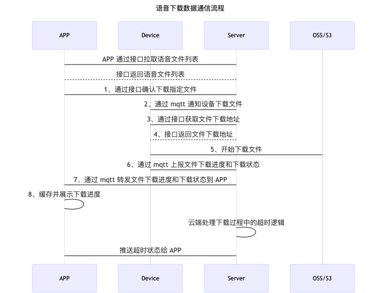

## 语音下载

### 数据流程



### 功能简介

扫地机 SDK 提供了语音下载功能，实现 `TuyaSmartSweeperDeviceDelegate` 代理协议接收语音下载过程中的状态变化回调以及下载进度回调。

| 类名                 | 说明                   |
| -------------------- | ---------------------- |
| TuyaSmartSweepDevice | 涂鸦扫地机设备相关的类 |


### 获取语音文件列表

**接口说明**

拉取当前扫地机设备可用的语音文件列表

```objective-c
- (void)getFileDownloadInfoWithSuccess:(void (^)(NSArray<TuyaSmartFileDownloadModel *> *upgradeFileList))success failure:(void (^)(NSError * _Nullable error))failure;
```

**参数说明**

| 类名                       | 说明           |
| -------------------------- | -------------- |
| TuyaSmartFileDownloadModel | 语音文件数据类 |

| 属性        | 类型                | 说明                 |
| ----------- | ------------------- | -------------------- |
| fileId      | NSString            | 语音文件 Id          |
| productId   | NSString            | 产品 Id              |
| name        | NSString            | 语音文件名称         |
| desc        | NSString            | 语音文件描述         |
| auditionUrl | NSString            | 语音试听文件下载链接 |
| officialUrl | NSString            | 语音正式文件下载链接 |
| imgUrl      | NSString            | 语音文件图标下载链接 |
| region      | NSArray<NSString *> | 区域码               |

| 参数    | 说明                                          |
| ------- | --------------------------------------------- |
| success | 成功回调（upgradeFileList：可用语音文件列表） |
| failure | 失败回调                                      |

**示例代码**

Objc:

```objective-c
[self.sweeperDevice getFileDownloadInfoWithSuccess:^(NSArray<TuyaSmartFileDownloadModel *> * _Nonnull upgradeFileList) {
        
    } failure:^(NSError * _Nullable error) {
        
    }];
```

Swift:

```swift
sweeperDevice?.getFileDownloadInfo(success: { (upgradeFileList) in
            
        }, failure: { (error) in
            
        })
```


### 确认下载语音文件

**接口说明**

调用接口确认下载指定语音文件

```objective-c
- (void)downloadFileWithFileId:(NSString *)fileId
                       success:(void (^)(id result))success
                       failure:(void (^)(NSError * _Nullable error))failure;
```

**参数说明**

| 参数    | 说明                  |
| ------- | --------------------- |
| fileId  | 确认下载的语音文件 id |
| success | 成功回调              |
| failure | 失败回调              |

**示例代码**

Objc:

```objective-c
[self.sweeperDevice downloadFileWithFileId:<#fileId#> success:^(id  _Nonnull result) {
        
    } failure:^(NSError * _Nullable error) {
        
    }];
```

Swift:

```swift
sweeperDevice?.downloadFile(withFileId: "", success: { (result) in
            
        }, failure: { (error) in
            
        })
```


### 获取语音文件下载进度

**接口说明**

语音文件下载进度数据模型

```objective-c
- (void)getFileDownloadRateWithSuccess:(void (^)(TuyaSmartFileDownloadRateModel *rateModel))success failure:(void (^)(NSError * _Nullable error))failure;
```

**参数说明**

| 类名                           | 说明               |
| ------------------------------ | ------------------ |
| TuyaSmartFileDownloadRateModel | 文件的下载进度信息 |

| 属性     | 类型      | 说明        |
| -------- | --------- | ----------- |
| fileId   | NSString  | 语音文件 id |
| deviceId | NSString  | 设备 id     |
| status   | NSInteger | 下载状态    |
| rate     | int       | 下载进度    |

| 参数    | 说明                                        |
| ------- | ------------------------------------------- |
| success | 成功回调（rateModel：语音文件下载进度信息） |
| failure | 失败回调                                    |

**示例代码**

Objc:

```objective-c
[self.sweeperDevice getFileDownloadRateWithSuccess:^(TuyaSmartFileDownloadRateModel * _Nonnull rateModel) {
        
    } failure:^(NSError * _Nullable error) {
        
    }];
```

Swift:

```swift
sweeperDevice?.getFileDownloadRate(success: { (rateModel) in
            
        }, failure: { (error) in
            
        })
```


### 语音下载回调

#### 下载状态实时回调

**接口说明**

语音下载状态实时回调

```objective-c
- (void)sweeperDevice:(TuyaSmartSweeperDevice *)sweeperDevice type:(NSString *)type downloadStatus:(TuyaSmartSweeperFileDownloadStatus)status;
```

**参数说明**

| TuyaSmartSweeperFileDownloadStatus    | 说明         |
| ------------------------------------- | ------------ |
| TuyaSmartSweeperFileDownloadUpgrading | 文件下载中   |
| TuyaSmartSweeperFileDownloadFinish    | 文件下载完成 |
| TuyaSmartSweeperFileDownloadFailure   | 文件下载失败 |

| 参数          | 说明                                             |
| ------------- | ------------------------------------------------ |
| sweeperDevice | `TuyaSmartSweeperDevice` 实例对象                |
| type          | 文件类型                                         |
| status        | 下载状态（`TuyaSmartSweeperFileDownloadStatus`） |

**示例代码**

Objc:

```objective-c
self.sweeperDevice = [TuyaSmartSweeperDevice deviceWithDeviceId:<#devId#>];
self.sweeperDevice.delegate = self;

// 实现代理方法
- (void)sweeperDevice:(TuyaSmartSweeperDevice *)sweeperDevice type:(NSString *)type downloadStatus:(TuyaSmartSweeperFileDownloadStatus)status {
  
}
```

Swift:

```swift
sweeperDevice = TuyaSmartSweeperDevice.init(deviceId: "your_devId")
sweeperDevice?.delegate = self

func sweeperDevice(_ sweeperDevice: TuyaSmartSweeperDevice, type: String, downloadStatus status: TuyaSmartSweeperFileDownloadStatus) {
        
    }
```


#### 下载进度实时回调

**接口说明**

语音下载进度实时回调

```objective-c
- (void)sweeperDevice:(TuyaSmartSweeperDevice *)sweeperDevice type:(NSString *)type downloadProgress:(int)progress;
```

**参数说明**

| 参数          | 说明                              |
| ------------- | --------------------------------- |
| sweeperDevice | `TuyaSmartSweeperDevice` 实例对象 |
| type          | 文件类型                          |
| progress      | 文件下载进度                      |

**示例代码**

Objc:

```objective-c
self.sweeperDevice = [TuyaSmartSweeperDevice deviceWithDeviceId:<#devId#>];
self.sweeperDevice.delegate = self;

// 实现代理方法
- (void)sweeperDevice:(TuyaSmartSweeperDevice *)sweeperDevice type:(NSString *)type downloadProgress:(int)progress {
  
}
```

Swift:

```swift
sweeperDevice = TuyaSmartSweeperDevice.init(deviceId: "your_devId")
sweeperDevice?.delegate = self

func sweeperDevice(_ sweeperDevice: TuyaSmartSweeperDevice, type: String, downloadProgress progress: Int32) {
        
    }
```