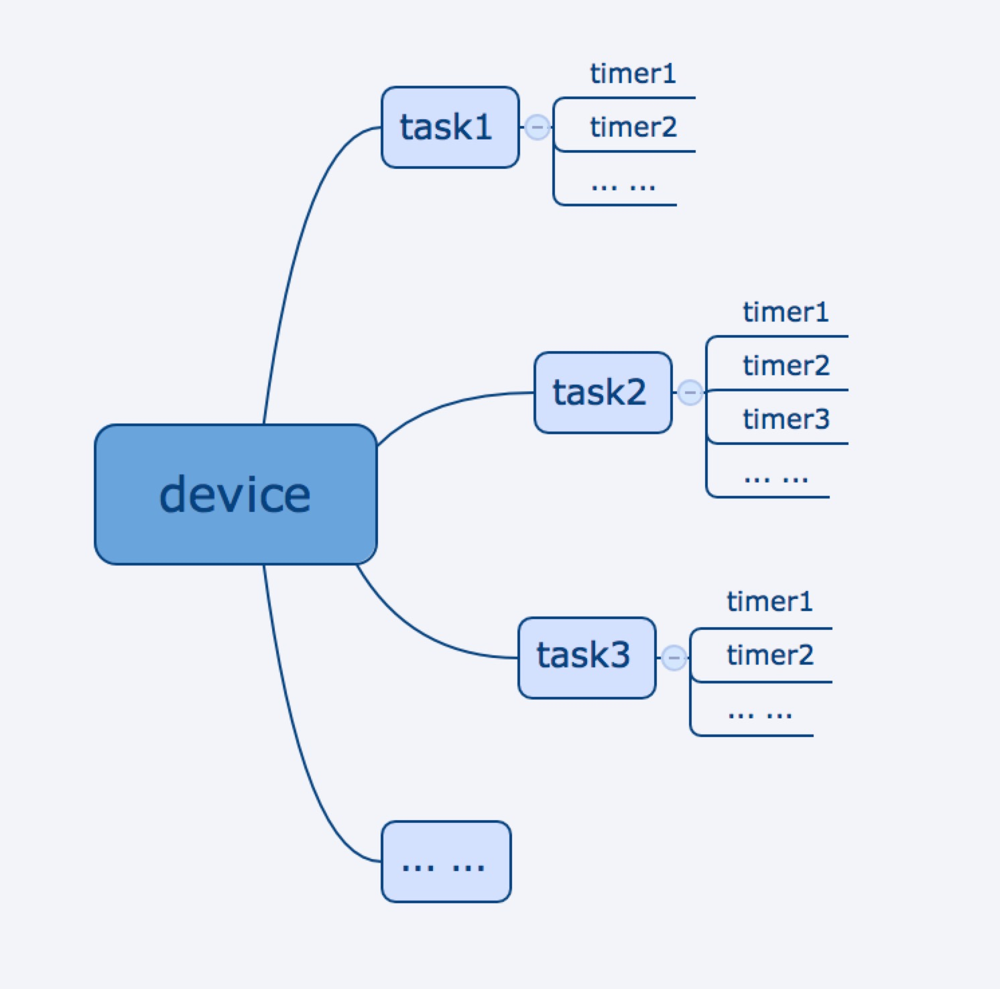

#定时任务

涂鸦智能提供了基本的定时能力，支持设备定时（包括 WiFi 设备，蓝牙 Mesh 子设备，Zigbee 子设备）和群组定时。并封装了针对设备 dp 点的定时器信息的增删改查接口。APP 通过定时接口设置好定时器信息后，硬件模块会自动根据定时要求进行预订的操作。每个定时任务下可以包含多个定时器。如下图所示：




| 类名           | 说明             |
| -------------- | ---------------- |
| TuyaSmartTimer | 定时任务接口封装 |

以下多个接口用到了 taskName 这个参数，具体可描述为一个分组，一个分组可以有多个定时器。每个定时属于或不属于一个分组，分组目前仅用于展示。例如一个开关可能有多个 dp 点，可以根据每个 dp 点设置一个定时分组，每个分组可以添加多个定时器，用于控制这个 dp 点各个时段的开启或关闭。


## 版本说明

从 3.18.0 版本新增一套定时接口，解决老接口存在的问题，见[旧版接口](https://github.com/TuyaInc/tuyasmart_home_ios_sdk_doc/blob/feature/doc_standard/zh-hans/resource/Timer.md)
新版定时都在 `TuyaSmartTimer.h`中，
旧版定时接口在 `TuyaSmartTimer+TYDeprecatedApi.h`  中

与旧版接口相比，新版接口有以下几点更新：

- 新增或更新定时器接口可以设置定时器开关状态
- 提供批量修改定时器状态接口
- 修复旧版关闭定时分组失效问题
- 提供分组定时删除功能


**升级建议**

旧版接口不再维护，建议升级到新版接口。升级需要将替换整套定时接口，使用旧版接口设置定时仍可以通过新版获取定时器列表获取


## 增加定时任务

**接口说明**

每个设备或群组定时的上限为 30 个

为 device 或 group 新增一个定时 timer 到指定的 task 下

```objective-c
- (void)addTimerWithTask:(NSString *)task
                   loops:(NSString *)loops
                   bizId:(NSString *)bizId
                 bizType:(NSUInteger)bizType
                    time:(NSString *)time
                     dps:(NSDictionary *)dps
                  status:(BOOL)status
               isAppPush:(BOOL)isAppPush
               aliasName:(NSString *)aliasName
                 success:(TYSuccessHandler)success
                 failure:(TYFailureError)failure;
```

**参数说明**

| 参数     | 说明     |
| -------- | -------- |
| task     | 定时任务名称 |
| loops    | 循环次数，格式 "0000000"<br />每一位 0:关闭, 1:开启, 从左至右依次表示: 周日 周一 周二 周三 周四 周五 周六<br />如每个周一: 0100000 |
| bizId | 设备 id，如果是群组传群组 id |
| bizType | 0:设备;  1:设备群组 |
| time     | 定时的时间，如 18:00 |
| dps      | dps 命令 |
| status | 是否开启定时|
| isAppPush      | 是否需要推送 |
| aliasName     | 备注信息 |
| success  | 成功回调  |
| failure | 失败回调 |

**示例代码**

Objc:

```objc
- (void)addTimer {
	// self.timer = [[TuyaSmartTimer alloc] init];
	  NSDictionary *dps = @{@"1": @(YES)};
    [self.timer addTimerWithTask:@"timer_task_name" loops:@"1000000" bizId:@"device_id" bizType:0 time:@"18:00"  dps:dps status:YES isAppPush:YES aliasName:@"timer for device xxx" success:^{
        NSLog(@"addTimerWithTask success");
    } failure:^(NSError *error) {
        NSLog(@"addTimerWithTask failure: %@", error);
    }];
}
```

Swift:

```swift
func addTimer() {
    let dps = ["1" : true]
    self.timer.add(withTask: "timer_task_name", loops: "1000000", bizId: "device_id", bizType: 0, time: "18:00", dps: dps, status: true, isAppPush: true, aliasName: "timer for device xxx") {
        print("addTimerWithTask success")
    } failure: { (error) in
        if let e = error {
            print("addTimerWithTask failure: \(e)")
        }
    }
}
```


## 批量修改普通定时状态或删除定时器

**接口说明**

```objective-c
- (void)updateTimerStatusWithTimerIds:(NSArray<NSString *> *)timerIds
                                bizId:(NSString *)bizId
                              bizType:(NSUInteger)bizType
                           updateType:(int)updateType
                              success:(TYSuccessHandler)success
                              failure:(TYFailureError)failure;
```

**参数说明**

| 参数                | 说明                                               |
| ------------------- | -------------------------------------------------- |
| timerIds            | 批量修改的定时 ids                                 |
| bizId | 设备 id，如果是群组传群组 id |
| bizType | 0:设备;  1:设备群组 |
| updateType     | 更新类型 0: 关闭定时器 1: 开启定时器 2:删除定时器 |
| success  | 成功回调  |
| failure | 失败回调 |

**示例代码**

Objc:

```objective-c
    [self.timer updateTimerStatusWithTimerIds:@[@"2222", @"timer_id2"] bizId:@"device_id" bizType:0 updateType:1 success:^{
        NSLog(@"updateTimer success");
    } failure:^(NSError *error) {
        NSLog(@"updateTimer failure: %@", error);
    }];
    
```

Swift:

```swift
    self.timer.updateTimerStatus(withTimerIds: ["232323", "233"], bizId: "device_id", bizType: 0, updateType: 1) {
        print("updateTimer success")
    } failure: { (error) in
        if let e = error {
            print("updateTimer failure: \(e)")
        }
    }
```

## 更新定时

**接口说明**

更新 device 或群组下指定 task 下的指定 timer 信息

```objective-c
- (void)updateTimerWithTimerId:(NSString *)timerId
                         loops:(NSString *)loops
                         bizId:(NSString *)bizId
                       bizType:(NSUInteger)bizType
                          time:(NSString *)time
                           dps:(NSDictionary *)dps
                        status:(BOOL)status
                     isAppPush:(BOOL)isAppPush
                     aliasName:(NSString *)aliasName
                       success:(TYSuccessHandler)success
                       failure:(TYFailureError)failure;
```

**参数说明**

| 参数     | 说明                                                         |
| -------- | ------------------------------------------------------------ |
| timerId | 更新的 timer id              |
| loops    | 循环次数，格式 "0000000"<br />每一位 0:关闭, 1:开启, 从左至右依次表示: 周日 周一 周二 周三 周四 周五 周六<br />如每个周一: 0100000 |
| bizId    | 设备 id，如果是群组传群组 id                                 |
| bizType     | 0:设备;  1:设备群组                                      |
| time     | 定时的时间，如 18:00                                         |
| dps      | dps 命令                                                |
| status | 是否开启定时 |
| isAppPush      | 是否需要推送 |
| aliasName     | 备注信息 |
| success  | 成功回调                                                     |
| failure  | 失败回调                                                     |

**示例代码**

Objc:

```objc
- (void)updateTimer {
	  // self.timer = [[TuyaSmartTimer alloc] init];
	  NSDictionary *dps = @{@"1": @(YES)};
	
    [self.timer updateTimerWithTimerId:@"timer_id" loops:@"1000000" bizId:@"device_id" bizType:0 time:@"18:00" dps:dps status:YES isAppPush:YES aliasName:@"timer for device xxx" success:^{
        NSLog(@"updateTimer success");
    } failure:^(NSError *error) {
        NSLog(@"updateTimer failure: %@", error);
    }];
}
```

Swift:

```swift
func updateTimer() {
    let dps = ["1" : true]
    self.timer.updateTimer(withTimerId: "timer_id", loops: "1000000", bizId: "device_id", bizType: 0, time: "18:00", dps: dps, status: true, isAppPush: true, aliasName: "timer for device xxx") {
        print("updateTimer success")
    } failure: { (error) in
        if let e = error {
            print("updateTimer failure: \(e)")
        }
    }
}
```


## 获取定时任务下所有定时

**接口说明**

获取 device 或群组下指定的 task 下的定时 timer

```objective-c
- (void)getTimerListWithTask:(NSString *)task
                       bizId:(NSString *)bizId
                     bizType:(NSUInteger)bizType
                     success:(void(^)(NSArray<TYTimerTaskModel *> *list))success
                     failure:(TYFailureError)failure;
```

**参数说明**

| 参数    | 说明                         |
| ------- | ---------------------------- |
| task     | 定时任务名称                 |
| bizId   | 设备 id，如果是群组传群组 id |
| bizType | 0:设备;  1:设备群组 |
| success | 成功回调，timer 数组         |
| failure | 失败回调                     |

**示例代码**

Objc:

```objc
- (void)getTimer {
	  // self.timer = [[TuyaSmartTimer alloc] init];

    [self.timer getTimerListWithTask:@"timer_task_name" bizId:@"device_id" bizType:0 success:^(NSArray<TYTimerModel *> *list) {
        NSLog(@"getTimer success %@:", list);
    } failure:^(NSError *error) {
        NSLog(@"getTimer failure: %@", error);
    }];
}
```

Swift:

```swift
func getTimer() {

    self.timer.getListWithTask("timer_task_name", bizId: "device_id", bizType: 0, success: { (list) in
        print("getTimer success: \(list)")
    }, failure: { (error) in
        if let e = error {
            print("getTimer failure: \(e)")
        }
    })
}
```


## 修改分类下所有定时任务状态或删除定时器

**接口说明**

```objective-c
- (void)updateTimerTaskStatusWithTask:(NSString *)task
                                bizId:(NSString *)bizId
                              bizType:(NSUInteger)bizType
                           updateType:(NSUInteger)updateType
                              success:(TYSuccessHandler)success
                              failure:(TYFailureError)failure;
```

**参数说明**

| 参数    | 说明                         |
| ------- | ---------------------------- |
| task    | 定时任务名称                 |
| bizId   | 设备 id，如果是群组传群组 id |
| bizType | 0:设备;  1:设备群组          |
| updateType     | 更新类型 0: 关闭定时器 1: 开启定时器 2:删除定时器 |
| success | 成功回调，timer 数组         |
| failure | 失败回调                     |

**示例代码**

Objc:

```objc
- (void)updateTimerTask {
	  // self.timer = [[TuyaSmartTimer alloc] init];

    [self.timer updateTimerTaskStatusWithTask:@"timer_task_name" bizId:@"device_id" bizType:0 updateType:1 success:^{
        NSLog(@"updateTimer success");
    } failure:^(NSError *error) {
        NSLog(@"updateTimer failure: %@", error);
    }];
}
```

Swift:

```swift
func updateTimerTask() {
    self.timer.updateTaskStatus(withTask: "timer_task_name", bizId: "device_id", bizType: 0, updateType: 1) {
        print("updateTimer success: \(list)")
    } failure: { (error) in
         if let e = error {
            print("updateTimer failure: \(e)")
        }   
    }
}
```

