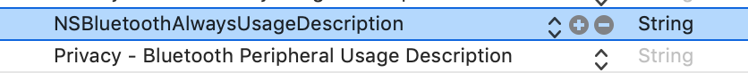
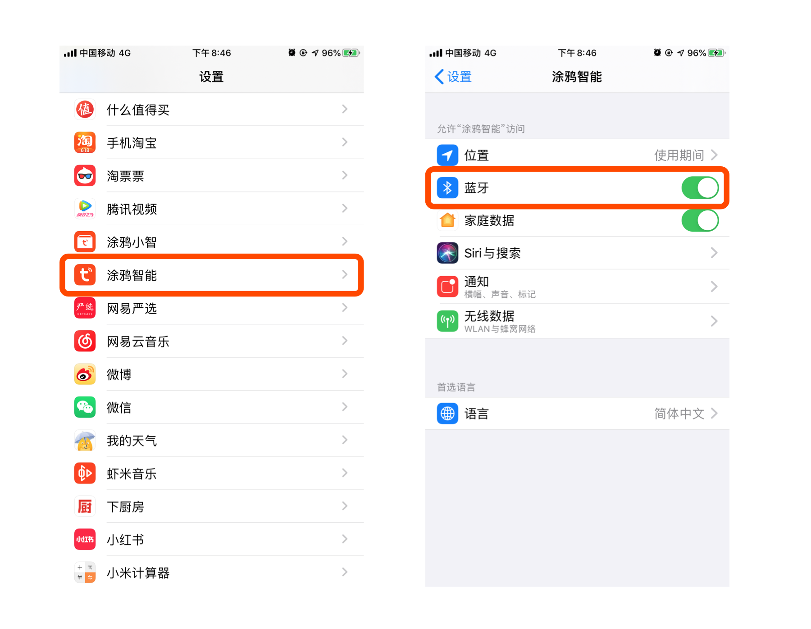

# iOS 版本适配

## iOS 14 适配

从 iOS 14 开始，在设备配网、局域网本地控制时会触发「本地网络」权限弹窗，在用户点击允许后，app才能够向本地局域网发送数据。如果用户点击了拒绝，将无法使用相关功能。目前苹果没有提供任何 API 对此权限进行判断，建议开发者在相关功能无法正常使用时提示、引导用户检查「系统设置 - app设置」，确认是否开启了「本地网络」权限。

## iOS 13 适配

### Wi-Fi 权限变化

从 iOS 13 开始，如果没有开启地理位置权限，`[[TuyaSmartActivator sharedInstance] currentWifiSSID]` 将获取不到正确的 SSID （在已开启 Wi-Fi 权限的前提下）,  在此情况下，系统会默认返回 WLAN or Wi-Fi，以下是 Apple 的官方邮件说明

```
As we announced at WWDC19, we're making changes to further protect user privacy and prevent unauthorized location tracking. Starting with iOS 13, the CNCopyCurrentNetworkInfo API will no longer return valid Wi-Fi SSID and BSSID information. Instead, the information returned by default will be:

SSID: “Wi-Fi” or “WLAN” (“WLAN" will be returned for the China SKU)
BSSID: "00:00:00:00:00:00"
```

1. 确认 App 已开启地理位置权限
2. 确认通过系统方法获取的 BSSID 为 00:00:00:00:00:00 则认为是系统的默认返回，该结果不可用，需要开发者另外处理，比如手动输入 Wi-Fi 名称

### 蓝牙权限变化

如果您有使用 SDK 开发集成涂鸦蓝牙设备，那么一定要关注 iOS 13 新增的「应用蓝牙权限」
在 iOS 13 系统中，除了系统蓝牙权限外，每个 App 都会有自己的蓝牙权限。若 App 中使用到蓝牙，每个应用首次启动前都会询问**是否允许应用使用蓝牙权限**

在 iOS 13 中，苹果将原来蓝牙申请权限用的 `NSBluetoothPeripheralUsageDescription` 字段，替换为  `NSBluetoothAlwaysUsageDescription` 字段。在 info.plist 中添加新字段




当用户选择不允许时，会影响蓝牙功能的使用。此时建议引导用户进行开启蓝牙权限（此时蓝牙中心的状态为 `CBCentralManagerStateUnauthorized`）


## iOS 12 适配

iOS 12 使用 `[[TuyaSmartActivator sharedInstance] currentWifiSSID]` 无法获取到SSID

在 Xcode 10 中获取WiFi信息需要开启相关权限，解决方案：

- `Xcode` -> [Project Name] -> `Targets` -> [Target Name] -> `Capabilities` -> `Access WiFi Information` -> `ON`

打开上述权限即可。


