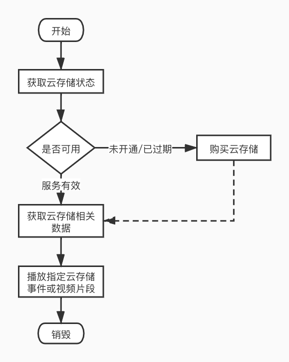

# 云存储

涂鸦平台为智能摄像机提供云存储的服务，可以将设备录制的视频上传到涂鸦云端。

## 流程图

先获取云存储服务状态，如果云存储服务未开通或者已经过期并且云视频已经被全部删除（云存储服务过期后，已经上传的云视频还会保留一段时间，通常是 7 天），就需要先购买云存储服务。如果云存储服务在有效期，先获取有云存储视频的日期，然后获取指定日期的相关数据，包括云存储事件，时间轴数据，鉴权信息等。之后就可以选择一个云存储事件或者一个时间点开始播放云视频了。



## 服务购买

### 组件引入

云存储购买需要引入云存储服务购买页面的组件，在 podfile 中增加下面代码

```ruby
# 涂鸦平台的开放库
source 'https://github.com/TuyaInc/TYPublicSpecs.git'
source 'https://github.com/CocoaPods/Specs.git'

platform :ios, '9.0'
target 'Your_Target' do
  pod 'TYCameraCloudServicePanelSDK'
end
```

然后在工程主目录下执行`pod update`。

### 使用方法

云存储购买服务 SDK 的初始化需要传入涂鸦平台上注册 App 的渠道标识符。

**接口说明**

初始化 SDK，需要在 `TuyaSmartSDK`激活后调用

```objc
+ (void)setupWithAppScheme:(NSString *)scheme;
```

**参数说明**

| 参数   | 说明             |
| ------ | ---------------- |
| scheme | App 的渠道标识符 |

**示例代码**

ObjC

```objc
- (BOOL)application:(UIApplication *)application didFinishLaunchingWithOptions:(NSDictionary *)launchOptions
{
    [[TuyaSmartSDK sharedInstance] startWithAppKey:@"your_appKey" secretKey:@"your_appSecret"];
    [TYCameraCloudServicePanelSDK setupWithAppScheme:@"your_scheme"];
}
```

Swift

``` swift
func application(_ application: UIApplication, didFinishLaunchingWithOptions launchOptions: [UIApplication.LaunchOptionsKey: Any]?) -> Bool {
    TuyaSmartSDK.sharedInstance().start(withAppKey: "your_appKey", secretKey: "your_appSecret")
    TYCameraCloudServicePanelSDK.setup(withAppScheme: "your_scheme")
    return true   
}
```

**接口说明**

同步用户登陆状态

```objc
+ (void)userStateChanged;
```

> 云存储服务与账户强关联，务必在在用户登录/登出的时候调用，以同步用户登录状态。

**示例代码**

ObjC

```objc
- (void)login {
    [[TuyaSmartUser sharedInstance] loginByPhone:@"countryCode" phoneNumber:@"phoneNumber" password:@"password" success:^{
				[TYCameraCloudServicePanelSDK userStateChanged];
    } failure:^(NSError *error) {
				// failed
    }];
}
```

Swift

``` swift
func login() {
        TuyaSmartUser.sharedInstance().login("countryCode", phoneNumber: "phoneNumber", password: "password", success: {
            TYCameraCloudServicePanelSDK.userStateChanged()
        }) { (error) in
            //failed
        }
    }
```

### 获取云存储购买页面

云存储购买页面是 H5 页面，由于需要从云端请求对应的页面地址，所以获取云存储页面的接口是异步的，并需要传入对应设备的 `TuyaSmartDeviceModel`对象。

**接口说明**

获取云存储购买的视图控制器

```objc
+ (void)cloudServicePanelWithDevice:(TuyaSmartDeviceModel *)deviceModel
                            success:(void(^)(UIViewController *vc))success
                            failure:(void(^)(NSError *error))failure;
```

**参数说明**

| 参数        | 说明                                                   |
| ----------- | ------------------------------------------------------ |
| deviceModel | 需要购买云存储服务的设备模型                           |
| success     | 成功回调，返回一个 `UINavigationController` 子类的对象 |
| failure     | 失败回调，error 标示错误信息                           |

> 接口返回的云存储购买视图控制器是一个 `UINavigationController` 的子类的对象，所以不能使用 `push` 的方式将其加入到导航控制器的视图栈中。

**示例代码**

ObjC

```objc
- (void)gotoCloudServicePanelWithDevice:(TuyaSmartDeviceModel *)deviceModel {
    [TYCameraCloudServicePanelSDK cloudServicePanelWithDevice:deviceModel success:^(UIViewController *vc) {
      // 这里返回的 vc 是一个 UINavigationController 的子类
		[self presentViewController:vc animated:YES completion:nil];
	} failure:^(NSError *error) {
		NSLog(@"Error: %@", error);
	}];
}
```

Swift

``` swift
TYCameraCloudServicePanelSDK.cloudServicePanel(withDevice: deviceModel, success: { (vc) in
     self.presentViewController(vc, animated: true, completion:nil)
}) { (error) in
            //failed
}
```

## 云视频

购买过云存储服务后，智能摄像机会把录制的视频上传涂鸦云端。可以通过 SDK 播放已经上传到涂鸦云端的视频录像。云存储相关功能通过 `TuyaSmartCameraKit` 中的 `TuyaSmartCloudManager`类操作。

**相关类和协议**

| 类名（协议名）                | 说明                                     |
| ----------------------------- | ---------------------------------------- |
| TuyaSmartCloudManager         | 云存储服务状态，视频数据维护和云视频播放 |
| TuyaSmartCloudManagerDelegate | 云存储视频播放，视频帧数据回调代理       |

`TuyaSmartCloudManager`初始化时，需要传入设备 id 。云存储默认是静音开始播放的，如果需要播放时开启声音，可在初始化时，设置静音状态为 `NO`。云存储播放时，视频帧数据和帧头信息都将用过代理方法回调。

**接口说明**

`TuyaSmartCloudManager`初始化方法

```objc
- (instancetype)initWithDeviceId:(NSString *)devId;
```

**参数说明**

| 参数  | 说明    |
| ----- | ------- |
| devId | 设备 id |

云存储代理接口为`TuyaSmartCloudManagerDelegate`，只有一个代理方法，会返回每一帧视频的 YUV 数据和帧信息，如果你想要自己渲染视频，可以将 `TuyaSmartCloudManager`的`autoRender`属性设置为`NO`（默认为`YES`），并在代理方法中获取视频帧的YUV数据加以渲染。

**接口说明**

视频帧数据代理回调

```objc
- (void)cloudManager:(TuyaSmartCloudManager *)cloudManager didReceivedFrame:(CMSampleBufferRef)frameBuffer videoFrameInfo:(TuyaSmartVideoFrameInfo)frameInfo;
```

**参数说明**

| 参数         | 说明                                      |
| ------------ | ----------------------------------------- |
| cloudManager | 播放云视频的 `TuyaSmartCloudManager` 对象 |
| frameBuffer  | 视频帧 YUV 数据                           |
| frameInfo    | 视频帧信息                                |


### 云存储数据

在使用云存储播放功能前，还需要先加载云存储的相关数据，这个接口会返回云存储服务当前的状态，以及加载对应的加密秘钥，鉴权信息等。

**接口说明**

加载云存储数据

```objc
- (void)loadCloudData:(void(^)(TuyaSmartCloudState state))complete
```

**参数说明**

| 参数     | 说明                                   |
| -------- | -------------------------------------- |
| complete | 加载完成回调，返回当前的云存储服务状态 |


**TuyaSmartCloudState 枚举**

| 枚举值                           | 说明                                         |
| -------------------------------- | -------------------------------------------- |
| TuyaSmartCloudStateNoService     | 未开通云存储服务                             |
| TuyaSmartCloudStateNoData        | 已开通云存储服务，但是没有回放视频           |
| TuyaSmartCloudStateValidData     | 已开通云存储服务，且有回放视频               |
| TuyaSmartCloudStateExpiredNoData | 云存储服务已过期，且无回放视频               |
| TuyaSmartCloudStateExpiredData   | 云存储服务已过期，但是还有可以查看的回放视频 |
| TuyaSmartCloudStateLoadFailed    | 加载失败                                     |

> 云存储服务过期后，已上传的云存储视频还会预留一段时间（通常是 7 天，具体看云存储服务协议），如果在此期间没有续费，到期后，云存储视频将会删除。

#### 云存储录像日期

在加载云存储数据成功返回后，如果云端有视频回放数据，可以通过```cloudDays``` 属性获取有视频回放数据的日期。

```objc
@property (nonatomic, strong, readonly) NSArray<TuyaSmartCloudDayModel *> *cloudDays;
```

**TuyaSmartCloudDayModel 模型**

| 字段        | 类型      | 说明                         |
| ----------- | --------- | ---------------------------- |
| sumDuration | NSInteger | 当天云视频总长度             |
| uploadDay   | NSString  | 日期，格式为：yyyy-MM-dd     |
| startTime   | NSInteger | 当天 00:00:00 的 Unix 时间戳 |
| endTime     | NSInteger | 当天 23:59:59 的 Unix 时间戳 |

#### 视频片段

在播放云存储视频前，需要获取到当天的视频片段数据。

**接口说明**

获取某天的视频片段时间数据

```objc
- (void)timeLineWithCloudDay:(TuyaSmartCloudDayModel *)cloudDay
                     success:(void(^)(NSArray<TuyaSmartCloudTimePieceModel *> * timePieces))success
                     failure:(void(^)(NSError * error))failure;
```

**参数说明**

| 参数     | 说明                                             |
| -------- | ------------------------------------------------ |
| cloudDay | 云存储录像日期模型                               |
| success  | 成功回调，返回当天所有视频片段时间数据模型的数组 |
| failure  | 失败回调，error 标示错误信息                     |


**TuyaSmartCloudTimePieceModel 数据模型**

| 字段      | 类型      | 说明                     |
| --------- | --------- | ------------------------ |
| startTime | NSInteger | 视频开始时间 Unix 时间戳 |
| startDate | NSDate    | 视频开始时间             |
| endTime   | NSInteger | 视频结束时间 Unix 时间戳 |
| endDate   | NSDate    | 视频结束时间             |

#### 云存储事件

开启云存储服务后，设备通过侦测报警上报的事件，会和云视频关联起来。云存储的报警事件和侦测报警消息略有不同。他们的触发原因可能是一样的，但是侦测报警消息的删除不会影响到云存储事件，也不是所有的侦测报警消息都会触发云视频录制，比如电量警告等。而且云存储事件和云视频相关联，正常情况下，每一个云存储事件都会有一段对应的云视频。

**接口说明**

获取某天的云存储报警事件

```objc
- (void)timeEventsWithCloudDay:(TuyaSmartCloudDayModel *)cloudDay
                        offset:(int)offset
                         limit:(int)limit
                       success:(void(^)(NSArray<TuyaSmartCloudTimeEventModel *> * timeEvents))success
                       failure:(void(^)(NSError * error))failure;
```

**参数说明**

| 参数     | 说明                           |
| -------- | ------------------------------ |
| cloudDay | 云存储录像日期模型             |
| offset   | 偏移量，0 标示从第一个事件开始 |
| limit    | 数量限制，-1 标示获取所有事件  |
| success  | 成功回调，返回事件模型的数组   |
| failure  | 失败回调，error 标示错误信息   |

**TuyaSmartCloudTimeEventModel 数据模型**

| 字段        | 类型      | 说明                           |
| ----------- | --------- | ------------------------------ |
| describe    | NSString  | 事件描述                       |
| startTime   | NSInteger | 事件开始时间 Unix 时间戳       |
| endTime     | NSInteger | 事件结束时间 Unix 时间戳       |
| snapshotUrl | NSString  | 事件发生时，设备抓拍的实时图片 |

### 云视频播放

播放云存储视频时，需要指定开始播放的时间，结束时间，和是否是播放事件。

**接口说明**

播放云存储视频

```objc
- (void)playCloudVideoWithStartTime:(long)startTime
                            endTime:(long)endTime
                            isEvent:(BOOL)isEvent
                         onResponse:(void(^)(int errCode))responseCallback
                         onFinished:(void(^)(int errCode))finishedCallback;
```

**参数说明**

| 参数             | 说明                                                       |
| ---------------- | ---------------------------------------------------------- |
| startTime        | 开始播放的时间                                             |
| endTime          | 结束时间，云存储视频播放会自动连续播放到当天所有视频结束   |
| isEvent          | 是否播放的事件                                             |
| responseCallback | 结果回调，errCode 标示错误码，0 表示成功开始播放           |
| finishedCallback | 播放结束回调，errCode 标示结束原因，0 表示视频正常播放结束 |

**接口说明**

暂停播放

```objc
- (int)pausePlayCloudVideo;
```

**返回值**

| 类型 | 说明               |
| ---- | ------------------ |
| int  | 错误码，0 表示成功 |

**接口说明**

恢复播放

```objc
- (int)resumePlayCloudVideo;
```

**返回值**

| 类型 | 说明               |
| ---- | ------------------ |
| int  | 错误码，0 表示成功 |

**接口说明**

停止播放

```objc
- (int)stopPlayCloudVideo;
```

**返回值**

| 类型 | 说明               |
| ---- | ------------------ |
| int  | 错误码，0 表示成功 |

**接口说明**

获取视频渲染视图

```objc
- (UIView<TuyaSmartVideoViewType> *)videoView;
```

**返回值**

| 类型                           | 说明                   |
| ------------------------------ | ---------------------- |
| UIView<TuyaSmartVideoViewType> | 云存储视频默认渲染视图 |


如果是直接播放某个视频片段（`TuyaSmartCloudTimePieceModel`），开始时间传入介于 `TuyaSmartCloudTimePieceModel` 中 `startTime` 和 `endTime` 之间的一个时间戳， `isEvent` 传入 `NO`。如果是想要播放某个事件（`TuyaSmartCloudTimeEventModel`），开始时间传入 `TuyaSmartCloudTimeEventModel` 的`startTime` ，`isEvent` 传入 `YES`，结束时间可以传入当天的结束时间，也就是 `TuyaSmartCloudDayModel` 的 `endTime`。

`TuyaSmartCloudManager`会自动渲染视频，通过`videoView`方法获取视频渲染视图，并添加到屏幕上。

#### 其他功能

云存储视频播放也提供有声音开关，本地视频录制，截图等功能。

**接口说明**

设置静音状态

```objc
- (void)enableMute:(BOOL)mute success:(void(^)(void))success failure:(void (^)(NSError * error))failure;
```

**参数说明**

| 参数    | 说明                         |
| ------- | ---------------------------- |
| mute    | 是否静音                     |
| success | 成功回调                     |
| failure | 失败回调，error 标示错误信息 |

**接口说明**

获取静音状态

```objc
- (BOOL)isMuted;
```

**返回值**

| 类型 | 说明       |
| ---- | ---------- |
| BOOL | 是否是静音 |

**接口说明**

开始录制视频，视频自动保存到系统相册中

```objc
- (void)startRecord;
```

**接口说明**

开始录制视频，视频保存到指定文件路径

```objc
- (void)startRecordAtPath:(NSString *)filePath;
```

**参数说明**

| 参数     | 说明                   |
| -------- | ---------------------- |
| filePath | 视频录像文件保存的路径 |

**接口说明**

停止录制，并保存视频文件

```objc
- (int)stopRecord;
```

**返回值**

| 类型 | 说明                       |
| ---- | -------------------------- |
| int  | 错误码，0 表示视频保存成功 |

**接口说明**

视频截图，图片保存在手机系统相册中

```objc
- (UIImage *)snapShoot;
```

**返回值**

| 类型    | 说明                                      |
| ------- | ----------------------------------------- |
| UIImage | 视频截图的 `UIImage` 对象，失败时返回 nil |

**接口说明**

视频截图，图片保存到指定文件路径

```objc
- (UIImage *)snapShootAtPath:(NSString *)filePath thumbnilPath:(NSString *)thumbnilPath;
```

**参数说明**

| 参数         | 说明                                     |
| ------------ | ---------------------------------------- |
| filePath     | 保存视频截图的文件路径                   |
| thumbnilPath | 缩略图保存路径，如果不需要缩略图，传 nil |

同样的，如果你只需要获取当前视频截图 `UIImage`对象，不需要自动保存，可以通过 `videoView`的 `- (UIImage *)screenshot;`方法获取截图。

**示例代码**

ObjC

```objc
// self.devId = @"xxxxx";
- (void)viewDidLoad {
	_cloudManager = [[TuyaSmartCloudManager alloc] initWithDeviceId:self.devId];
    [_cloudManager enableMute:NO success:nil failure:nil];
	_cloudManager.delegate = self;
}

- (void)loadData {
	__weak typeof(self) weakSelf = self;
	[self.cloudManager loadCloudData:^(TuyaSmartCloudState state) {
      weak_self.cloudStorageDays = weak_self.cloudManager.cloudDays;
      weak_self.selectedDay = weak_self.cloudManager.cloudDays.lastObject;
      [weakSelf checkCloudState:state];
  }];
}

- (void)requestTimelineData {
    [self.cloudManager timeLineWithCloudDay:self.selectedDay success:^(NSArray<TuyaSmartCloudTimePieceModel *> *timePieces) {
		// success
    } failure:^(NSError *error) {
		// failed
    }];
}

-(void)playVideo:(TuyaSmartCloudTimePieceModel *)timePiece {
    [self.cloudManager playCloudVideoWithStartTime:timePiece.startTime endTime:self.selectedDay.endTime isEvent:NO onResponse:^(int errCode) {
        if (errCode == 0) {
            // success
        }else {
				    // failed
        }
    } onFinished:^(int errCode) {
	  		// finished
        if (errCode != 0) {
				    // some error
        }
    }];
}

- (void)playEvent:(TuyaSmartCloudTimeEventModel *)event {
    [self.cloudManager playCloudVideoWithStartTime:event.startTime endTime:self.selectedDay.endTime isEvent:YES onResponse:^(int errCode) {
        if (errCode == 0) {
            // success
        }else {
    // failed
        }
    } onFinished:^(int errCode) {
  // finished
        if (errCode != 0) {
    // some error
        }
    }];
}

- (void)pause {
    if ([self.cloudManager pausePlayCloudVideo] != 0) {
        // 暂停失败
    }
}

- (void)resume {
    if ([self.cloudManager resumePlayCloudVideo] != 0) {
        // 恢复播放失败
    }
}

- (void)stop {
		[self.cloudManager stopPlayCloudVideo];
}

- (void)muteAction {
    BOOL isMuted = [self.cloudManger isMuted];
    [self.cloudManager enableMute:!isMuted success:^{
		// success
    } failure:^(NSError *error) {
		// failed
    }];
}

- (void)recordAction {
    if (self.isRecording) {
        if ([self.cloudManager stopRecord] != 0) {
            // 录制失败
        }else {
            // 录制成功，视频已保存到系统相册
        }
      	self.isRecording = NO;
    }else {
        [self.cloudManager startRecord];
    		self.isRecording = YES;
    }
}

- (void)snapShoot {
    if ([self.cloudManager snapShoot]) {
        // 图片已保存到系统相册
    }else {
        // 截图失败
    }
}

```

Swift

```swift
func viewDidLoad() {
    let cloudManager = TuyaSmartCloudManager(deviceId: devId)
    cloudManager?.enableMute(false, success: nil, failure: nil)
    cloudManager?.delegate = self
}

func loadData() {
    self.cloudManager.loadCloudData { [weak self] (state) in
    		self.cloudStorageDays = self.cloudManager.cloudDays
		    self.selectedDay =  self.cloudManager.cloudDays.last
    		self.checkCloudState(state)            
    }
}

func requestTimelineData() {
		self.cloudManager.timeLine(withCloudDay: self.selectedDay, success: { (timePieces) in
        //success
    }) { (error) in
        //failed
    }
}

func playVideo(_ timePiece: TuyaSmartCloudTimePieceModel) {
    self.cloudManager.playCloudVideo(withStartTime: timePiece.startTime, endTime:self.selectedDay.endTime , isEvent: false, onResponse: { (code) in
        if code == 0 {
            //success
        } else {
            //failed
        }
    }) { (errCode) in
        //finished
        if codeCode != 0 {
            //some error
        }
    }
}
    
func playEvent(_ event: TuyaSmartCloudTimeEventModel) {
    cloudManager.playCloudVideo(withStartTime: event.startTime, endTime: self.selectedDay.endTime, isEvent: true, onResponse: { (errCode) in
        if code == 0 {
            //success
        } else {
            //failed
        }
    }) { (errCode) in
        //finished
        if errCode != 0 {
            // some error
        }
    }
}

func pause() {
    if self.cloudManager.pausePlayCloudVideo() != 0 {
        //暂停失败
    }
}

func resume() {
    if self.cloudManager.resumePlayCloudVideo() != 0 {
        // 恢复播放失败
    }
}

func stop() {
		self.cloudManager.stopPlayCloudVideo()
}

func muteAction() {
    let isMuted = self.cloudManager.isMuted()
    self.cloudManager.enableMute(!isMuted, success: {
				// success
    }) { (error) in
        // failed
    }
}

func recordAction() {
    if self.isRecording {
        if self.cloudManager.stopRecord() != 0 {
            //录制失败
        } else {
            //录制成功，视频已保存系统相册
        }
        self.isRecording = false
    } else {
        self.cloudManager.startRecord()
        self.isRecording = true
    }
}

func snapShoot() {
    if self.cloudManager.snapShoot() {
        // 图片已保存到系统相册
    } else {
        // 截图失败
    }
}
```


