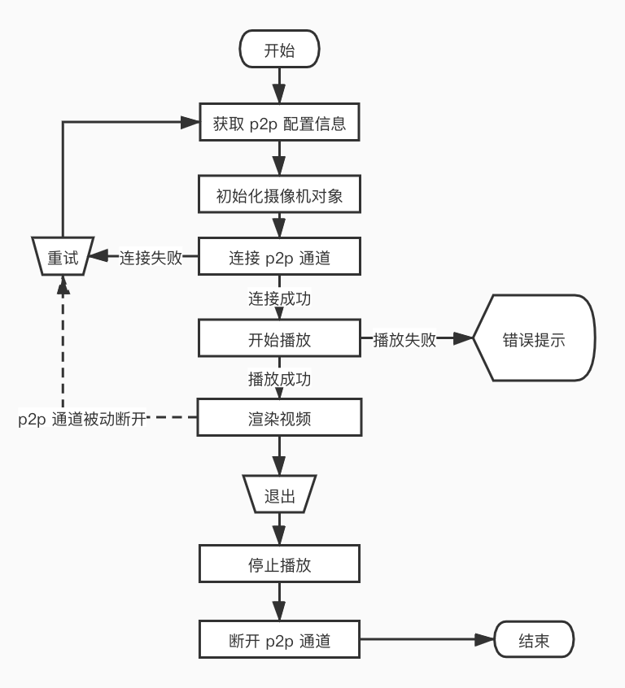

# 摄像机功能

Camera SDK 提供智能摄像机的实时视频播放，设备存储卡录像播放，对当前正在播放的视频截图、录制视频， 与摄像机实时通话等基础能力，并提供视频帧解码后的 YUV 数据，开发者可以对视频数据进行二次处理。

## 视频直播

在创建`TuyaSmartCameraType`实例对象后，就可以开始播放实时视频了。视频数据的传输和命令交互基于 p2p 通道实现。

### P2P 连接

在开始播放视频之前，需要先连接 p2p 通道。p2p 的连接状态需要开发者自己维护，Camera SDK 只负责下发命令和接收摄像机响应结果。

**接口说明**

开始连接 p2p 通道

```objc
- (void)connect;
```

断开 p2p 通道

```objc
- (void)disConnect;
```


**代理回调**

p2p 通道成功连接

```objc
- (void)cameraDidConnected:(id<TuyaSmartCameraType>)camera;
```

p2p 通道已断开，被动断开时才会调用，如网络环境比较差，或者设备主动断开连接

```objc
- (void)cameraDisconnected:(id<TuyaSmartCameraType>)camera;
```

> connect 方法可能会阻塞线程，建议在子线程调用。

### 实时视频播放

p2p 通道连接成功以后，就可以开始播放实时视频了。

**接口说明**

开始播放实时视频

```objc
- (void)startPreview;
```

停止播放实时视频

```objc
- (void)stopPreview;
```

获取视频渲染视图

```objc
- (UIView<TuyaSmartVideoViewType> *)videoView;
```


**代理回调**

视频直播已经成功开始播放

```objc
- (void)cameraDidBeginPreview:(id<TuyaSmartCameraType>)camera;
```

视频直播已经成功停止播放

```objc
- (void)cameraDidStopPreview:(id<TuyaSmartCameraType>)camera;
```


### 视频渲染

视频成功播放后，Camera SDK 收到视频流将会自动渲染，开发者可以通过 camera 对象的 `- (UIView<TuyaSmartVideoViewType> *)videoView` 方法来获取渲染视图，将其添加到屏幕上，并设置布局属性。

**协议说明**

| 协议名                 | 说明                                                         |
| ---------------------- | ------------------------------------------------------------ |
| TuyaSmartVideoViewType | 视频渲染器协议，根据摄像机实现方案不同，视频渲染的具体实现也有不同 |


**接口说明**

图像缩放属性。默认是 `NO`，如果视图的宽高比和视频图像的宽高比不一样，则会在图像的上下或者左右两侧留有黑边。设置为`YES`，图像会拉伸铺满整个视图，可能会造成图像变形。

```objc
@property (nonatomic, assign) BOOL scaleToFill;
```

设置图像缩放比例

```objc
- (void)tuya_setScaled:(float)scaled;
```

设置图像偏移量

```objc
- (void)tuya_setOffset:(CGPoint)offset;
```

清除当前的图像和缓存的视频帧

```objc
- (void)tuya_clear;
```

对当前渲染的图像截图

```objc
- (UIImage *)screenshot;
```

> `TuyaSmartCameraType` 对象还提供了一个 `autoRender` 属性，默认是 `YES`，Camera SDK 会自动渲染视频图像。如果开发者不希望 SDK 自动渲染视频，可将此属性设置为 `NO`，然后可以从代理方法中获取到每一帧视频的 YUV 数据，并自主开发视频渲染，详细的接口在[裸流数据](https://tuyainc.github.io/tuyasmart_camera_ios_sdk_doc/zh-hans/resource/av_function.html#%E8%A3%B8%E6%B5%81%E6%95%B0%E6%8D%AE)章节中介绍。

#### 全屏播放

Camera SDK 并不提供全屏播放的能力，全屏播放只需要修改视频渲染视图的布局即可，若需要视频图像铺满视图，可以将`scaleToFill`属性设置为 `YES`，但是此时图像可能会被拉伸变形。全屏模式时，横竖屏的旋转，布局的变化都需要开发者自行维护。

### 流程图




### 错误回调

摄像机操作的所有错误反馈都将通过代理方法回调。

**接口说明**

摄像机操作失败回调

```objc
- (void)camera:(id<TuyaSmartCameraType>)camera didOccurredErrorAtStep:(TYCameraErrorCode)errStepCode specificErrorCode:(NSInteger)errorCode;
```

**参数说明**

| 参数        | 说明                   |
| ----------- | ---------------------- |
| camera      | 发生错误的摄像机对象   |
| errStepCode | 发生错误的操作         |
| errorCode   | 错误码，标示失败的原因 |


**TYCameraErrorCode 枚举**

| 枚举值                           | 说明                       |
| -------------------------------- | -------------------------- |
| TY_ERROR_NONE                    | 无                         |
| TY_ERROR_CONNECT_FAILED          | p2p 连接失败               |
| TY_ERROR_START_PREVIEW_FAILED    | 实时视频播放失败           |
| TY_ERROR_START_PLAYBACK_FAILED   | 存储卡视频播放失败         |
| TY_ERROR_PAUSE_PLAYBACK_FAILED   | 暂停存储卡视频播放失败     |
| TY_ERROR_RESUME_PLAYBACK_FAILED  | 恢复存储卡视频播放失败     |
| TY_ERROR_ENABLE_MUTE_FAILED      | 视频声音开关失败           |
| TY_ERROR_START_TALK_FAILED       | 开启对讲失败               |
| TY_ERROR_RECORD_FAILED           | 视频录制失败               |
| TY_ERROR_ENABLE_HD_FAILED        | 设置视频清晰度失败         |
| TY_ERROR_GET_HD_FAILED           | 获取视频清晰度失败         |
| TY_ERROR_QUERY_RECORD_DAY_FAILED | 存储卡视频回放日期查询失败 |
| TY_ERROR_QUERY_TIMESLICE_FAILED  | 存储卡视频片段查询失败     |


`errorCode`的含义可以参考后面的[错误码](./resource/errors.html)章节。

**示例代码**

ObjC

```objc
#define kTuyaSmartIPCConfigAPI @"tuya.m.ipc.config.get"
#define kTuyaSmartIPCConfigAPIVersion @"2.0"

- (void)startStream {
    if (self.connected) {
        [self.camera startPreview];
        return;
    }
    id p2pType = [self.deviceModel.skills objectForKey:@"p2pType"];
    [[TuyaSmartRequest new] requestWithApiName:kTuyaSmartIPCConfigAPI postData:@{@"devId": self.devId} version:kTuyaSmartIPCConfigAPIVersion success:^(id result) {
        dispatch_async(dispatch_get_global_queue(DISPATCH_QUEUE_PRIORITY_DEFAULT, 0), ^{
            TuyaSmartCameraConfig *config = [TuyaSmartCameraFactory ipcConfigWithUid:[TuyaSmartUser sharedInstance].uid localKey:self.deviceModel.localKey configData:result];
            self.camera = [TuyaSmartCameraFactory cameraWithP2PType:p2pType config:config delegate:self];
            [self.camera connect];
        });
    } failure:^(NSError *error) {
				// 获取配置信息失败
    }];
}

#pragma mark - TuyaSmartCameraDelegate

- (void)cameraDidConnected:(id<TuyaSmartCameraType>)camera {
    self.connected = YES;
  	// 需要 p2p 连接成功后再开始预览
		[camera startPreview];
}

- (void)cameraDisconnected:(id<TuyaSmartCameraType>)camera {
  	// p2p 连接被动断开，一般为网络波动导致
    self.connected = NO;
    self.previewing = NO;
}

- (void)cameraDidBeginPreview:(id<TuyaSmartCameraType>)camera {
		// 实时视频开始播放
    self.previewing = YES;
  	// 将视频渲染视图添加到屏幕上
		[self.view addSubview:camera.videoView];
}

- (void)cameraDidStopPreview:(id<TuyaSmartCameraType>)camera {
		// 实时视频停止播放
    self.previewing = NO;
}

// 错误回调
- (void)camera:(id<TuyaSmartCameraType>)camera didOccurredErrorAtStep:(TYCameraErrorCode)errStepCode specificErrorCode:(NSInteger)errorCode {
		if (errStepCode == TY_ERROR_CONNECT_FAILED) {
      	// p2p 连接失败
        self.connected = NO;
    }
    else if (errStepCode == TY_ERROR_START_PREVIEW_FAILED) {
      	// 实时视频播放失败
        self.previewing = NO;
    }
}
```

Swift

```swift
func startStream() {
    if self.isConnected {
        self.camera.startPreview()
        return
    }
    let p2pType = self.deviceModel.skills["p2pType"]!
    TuyaSmartRequest().request(withApiName: kTuyaSmartIPCConfigAPI, postData: ["devId": self.devId], version: kTuyaSmartIPCConfigAPIVersion, success: { result in
        guard let responder = result as? [AnyHashable:Any] else {
            return;
        }
        DispatchQueue.global().async {
            let config = TuyaSmartCameraFactory.ipcConfig(withUid: TuyaSmartUser.sharedInstance().uid, localKey: self.deviceModel.localKey, configData: responder)
            self.camera = TuyaSmartCameraFactory.camera(withP2PType: p2pType, config: config, delegate: self)
            self.camera.connect()
        }
    }) { _ in
        // 获取配置信息失败
    }
}

func cameraDidConnected(_ camera: TuyaSmartCameraType!) {
    self.isConnected = true
    // 需要 p2p 连接成功后再开始预览
    camera.startPreview()
}

func cameraDisconnected(_ camera: TuyaSmartCameraType!) {
    // p2p 连接被动断开，一般为网络波动导致
    self.isConnected = false
    self.isPreviewing = false
}

func cameraDidBeginPreview(_ camera: TuyaSmartCameraType!) {
    // 实时视频开始播放
    self.isPreviewing = true;
    // 将视频渲染视图添加到屏幕上
    self.view.addSubview(camera.videoView())
}

func cameraDidStopPreview(_ camera: TuyaSmartCameraType!) {
    // 实时视频停止播放
    self.isPreviewing = false
}

func camera(_ camera: TuyaSmartCameraType!, didOccurredErrorAtStep errStepCode: TYCameraErrorCode, specificErrorCode errorCode: Int) {
    if errStepCode == TY_ERROR_CONNECT_FAILED  {
        // p2p 连接失败
        self.isConnected = false
    }else if errStepCode == TY_ERROR_START_PREVIEW_FAILED {
        // 实时视频播放失败
        self.isPreviewing = false
    }
}
```

> App 进入后台的时候，要需要停止视频播放，视频数据使用硬件解码，OpenGL 渲染，在后台的时候，继续播放，可能会造成 App 崩溃。另外，涂鸦智能摄像机一般最多支持同时连接 5 路 p2p 通道（即支持 5 个手机同时连接），建议 App 在后台停留一段时间后，主动断开 p2p 连接，以释放资源。


