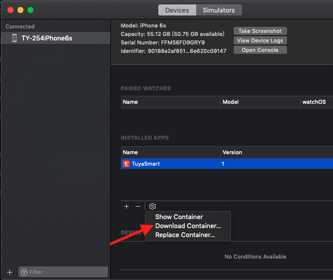

## 调试日志文件

为了解决开发者接入 Camera SDK 时，遇到异常难以排查的问题，现提供一个将运行日志输出到本地文件中的组件 ```TuyaSmartLogger```。

在 `Podfile` 文件中添加如下代码：

```
pod 'TuyaSmartLogger'
```

在 ```AppDelegate.m```文件中，添加以下代码：

```objective-c
- (BOOL)application:(UIApplication *)application didFinishLaunchingWithOptions:(NSDictionary *)launchOptions
{
  // your other code
  [TuyaSmartLogger startLog];
  // print log path
  NSLog(@"%@", [TuyaSmartLogger getDebugLogPath]);
  return YES;
}
```

运行你的 App ，在沙盒中找到上面打印出的路径里的日志文件。如果你使用的是真机调试，需要在 Xcode 中导出你的 App 的沙盒文件，导出 App 沙盒文件的方式如下：



