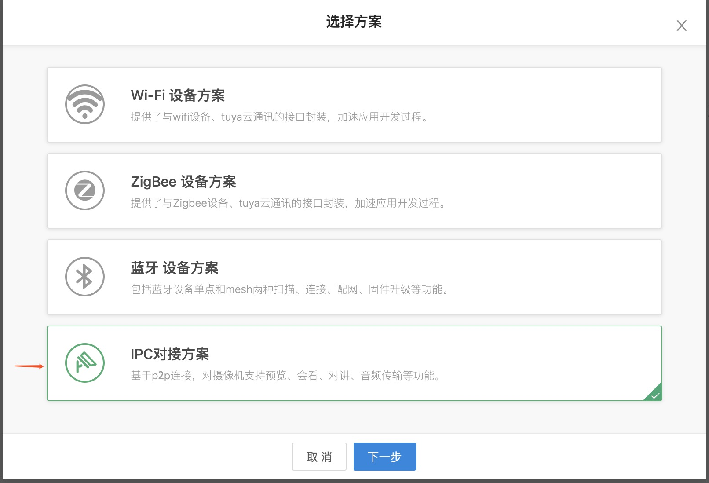

## 集成 SDK

### 对接方式

Camera SDK 依赖 Home SDK 中用户管理，设备配网，家庭管理，设备管理等部分，在此基础上实现了智能摄像机设备的功能。

涂鸦平台提供多种对接方案，开发者可以根据自己的需求选择不同的对接方式，可以参考[方案介绍](https://docs.tuya.com/zh/iot/open-api/quick-start/solution-overview)。

不同的对接方案需要集成的 SDK 不同。

#### 云云对接

云云对接方案是指，开发者可以通过涂鸦云端提供的 open api 完成用户对接，以及设备管理、控制等功能，App 端只需要集成删减版的涂鸦智能设备配网 SDK 完成设备的绑定即可。这种方式的优点是 SDK 依赖最小，App 侵入性低，缺点是 App 开发工作量大，并需要开发者拥有较强的云端服务支持，控制链路过长。此方案适合已经有成型的账号体系和较完善的 App 产品。

由于无法通过 open api 实现摄像机的视频播放功能，所以云云对接仍然需要集成 Camera SDK。

可通过涂鸦云端提供的 open api 完成用户对接，云存储，侦测报警，以及基于设备功能点实现的功能。使用 Camera SDK 完成视频直播，存储卡回放，实时对讲等摄像机基础功能。

**模块说明**

| 模块名             | 说明                             |
| ------------------ | -------------------------------- |
| TuyaSmartActivator | 云云对接专用删减版的设备配网 SDK |
| TuyaSmartCameraKit | 涂鸦智能摄像机垂直化功能 SDK     |

在 ```Podfile```文件中添加以下内容：

```ruby
platform :ios, '9.0'

target 'your_target_name' do

  pod "TuyaSmartActivator"
	pod "TuyaSmartCameraKit"
	# pod "TuyaSmartCameraT"

end
```

#### SDK 对接

完整的 Home SDK 提供更加全面的与硬件设备、涂鸦云通讯的接口，可以更加快速高效的搭建起一个产品级应用，并且不需要开发者拥有云端服务的支持，但是同样支持涂鸦云端 open api 的正常使用。

**模块说明**

| 模块名                | 说明                         |
| --------------------- | ---------------------------- |
| TuyaSmartActivatorKit | 完整版的设备配网 SDK         |
| TuyaSmartCameraKit    | 涂鸦智能摄像机垂直化功能 SDK |

> 需要注意的是，云云对接使用的设备配网 SDK 是 `TuyaSmartActivator`，而 Home SDK 对接使用的设备配网 SDK 是`TuyaSmartActivatorKit`，这两个模块不可以同时依赖，会导致编译冲突。
>
> `TuyaSmartCameraKit`不只是一个单独的库，还会依赖到其他基础功能支撑的库，可以参考 [SDK 架构说明](https://tuyainc.github.io/tuyasmart_camera_ios_sdk_doc/zh-hans/resource/architecture.html)。

在```Podfile```文件中添加以下内容：

```ruby
platform :ios, '9.0'

target 'your_target_name' do

  pod "TuyaSmartActivatorKit"
	pod "TuyaSmartCameraKit"
	# pod "TuyaSmartCameraT"

end
```

如果您需要支持 p2p 1.0 的设备，需要增加 `pod "TuyaSmartCameraT"`, 然后在项目根目录下执行```pod update```命令。

CocoaPods的使用请参考：[CocoaPods Guides](https://guides.cocoapods.org/)

### 准备工作

在开始使用 SDK 开发前，需要在涂鸦智能开发平台上注册开发者账号、创建产品等，并获取到激活 SDK 的密钥，具体的操作流程请参考 [准备工作](https://tuyainc.github.io/tuyasmart_home_ios_sdk_doc/zh-hans/resource/Preparation.html)。

在获取 App SDK 时，方案选择`IPC 对接方案`，如下图所示：



### 初始化 SDK

1. 打开项目设置，Target => General，修改```Bundle Identifier```为涂鸦开发者平台上注册的 App 对应的 iOS 包名。

2. 将上面[准备工作](https://tuyainc.github.io/tuyasmart_home_ios_sdk_doc/zh-hans/resource/Preparation.html)中下载的安全图片导入到工程根目录，重命名为```t_s.bmp```，并加入「项目设置 => Target => Build Phases => Copy Bundle Resources」中。

3. 在项目的```PrefixHeader.pch```文件添加以下内容（Swift 项目可以添加在```xxx_Bridging-Header.h```桥接文件中）：

   ```objc
   #import <TuyaSmartBaseKit/TuyaSmartBaseKit.h>
   #import <TuyaSmartActivatorKit/TuyaSmartActivatorKit.h>
   #import <TuyaSmartCameraKit/TuyaSmartCameraKit.h>
   ```

4. 打开`AppDelegate.m`文件，在`[AppDelegate application:didFinishLaunchingWithOptions:]`方法中，使用在涂鸦开发者平台上，App 对应的 `App Key`，`App Secret` 初始化SDK：

   ObjC

   ```objc
   [[TuyaSmartSDK sharedInstance] startWithAppKey:<#your_app_key#> secretKey:<#your_secret_key#>];
   ```

   Swift

   ```swift
   TuyaSmartSDK.sharedInstance()?.start(withAppKey: <#your_app_key#>, secretKey: <#your_secret_key#>)
   ```

至此，涂鸦智能 App SDK 已经成功激活，可以开始 App 开发了。

### Debug 模式

在开发的过程中可以开启 Debug 模式，打印一些日志用于分析问题。

ObjC

```objc
#ifdef DEBUG
    [[TuyaSmartSDK sharedInstance] setDebugMode:YES];
#else
#endif
```

Swift

```swift
#if DEBUG
   TuyaSmartSDK.sharedInstance()?.debugMode = true
#else
#endif

```

